# 软件工程实验报告-Lab6

## 一、**实验名称**

项目协同开发管理与工具集成环境实验

## 二、**实验目的**

- 了解协同开发与持续集成过程
- 学会使用项目协同开发管理工具 git/github 
- 了解持续集成并使用 jenkins 自动构建项目

## 三、**实验环境**

1. 软件（JDK，Android SDK，Gradle）：
   - JDK：1.8.0_231
   - Android SDK：Android 11 (API 30)
   - Gradle：
     -  Android Gradle Plugin Version：7.0.3
     -  Gradle Version：7.0.2
2. 硬件（安卓模拟器版本）：Pixel 2 API 30

## 四、实验内容

1. Git
   - 安装 git，在本地将你的开源项目目录初始化为 git 仓库 (如已有.git 文件夹请先删除) 
   - 在本地尝试修改、提交、回退等过程，在报告中展示你的操作，并使用 git diff, git log, git status 等命令展示操作前后的区别 
   - 根据实验三针对几个页面进行微调的任务，在本地为每个子任务创建一个分支并在各 分支上进行开发，最终将所有修改合并到 master 分支上；如有冲突请尝试解决。在报 告中展示你的操作，并使用 git log --graph 命令展示分支合并图
   - 给你的某个稳定版本的代码打上标签
   - 注册 github 账号，在账号中创建远程仓库 (权限请设置为 public)；把本地的所有分支 和标签推送到远端
   - 使用 pull request 提交自己的代码和报告 (作业提交说明里细 )
   - 在报告中回答以下问题：
     - 使用 git 的好处？
     - 使用远程仓库 (如 github/gitee 等) 的好处？ 
     - 在开发中使用分支的好处？你在实际开发中有哪些体会和经验？
   - 如果你额外学习并实践了关于 git/github 的其他进阶操作 (如 merge 和 rebase 的区 别、reset 和 revert 的区别、stash, cherry-pick 的使用等)，可在报告中展示
2. Jenkins
   - 在本机安装 jenkins，并在全局工具配置和系统设置中配置好 JDK 地址、Gradle 地址、 ANDROID_HOME 地址和 JAVA_HOME 地址
   - 新建任务，在源码管理中填写自己项目的 github 地址，对项目进行一次构建
   - 修改代码再次推送到 github 仓库中，再次对项目进行构建

## 五、实验结果

### Git

#### 1

> 安装 git，在本地将你的开源项目目录初始化为 git 仓库 (如已有.git 文件夹请先删除) 

首先初始化本地目录为git仓库

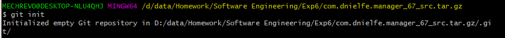

将本地git仓库与github中新建的项目仓库关联

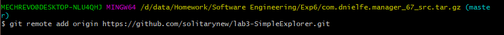

初始化提交所有已存在的文件，命名该次提交为init

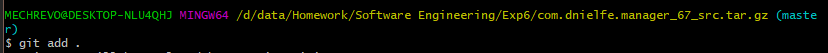

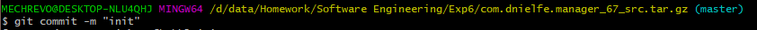

#### 2

> 在本地尝试修改、提交、回退等过程，在报告中展示你的操作，并使用 git diff, git log, git status 等命令展示操作前后的区别 

对项目进行修改，增加了红色选框内的内容

使用git status查看当前状态，可以看到检测到README.md文件已经被修改

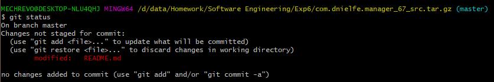

使用git diff查看不同的工作区与当前版本的不同之处，可以看到增加#This is test change的内容

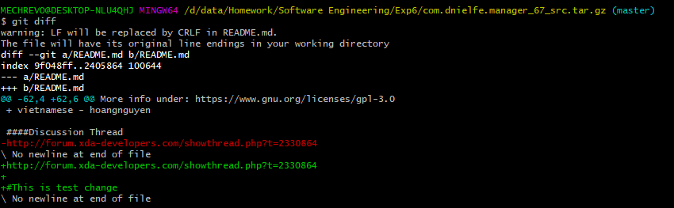

利用git add，git commit分别提交修改在暂存区，版本库

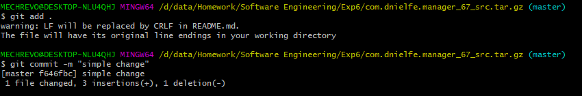

查看当前状态，可以看到已经没有未提交的修改

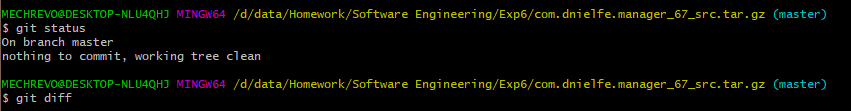

通过git log查看git分支记录，可以看到，当前head处于刚才的simple change提交上

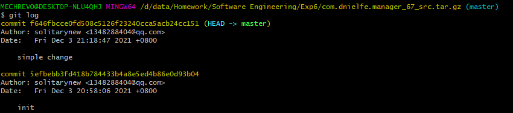

通过git reset回退版本，可以看到工作区的文件并未修改，只改变了head的指针

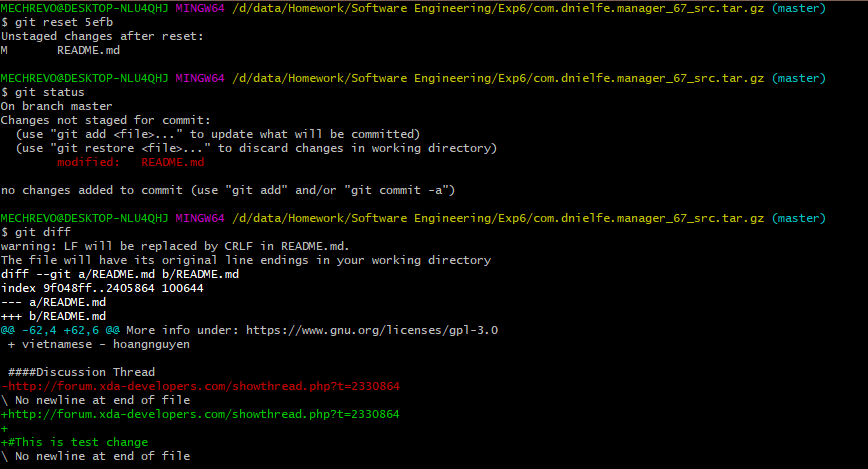

使用git reset --hard回退版本，可以使得工作区的文件也进行恢复到以前的版本，此时可以看到，head指向init的提交，之后的提交已经看不到了

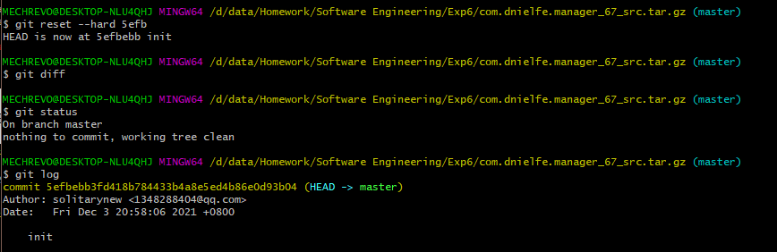

#### 3

> 根据实验三针对几个页面进行微调的任务，在本地为每个子任务创建一个分支并在各 分支上进行开发，最终将所有修改合并到 master 分支上；如有冲突请尝试解决。在报 告中展示你的操作，并使用 git log --graph 命令展示分支合并图

实验三共进行了三个部分的修改，所以创建三个分支，分别为modify-1，modify-2，modify-3

首先创建modify-1分支，同时切换到到了这个分支

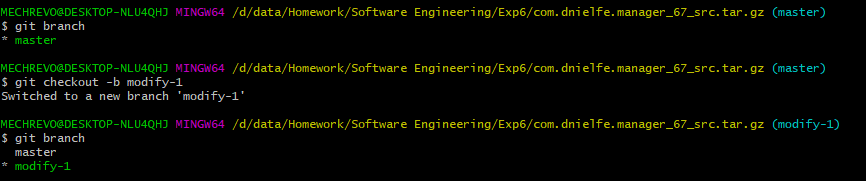

进行代码的修改，使用git status查看状态，再使用git add与git commit提交修改

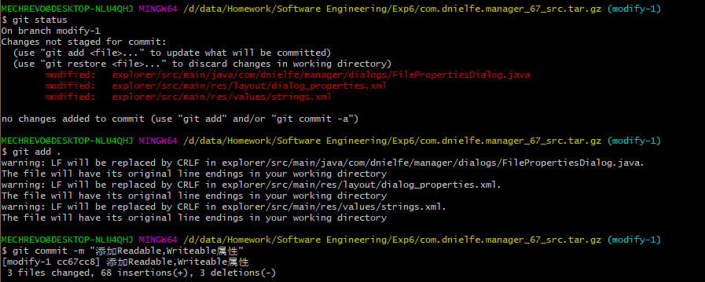

创建modify-2分支，同时切换到到了这个分支

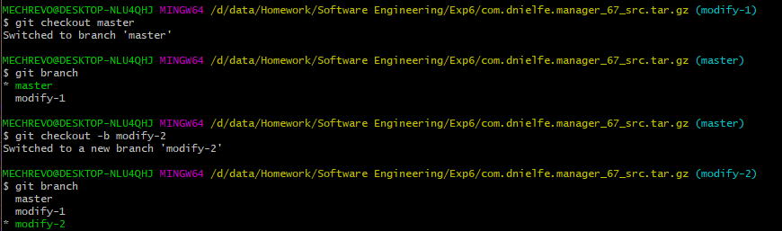

进行代码的修改，使用git status查看状态，再使用git add与git commit提交修改

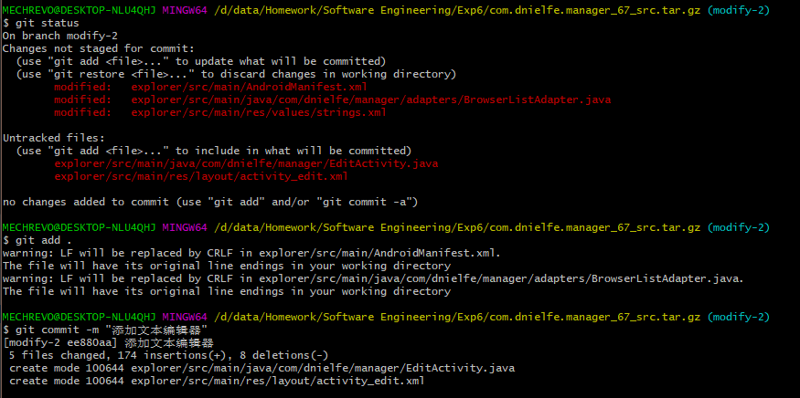

创建modify-3分支，同时切换到到了这个分支

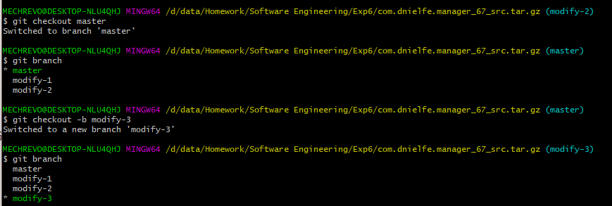

进行代码的修改，使用git status查看状态，再使用git add与git commit提交修改

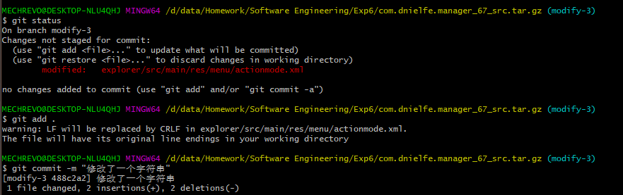

切换到master分支，并使用git log --graph查看分支合并图

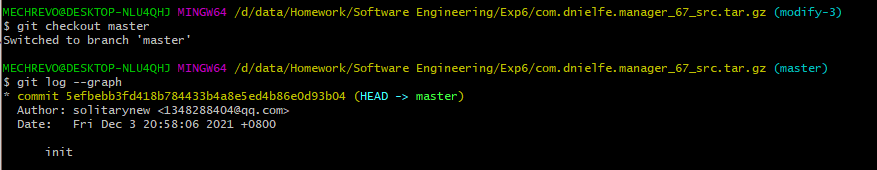

合并modify-1分支，并使用git log --graph查看分支合并图

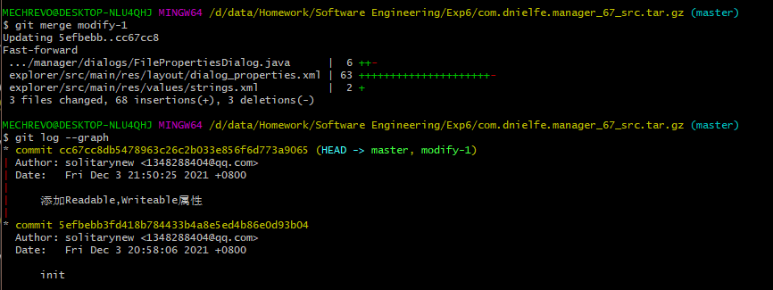

合并modify-2分支，此时遇到了冲突，并提示了冲突的文件

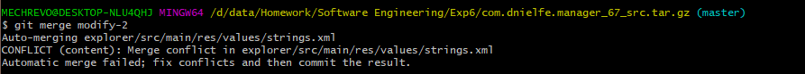

此时需要手动解决冲突，使用cat命令查看该文件，可以看到当前处于一个master|MERING的合并状态，打开该文件后，手动修改内容

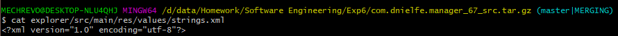

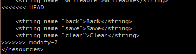

此时再使用git add，git commit提交即可完成merge，再使用git log --graph查看合并分支图

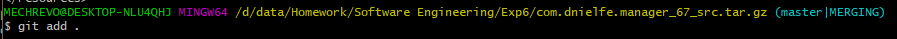

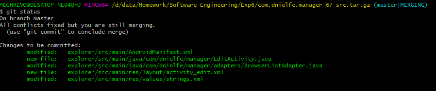

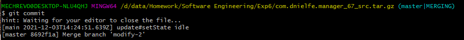

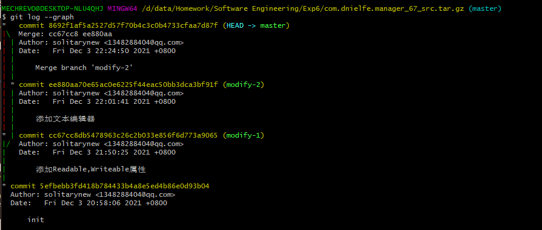

合并modify-3分支，并使用git log --graph查看分支合并图

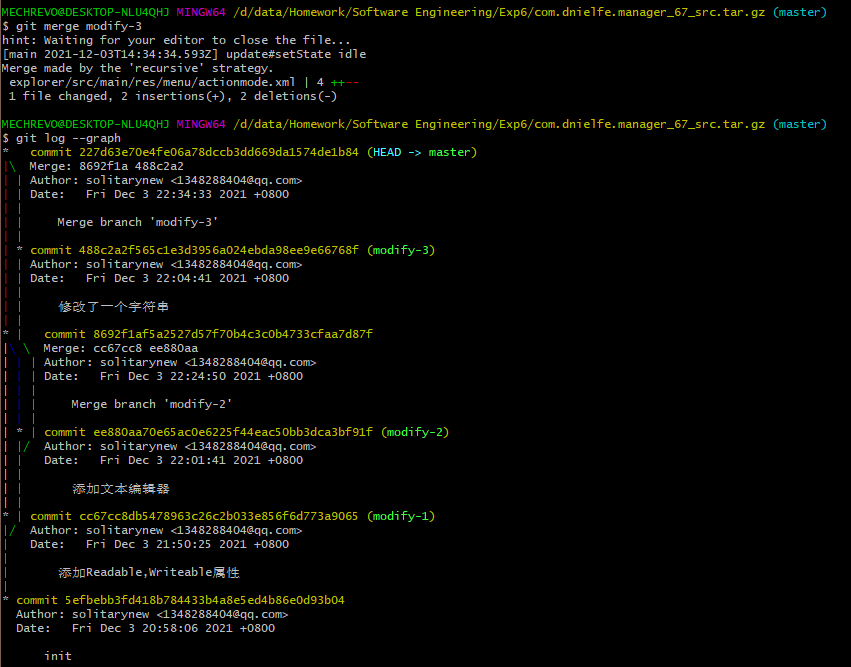

IDE中更加清楚的分支合并图如下所示

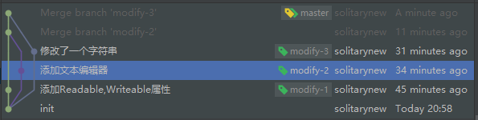

#### 4

> 给你的某个稳定版本的代码打上标签

使用git tag -a命令为当前的文档版本打上标签，并查看标签内容

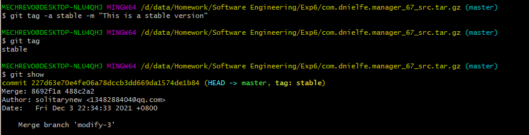

#### 5

> 注册 github 账号，在账号中创建远程仓库 (权限请设置为 public)；把本地的所有分支 和标签推送到远端

创建远程仓库与本地仓库关联在1中已经完成，在此不再赘述

推送所有分支

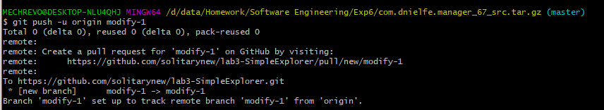

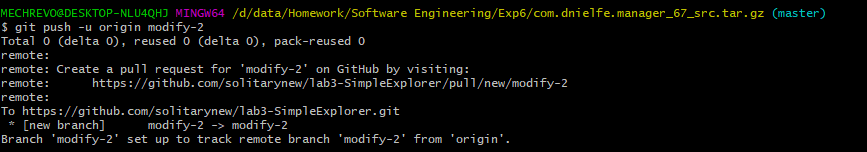

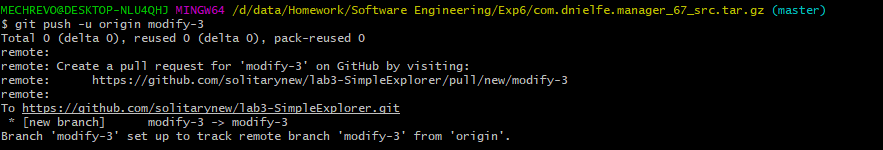

推送标签

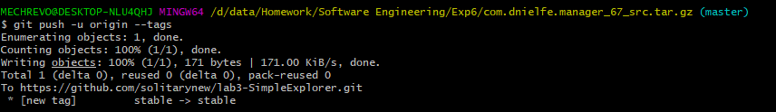

#### 6

> 使用 pull request 提交自己的代码和报告 (作业提交说明里细 )

略

#### 7

> 在报告中回答以下问题：
>
> - 使用 git 的好处？
> - 使用远程仓库 (如 github/gitee 等) 的好处？ 
> - 在开发中使用分支的好处？你在实际开发中有哪些体会和经验？

1. 使用 git 的好处？
   - 可以在本地仓库进行开发，无需始终连接到中心仓库，在离线状态下不影响开发
   - 分布式的版本库，不会像传统中心版本库一样受限于中心仓库，更加稳定安全
   - 可以自由切换分支，合并分支，速度快，性能好，易操作
   - 可以自由回退版本，添加标签，版本比对，有助于开发进程管理与操作
2. 使用远程仓库 (如 github/gitee 等) 的好处？ 
   - 在远程部署一个远程仓库，可以方便的协助多人开发进程，每个开发者将远程仓库克隆在本地，在本地进行开发后，上传至远程库，这样的开发模式很好的协同了多个程序员，提高了开发效率
   - 远程仓库相当于是本地仓库的一个备份，在本地仓库收到影响的时候可以从远程仓库恢复
3. 在开发中使用分支的好处？你在实际开发中有哪些体会和经验？
   - 每个开发者将远程仓库克隆到本地后，可以在master主分支的基础上新建新的分支，在新的分支上开发，开发结束后合并到主分支后，在上传到远程仓库中，这样不会污染主分支，又完成了开发任务
   - 每个功能独立出各自的分支，可以互不影响的完成不同功能的开发，类似的fix修复bug的分支也不会相互影响，提高了开发的可靠性与安全性
   - 分支本质上只是一个指针，是轻量级的，对于失败的开发分支，可以直接删除，不会造其他影响
   - 实际开发中，曾经与其他人进行过同一个项目的开发，每个人在本地使用git进行开发，可以很好的协同他人，每个人或者组内完成自己的开发任务在特定的分支，再由管理员统一合并部署，很好的提高了开发效率，减少了协同代码的操作

#### 8

> 如果你额外学习并实践了关于 git/github 的其他进阶操作 (如 merge 和 rebase 的区 别、reset 和 revert 的区别、stash, cherry-pick 的使用等)，可在报告中展示

1. merge 和 rebase 的区别

   merge操作在前面已经使用，在此不再赘述

   rebase操作时，新建一个test_rebase分支，分别在master分支与test_rebase分支上做出修改，并提交修改，如下图所示

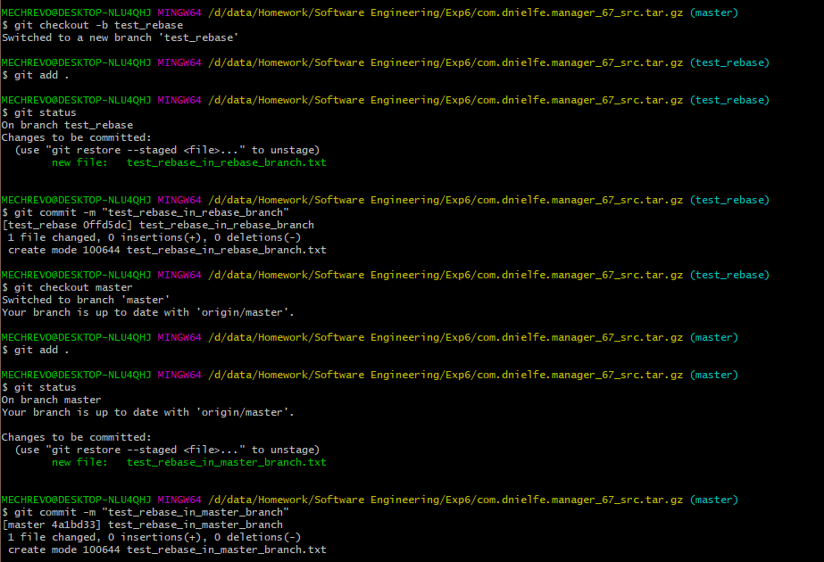

此时的分支合并图如下所示：

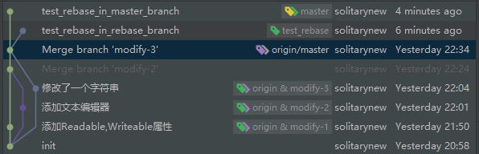

此时执行rebase操作

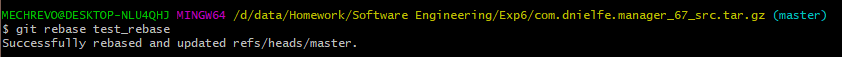

可以看到分支合并图如下所示：

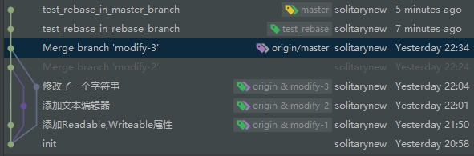

两个新建文件均出现在maste分支上

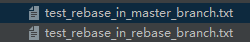

由此可以看出merge与rebase的区别：

- merge合并是会创建新的commit：Merge branch，不同的分支间出现交叉
- 而rebase意为变基，合并时会寻找分支的共同祖先commit，将其中被合并分支的部分移动到合并分支顶端，不会创建新的commit

2. reset 和 revert 的区别

   reset操作在前面已经使用，在此不再赘述，共有三种方式回退：

   - --soft 回退时保留源码，仅仅回退 commit，修改的文件仍然保存在暂存区,再次提交时只需要 git commit
   - --mixed（默认）回退时保留源码，回退 commit 同时修改的文件会置于 工作区，再次提交时需要 git add
   - --hard 回退时清除提交的源码（危险操作），源码和commit 都会回滚到某个版本

   revert的操作如下，现在想使得master分支回退到test_rebase_in_rebase_branch的commit处

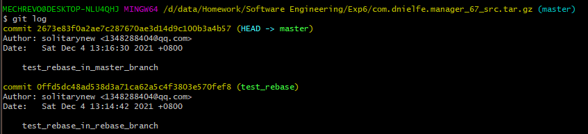

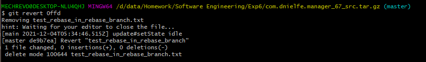

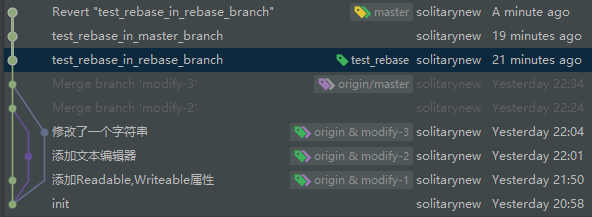

可以看到，出现了新的commit为Revert的commit，同时master分支处于该处

他们之间的区别在于：reset操作直接改变分支的指向，而revert分支恢复到某个commit，但是新建了commit与原来的commit内容相同，不会使得commit丢失，较为安全

3. stash的使用

   git stash会把所有未提交的修改（包括暂存的和非暂存的）都保存起来，用于后续恢复当前工作目录。
   
   首先新建test_stash.txt文件，添加文件到git，使用git status查看状态，使用git stash后再次查看状态可以看到工作目录没有更改
   
   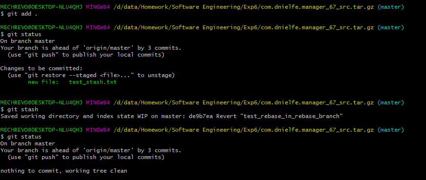

使用git stash pop可以恢复stash

4.  cherry-pick的使用

git cherry-pick可以理解为”挑拣”提交，它会获取某一个分支的单笔提交，并作为一个新的提交引入到你当前分支上。

新建test_cherry-pick分支，在该分支上进行两次提交

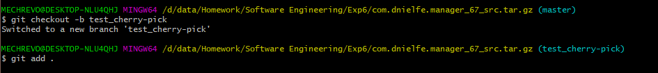

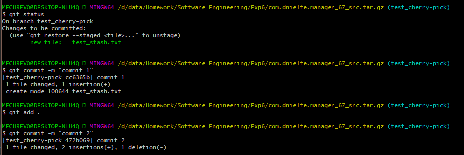

切换到master分支，cherry-pick操作目标为test_cherry-pick分支的第一次提交

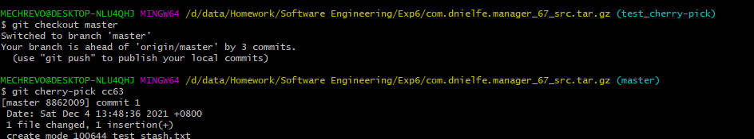

可以看到分支合并图如下所示：

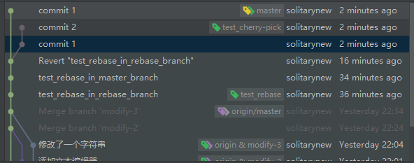

在master主分支创建了一个新的分支与commit提交一样

### Jenkins

使用docker下载了Jenkins镜像

运行jenkins镜像

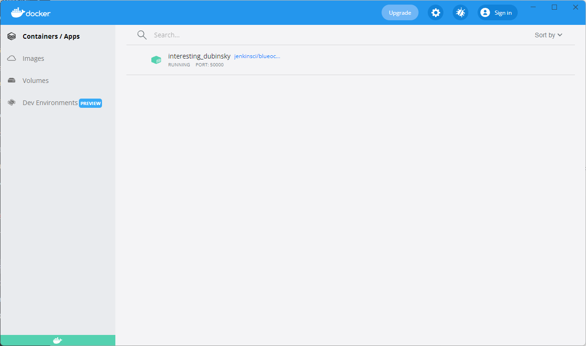

新建任务lab6

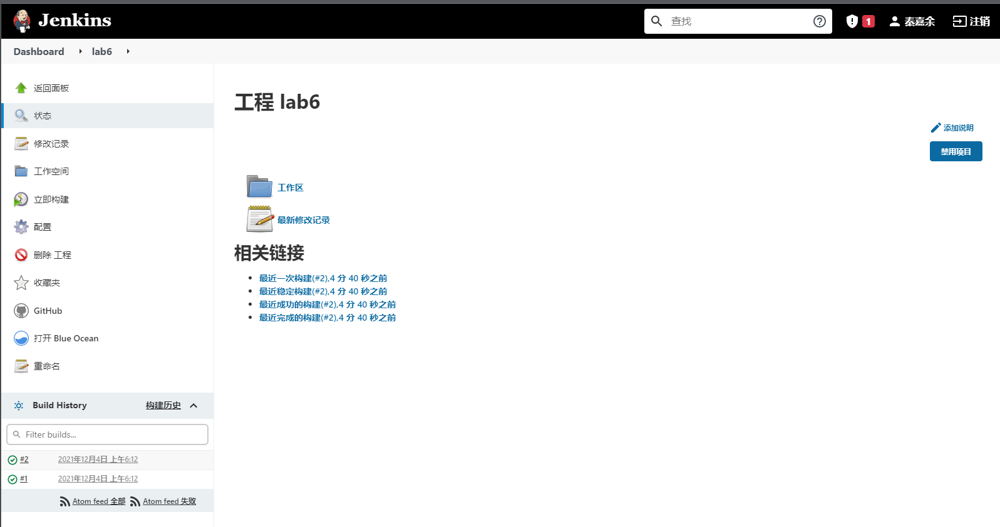

对lab6进行第一次构建

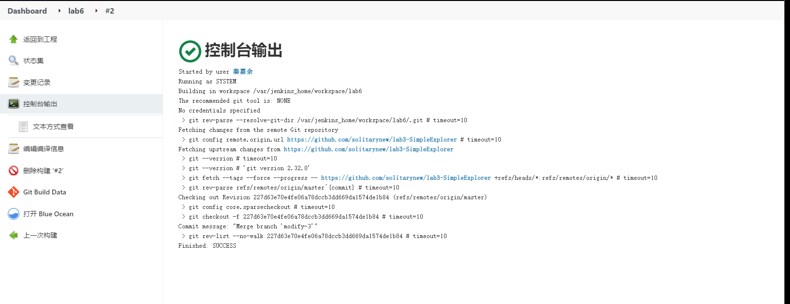

pus新的commit后，再次构建

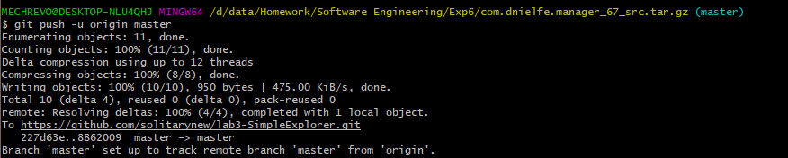

## 六、感想与分析

本次实验熟悉了git使用，拓展了对于git各个指令使用方法的知识，包括reset，revert，merge，rebase等相近指令的区别，cherry-pick，stash等指令的用法，通过本次实验，很大程度提升了对于git的掌握程度，受益颇深。同时，尝试了Jenkins的使用，了解了工程上构建软件的流程的构建方式。

