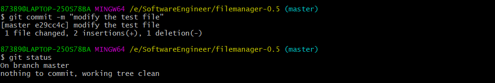
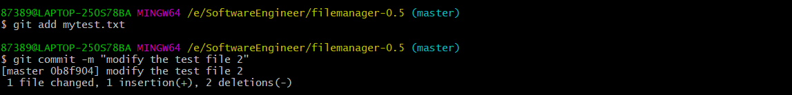
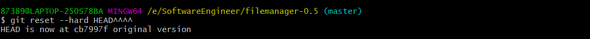
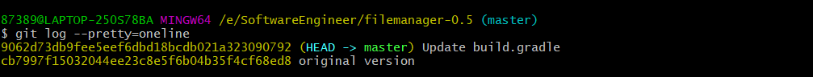
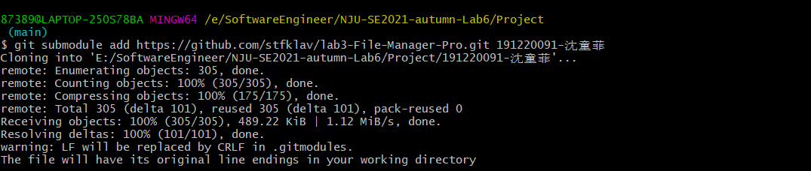

# Lab6 Report

## 一、Git的操作学习

#### 1. 建立本地git仓库

我的开源项目为2号app：`File Manager Pro`，目录在`E:\SoftwareEngineer\filemanager-0.5`下，通过`git init`命令把这个目录变成Git可以管理的仓库（空的仓库）：


可见当前目录下多了一个`.git`的目录，来跟踪管理版本库。

使用命令`git add .`将该文件夹下的文件添加进仓库，并用` git commit -m "original version"`将未经修改的原始版本提交至仓库


#### 2. git操作的练习

> 把文件添加到版本库

在当前目录（`E:\SoftwareEngineer\filemanager-0.5`）下创建文件`mytest.txt`，文件内容如下：

```
Git is a version control system.
Git is free software.
I use Git to manage my experimental project called 'filemanager-0.5'.

```

用命令`git add mytest.txt`把该文件添加到仓库，再用命令`git commit -m "wrote a test file"`把文件提交到仓库，截图展示如下：


> 修改文件

将文件`mytest.txt`的内容修改如下：

```
Git is a distributed version control system.
Git is free software.
I'm studying software engineering.
I use Git to manage my experimental project called 'filemanager-0.5'.

```

运行`git status`命令查看结果，得到结果：


这表示`readme.txt`被修改过了，但还没有准备提交的修改。

用`git diff`命令查看文件具体被修改的内容：


将修改后的文件提交至仓库：

用命令`git add `把文件添加到仓库，执行`git commit`之前，先运行`git status`看看当前仓库的状态：


发现将要被提交的修改包括`mytest.txt`，符合预期。

用命令`git commi`把文件提交到仓库，再运行`git status`看当前仓库的状态：



说明当前没有需要提交的修改，且工作目录是干净的。


> 版本回退

再次修改`mytest.txt`的内容并进行提交，修改后内容如下：

```
Git is a distributed version control system.
Git is free software distributed under the GPL.
I use Git to manage my experimental project called 'filemanager-0.5'.

```



现在，`mytest.txt`文件一共有3个版本被提交到Git仓库里，加上最开始提交的开源项目的最初版本，共提交了4个版本：

版本1：`original version`

版本2：`wrote a test file`

版本3：`modify the test file`

版本4：`modify the test file 2`

用`git log`命令查看历史记录：


用`git log --pretty=oneline`查看更加简洁：


该命令显示了从最近到最远的提交日志，可以看到4次提交。

现在，使用`git reset`命令把当前版本`modify the test file 2`回退到上一个版本`modify the test file`，并且`mytest.txt`的内容也被还原：


再用`git log --pretty=oneline`查看版本历史记录：


若现在想回到最新版本`modify the test file 2`，就要通过它的`commit id`；

用命令`git reflog`查看以前的每一次命令，找到相应版本的`commit id`后用命令`git reset`回到该版本：


> 删除文件

要删除版本库中的`mytest.txt`，先用命令`rm mytest.txt`删除工作区中的该文件：


用`git status`可以查看到删除了该文件。

用命令`git rm`删掉仓库中的文件，并且`git commit`：


用`git log --pretty=oneline`查看历史记录：


## 二、实验三的开发

先用`git reset --hard HEAD^^^^`回退到该项目未经修改的原始版本`original version`：



对`build.gradle`进行部分修改使项目可以添加Activity，向仓库中添加一个提交`Update build.gradle`



**将实现三分为三个分支，先分别在三个分支上进行各自的修改，再合并。**

用命令`git checkout -b `创建三个新的分支`revise_1`，`revise_2`，`revise_3`

用`git branch`查看当前所有分支：


1. `revise_1`分支

   `revise_1`分支修改的是选中文件后的操作界面，修改完后进行了提交：

   

2. `revise_2`分支

   `revise_2`分支修改的是选中文件后的操作界面，修改完后进行了提交：

   

3. `revise_3`分支

   `revise_3`分支修改的是选中文件后的操作界面，修改完后进行了提交：

   

   给`revise_3`最后一次提交打上标签`v1.0`：

   

4. 分支合并

   将`revise_1`分支合并至`master`分支，之后删除`revise_1`分支：

   

   可以看到`master`分支上多了原来`revise_1`上的修改和提交：

   

   将`revise_2`分支合并至`master`分支：

   

   用`git log --graph`查看`master`的提交版本过程：

   

   将`revise_3`分支合并至`master`分支：

   

   用`git log --graph`查看`master`的提交版本过程：

   

   

   给`master`最后一次提交打上标签`v2.0`:

   

   查看标签`v2.0`的信息：

   

​    

## 三、远程仓库的提交

在Github上创建仓库`stfklav/lab3-File-Manager-Pro`，将它和本地仓库关联：


将本地的三个分支推送至远程仓库：


在本机进入到`Project`目录下，执行` git submodule add https://github.com/stfklav/lab3-File-Manager-Pro.git 191220091-沈童菲`：




## 四、问题

**• 使用git 的好处？**

Git是目前世界上最先进的分布式版本控制系统（没有之一），相比于集中式版本控制系统，Git的优点有：本地拥有版本库，随时进行版本后退；非常简单的建立分支；很快的分支建立切换速度；可以指定和若干不同的远端代码仓库进行交互等等。


**• 使用远程仓库(如github/gitee 等) 的好处？**

使用远程仓库可以实现团队协作开发，将远程仓库当作公共服务器，每个机器都从这个“服务器”仓库克隆一份到本地，并且各自把各自的提交推送到服务器仓库里，也从服务器仓库中拉取别人的提交，使团队协作开发非常方便。

Github是提供Git仓库托管服务的网站，只要注册一个GitHub账号，就可以免费获得Git远程仓库。


**• 在开发中使用分支的好处？你在实际开发中有哪些体会和经验？**

在开发中使用分支可以使：版本迭代更加清晰；开发效率提升；利于代码review的实现，从而使整个团队开发更加规范，减少bug率。

在实验三的开发中，我将不同的小功能放给了不同分支去完成，最后将其合并到`master`分支上，这样使得分支之间互不干扰，写代码的思路清晰，不会被其他分支的错误影响。