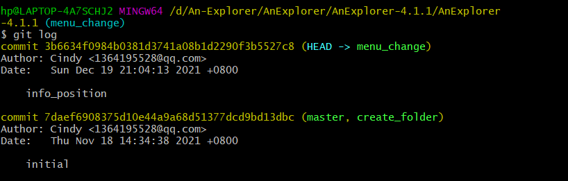
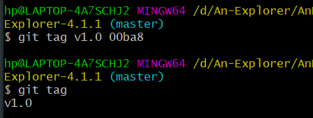
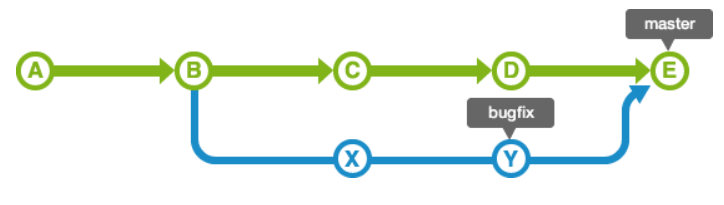

# experiment6

191220097  时欣

## 一、实验名称
软件工程实验六：项目协同开发管理与工具继承环境试验

## 二、实验目的
>1.了解协同开发与持续集成过程；  
>2.学会使用项目协同开发管理工具；  
>3.了解持续集成并使用 jenkins 自动构建项目。
## 三、实验要求
使用git对项目进行跟踪与协同开发管理。

## 四、实验环境
git bash

## 五、实验内容
>1.安装git，在本地将开源项目目录初始化为 git 仓库。    
我在本地使用git bash进行git管理，初始化应为在命令行输入“git init”，由于当时的截图没有保存，我在此处展示我远程连的仓库：      
        
>2.在本地尝试修改、提交、回退等过程，并使用 git diff, git        
log, git status 等命令展示操作前后的区别。      
>>a.修改通过git status、git diff、git log展示，即我修改了一个xml里控件的相对位置      
git status，用来查看仓库的状态，可以让我们知道当前修改文件是否被add，是否被commit，是否up to date等等。       
       
git log，用来查看和搜索提交历史，会显示每一次的提交，如下图这是修改后的log，其中3b663这一条是在commit了我的修改以后增添的一条提交记录。      
       
git diff，用来比较文件之间的不同，不加参数时比较文件在暂存区和工作区的差异。如下图可以看到我尚未暂存的文件更新了哪些部分。       
       
>>b.提交本分支修改内容通过git add，git commit完成        
git add将需要提交的代码从工作区添加到暂存区，即告诉git系统要提交哪些文件；而git commit将暂存区里的改动提交到本地的版本库，后面的-m参数用来对本次提交作简单说明的备注。      
        
>>c.回退的操作如下      
git reset用来进行版本回退，此处我在后面加上的参数为我想回退到的版本号。加上--hard是因为我需要将工作区也退回到我想要的版本，如果不加--hard只会操作暂存区。     
       
>3.根据实验三针对几个页面进行微调的任务，在本地为每个子任务创建一个分支并在各分支上进行开发，最终将所有修改合并到 master 分支上；如有冲突则解决，并在报
告中展示操作，使用 git log --graph 命令展示分支合并图。       
>>a.以下是我建立的分支     
     
> >b.合并分支（仅展示部分）      
git merge dev表示在当前分支合并dev分支，如下图我将添加的分支都合并到master分支上。    
      
>>c.分支合并图      
我的分支合并如下图，其中|表示分支前进，/表示分叉，\表示合入。可见我的分支最后都合并进了master。     
      
>4.给某个稳定版本的代码打上标签。      
tag是git版本库的一个标记，指向某个commit的指针，主要用于发布版本的管理。不同于branch对应很多个commit，它只对应某次commit，是一个不可移动的点。      
      
>5.注册 github 账号，在账号中创建远程仓库 (权限请设置为 public),并把本地的所有分支和标签推送到远端。           
>>a.把我的本地与远程库相关联的操作是git remote add origin git@github.com:Cindyxin228/lab3-AnExplorer.git（此处又忘记截图了，但在第一点中展示了我连接的远程仓库情况）     
>>b.把修改推送到远程仓库如下     
       
>6.使用 pull request 提交自己的代码和报告。     

## 六、相关问题
>1.使用 git 的好处？     
>>a.可以较方便的实现版本控制，这其中包括了开发中很重要的进行版本回退等；        
>>b.可以直接在本地实现离线工作，不需要受到集中型版本控制那样必须连接远程仓库的制约；      
>>c.对于不同分支的控制可以清楚地展示每一次提交所相关的修改内容，使得开发过程更加清晰；同时它也能避免混乱，在协同开发的初期即分开工作时候互不影响；      
>>d.管理代码成本低，不需要自己配备服务器等资源，并且部署方便。   
  
>2.使用远程仓库 (如 github/gitee 等) 的好处？ 
>>a. 可以实现多版本、多人、多设备协同开发；   
>>b.对于协同开发者而言，可以在不同的分支进行单独工作，互不影响，并且也能看到对方在远端推送的分支、进度等。在开发完以后可以对分支进行合并，此时通过提交到远程仓库，开发者都可以便捷地看到完整的代码。从而实现了成本低、十分便捷的协同开发、效率更高。    
>>c.将代码放在远程仓库上就相当于一个备份，可以有效避免数据丢失。  

>3.在开发中使用分支的好处？你在实际开发中有哪些体会和经验？  

>>a.可以对不同的功能使用不同的分支进行开发，这样开发的时候对于功能实现情况可以很好的了解清楚。比如在实验三中对不同的功能修改使用不同的分支，我能对我的修改一目了然；    
>>b.分支之间互不影响，因此如果某个分支在开发过程中发生了严重错误并不会影响到其他分支，只要删除重开分支即可，提高了开发效率；   
>>c.利用分支可以更好地实现团队合作开发，各人完成自己的分支再进行合并，提高开发效率。

## 七、git的进阶操作
ps：此处我并未在实验三的代码上进行修改，而是另建了一个简单的hello world程序做试验。        
>1.merge和rebase的区别?     
我的实际操作为，master分支中有一个文件，first分支中在master的基础上增添了一个文件，second分支在master的基础上增添了一个文件。     
>>a.首先我使用git merge，将first和second分支依次合并到master分支上。      
      
我利用git log --graph命令查看commit记录情况如下。      
      
>>b.然后我继续使用git rebase命令，此时再查看git log结果如下，把本地未push的分叉提交历史整理成了直线        
     
即之前的分叉消失了      
>>c.通过上面的例子，以及资料查阅，我了解到merge和rebase的区别，以下面的例子来说明：bugfix分支从master分支分叉出来，即       
        
>>>i)如果使用merge，且master分支未被修改过，则bugfix分支的历史记录包含master分支的所有历史记录，此时为fast-forward合并，     
图示为      
       
而如果使用merge，但在bugfix分支分叉出去后，master分支可能有新的更新，那么master分支合bugfix分支的修改会合并起来（如果有冲突需要解决），master分支的head移动到它们合并的这一次提交上。      
      
>>>ii)如果使用rebase，则查看提交历史记录是线性的，不会出现分叉等很乱的情况，       
首先，rebase bugfix分支到master分支，则bugfix的历史记录被添加到master的后面（如果X和Y移动发生冲突了则需要解决）（在我实践的例子中没有在分支上分别rebase，而是直接在master上用rebase整理了）     
      
而在解决了冲突成功移动后，整个log记录如下图，是线性的     
      
>>d.也就是说使用git merge，则合并分支代码后不会破坏原来的代码提交记录，但是会产生额外的提交记录产生分叉等，log记录比较混乱；而使用git rebase可以将对象分支的提交历史接着目标分支的记录，形成线性提交历史记录，更加直观整洁。     
>2.reset和revert的区别?      
以下分别是我使用git revert和reset的结果       
     
     
显然他们的区别是revert是“反做”某一个版本，以达到撤销该版本的修改的目的。也就是能够撤销之前的某一版本，同时又能保留该目标版本后面的版本，记录下这整个版本变动流程。而reset会将本地版本库的头指针全部重置到指定版本，也会重置暂存区。也即reset是指向原地或者向前移动指针，而revert是创建一个commit来覆盖当前的commit，指针向后移动。      
>3.stash的使用？     
       
stash用于在某个分支修改，并不想commit,而是暂存在本地。将当前的工作现场“存储”起来，便于在未来某个时间恢复到当前版本。        
我的试验为将“first.cpp”删除，然后git stash一下此时的进度。而git stash list就是我在stash内存的记录。随后我用以下的命令删除当前进度，并将我存储的进度恢复到工作区。可以看到恢复了我存储的“删除first.cpp”的进度。      
     

## 八、实验结果与结论
git几乎是当今开发中不可离开的工具，其分支、远程仓库所有的功能对开发具有重要意义和重大作用。在编程中应当养成良好的习惯，时刻用git进行备份，提高开发效率。

