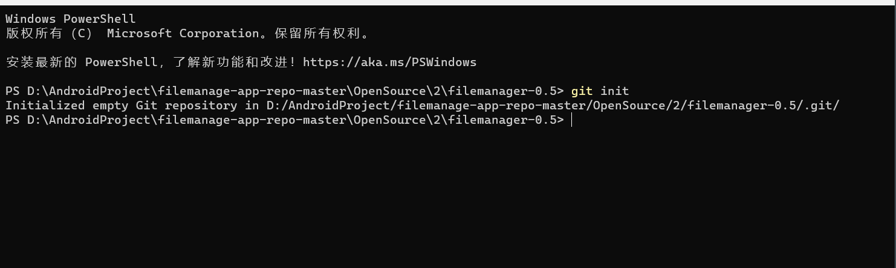
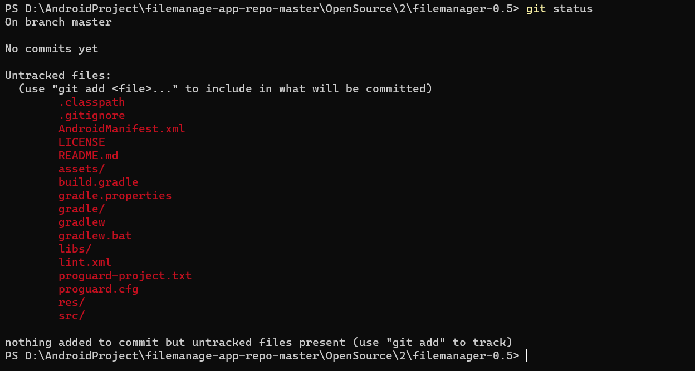
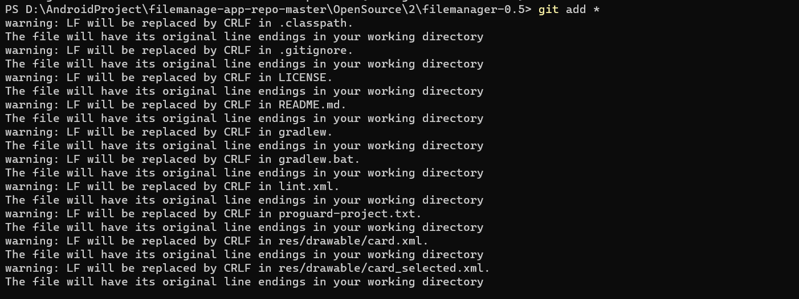
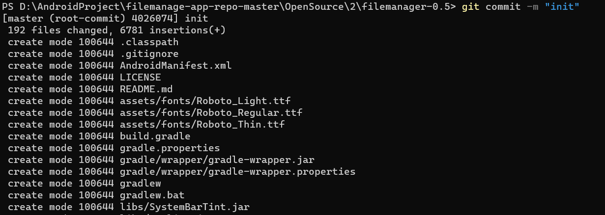
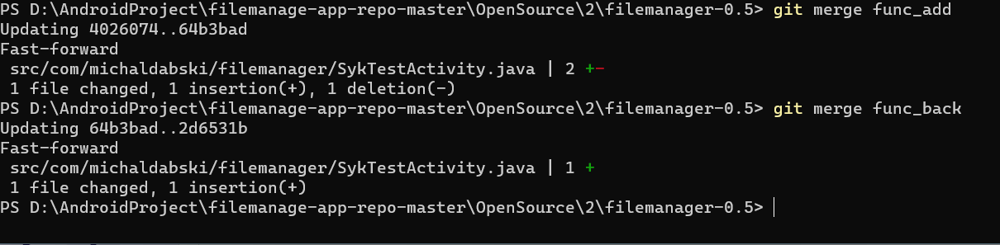
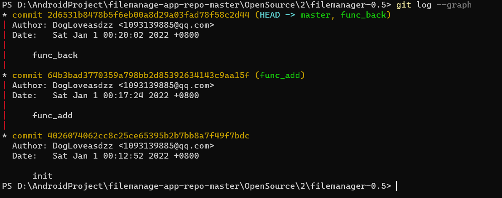
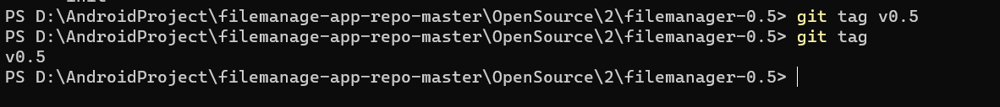

# 1. 实验过程截图
## 1. 初始化仓库

## 2. git status(commit 前)

## 3. git add

## 4. git commit

## 5. git status(commit 后)

## 6. 分支合并

## 7. 合并分支后的git log

## 8. 添加tag


# 2. 问题回答
## 1. 使用 git 的好处？
```
版本控制，便于在项目出现问题时及时回退到正确的版本，降低出错时的代价。同时git体量小，便于使用。
```

## 2. 使用远程仓库 (如 github/gitee 等) 的好处？
```
1、减少本地出错时的损失。如因为物理原因导致本地仓库损坏，项目内容全部丢失。此时git无法将失去的数据补回。但是远程仓库就像云盘一样，可以在云端备份仓库数据、进度。此时有远程仓库就能将损失降低到很小的值。
2、方便开发。仓库内容随时可以通过网络拷贝，不在需要通过物理手段将项目内容从不同的机器拷贝到其他机器。
3、便于协作、分享。远程仓库，尤其是开源的仓库，可以更为便利地分享。
```
## 3. 在开发中使用分支的好处？你在实际开发中有哪些体会和经验？
```
1、 便于多人协作开发。可以不同人负责不同分支，完成工作后合并分支
2、 便于debug。可以独立出debug分支，不影响整个项目。debug结束后合并到主分支，完成bug的修复。
3、 便于加入新功能。添加新功能时可以在新分支上完成，等测试准确后再并入主分支。
```
