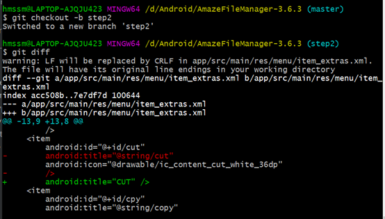
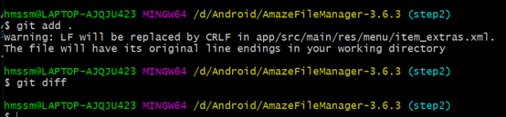
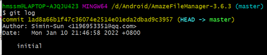
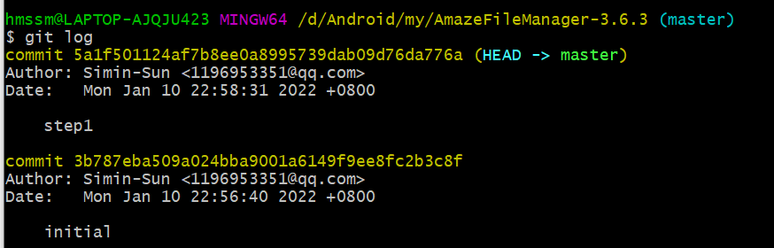
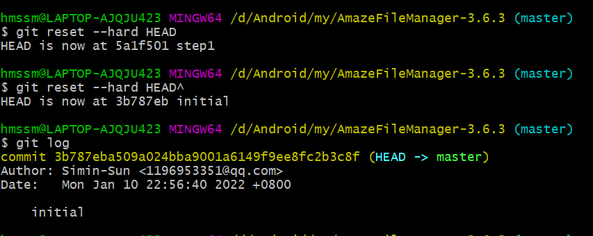
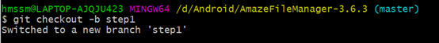
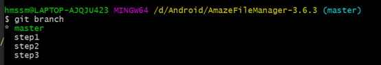
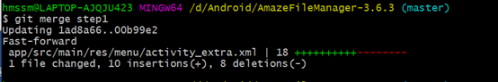
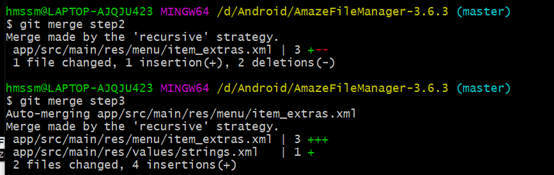
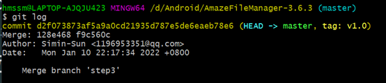

#                         实验六实验报告

### 一、git相关命令

##### 		1、修改本地代码(工作区)但未add到暂存区

​				git diff：显示已写入暂存区和已经被修改但尚未写入暂存区文件的区别

​				如图，我在step2分支上进行了修改，add前git diff可以看到具体在哪个文件进行了什么修改。add后，工作区的文件添加到暂存区，则没有区别了。

​				

​				

##### 		2、提交（commit）

​				一个commit有一个序号

​				

##### 		3、回退

​				通过git log看到现在有两个提交

​				

​				在git中HEAD表示当前版本，HEAD^为上个版本，使用reset回到上个版本后。

​				

### 二、分支与合并

##### 		1、创建分支

​				

##### 		2、查看分支

​				带星号的为主分支

​				

##### 		3、合并分支

​				合并step1时，可以看到“Fast-forward”快速合并。

​				

​				合并step2，step3时，出现“**Merge made by the 'recursive' strategy.**”，因为在本地提交后没有切换分支，直接pull代码，导致分支切换后拉取、合并出现问题，可在本地分支先执行“git rebase step”,再切换远程分支pull代码。

​				

​				

##### 		4、设置版本

​				git tag v1.0 commit序号

​				

### 三、思考题

##### 	1、使用git的好处

​			可以在本地进行代码的管理，包括版本前进后退，是一个很先进的版本控制系统。它适合分布式开发，强调个体性，可以离线工作。公共服务器的压力和数据量不会太大。任意两个开发者之间可以较容易地解决冲突。

##### 	2、使用远程仓库 (如 github/gitee 等) 的好处

​			可以实现团队协作开发，随时拉取代码和请求合并自己的代码。

##### 	3、在开发中使用分支的好处？你在实际开发中有哪些体会和经验？

​			确保每个人有自己的独立分支而不是全部在主分支上开发，全部在主分支上开发的话，隔离性差、解决冲突困难……分支开发使得版本迭代更清晰，开发效率提升，使得团队开发更加规范。