# 软件工程实验六

191220102  孙文戈

------

## 实验目的

• 了解协同开发与持续集成过程

 • 学会使用项目协同开发管理工具 git/github 

• 了解持续集成并使用 jenkins 自动构建项目

## 实验过程

#### 安装，修改，提交

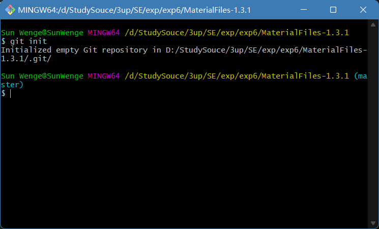

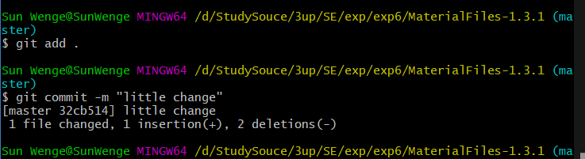

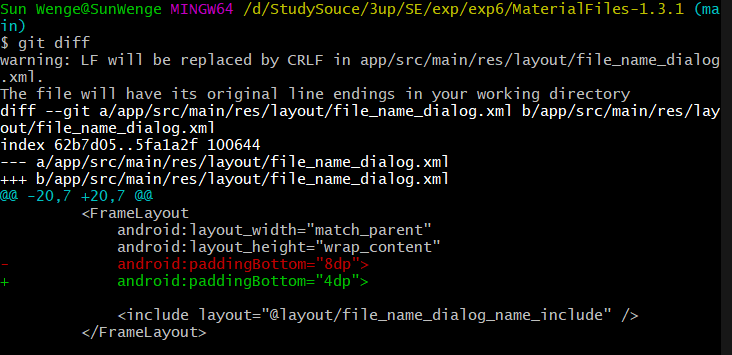

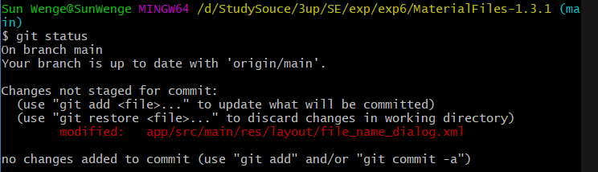

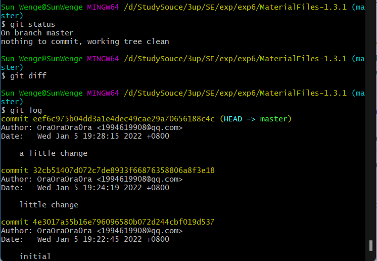

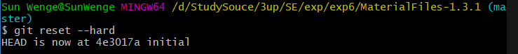

#### 创建分支，合并分支

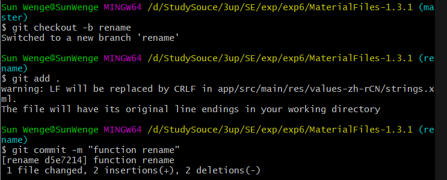

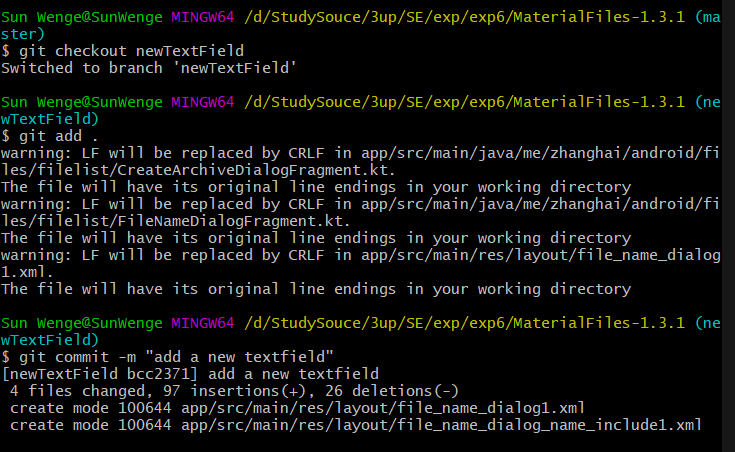

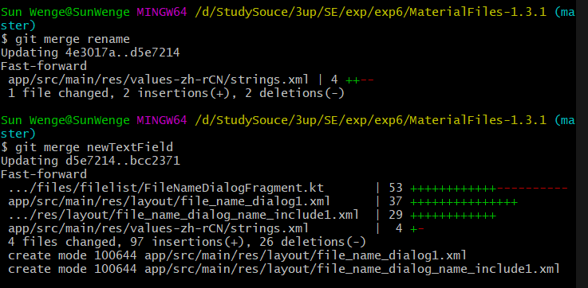

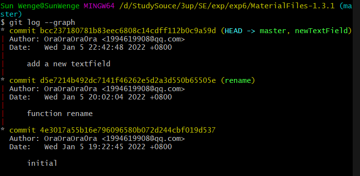

#### 标签

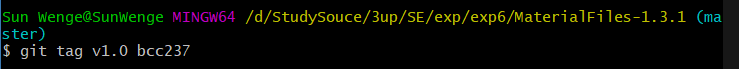

#### 推送

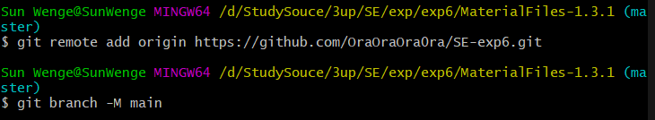

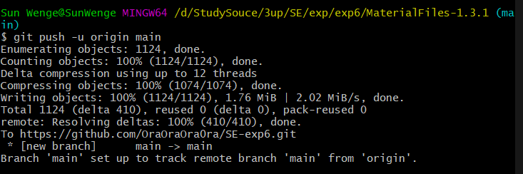

## 思考问题

#### • 使用 git 的好处？ 

- 适合分布式开发，强调个体。
- 公共服务器压力和数据量都不会太大。
- 速度快、灵活。
- 任意两个开发者之间可以很容易的解决冲突。
- 离线工作。

#### • 使用远程仓库 (如 github/gitee 等) 的好处？

- 利于团队协同开发，通过提交到远程仓库以完成成员代码的合并

- 提高了存储可靠性，在本地仓库丢失的情况下可以从远程重新拉取

####  • 在开发中使用分支的好处？你在实际开发中有哪些体会和经验？

- 版本迭代更加清晰

- 开发效率提升

- 利于代码review的实现，从而使整个团队开发更加规范，减少bug率

  在本学期的Java课程中，我使用过分支来尝试作业中给游戏增添不同的功能，切实体会到了以上的好处。