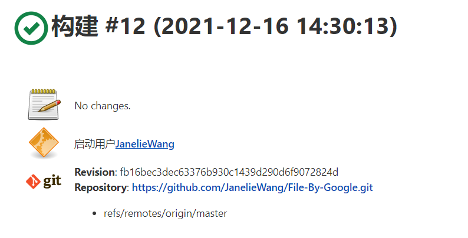

# **实验六 Git**

## **计算机科学与技术系  王靖灵  191220108**

### **版本控制**

#### **初始化**

`git init`：在目录中创建新的 Git 仓库。

如果在错误的目录下创建了Git仓库，可找到对应的目录，使用`rm -rf .git`将错误的仓库删除

#### **提交**

**git add** 将该文件添加到暂存区

`git add .`：当前目录下的所有文件到暂存区。

`git add [file1] [file2]...`：添加一个或多个文件到暂存区。

`git add [dir]`：添加指定目录到暂存区，包括子目录。

#### **检查**

`git status`：用于查看在上次提交之后是否有对文件进行再次修改。

**git diff**

比较文件的不同，即比较文件在暂存区和工作区的差异。

显示已写入暂存区和已经被修改但尚未写入暂存区文件的区别。

`git diff`：尚未缓存的改动

`git diff --cached`：查看已缓存的改动

`git diff HEAD`：查看已缓存的与未缓存的所有改动

`git diff --stat`：显示摘要而非整个 diff

**git log**

`git log`：查看提交commit history

`git log --oneline`：简化git log的默认的输出，仅仅输出commit hash 前7个字符串和commit message.

`git log --stat`：在git log 的基础上输出文件增删改的统计数据。输入q即可退出查看。

`git log -p`：控制输出每个commit具体修改的内容，输出的形式以diff的形式给出。

`git shortlog`：以作者进行分类，输出汇总信息。

`git shortlog -s`：可以用来统计每个作者的commit数量。

`git shortlog -n`：可以用来对统计的量进行倒序排列。

`git log --author`：过滤commit,限定输出给定的用户

`git log --decoreate`：用来控制log输出时，显示对应commit所属的branch和tag信息

#### **回退**

`git reset`:将当前head的内容重置，不会留log信息

### **分支管理**

#### **创建分支**

`git checkout -b branchName`：创建名为branchName的分支并转换到那个分支，作用同git branch +git checkout ，要push 后才会在远程仓库出现相应分支。

`git branch`：查看所有分支，前面带有*号的是当前分支

#### **合并分支**

`git merge branchname`：将名为branchname的分支合并到当前分支上

#### **检查结果**

`git log --graph`：展示分支合并图

#### **版本标签**

`git rev-parse HEAD`：获取当前分支的commit id.

`git tag version commit_id`：给commit id为commit_id的版本打上内容为version的标签

`git tag`：查看当前分支的标签记录

`git push origin v1.0`：将标签推送至远程仓库

### **其他命令**

#### **stash**

`git stash save "save message"` : 执行存储时，添加备注，方便查找。

虽然只有`git stash` 也可以达到上述相同的存储效果，但查找时不方便识别。因为stash是本地的，不会通过`git push`命令上传到git server上。因此，实际应用中推荐给每个stash加一个message，用于记录版本，使用`git stash save`取代`git stash`命令

`git stash list`：查看stash了哪些存储

`git stash show`：显示做了哪些改动，默认show第一个存储,如果要显示其他存贮，后面加`stash@{$num}`，比如 `git stash show stash@{1}`。`git stash show -p `:则是显示第一个存储的改动，如果想显示其他存储的改动，后面也要加上`stash@{$num}`，比如`git stash show stash@{1} -p`

`git stash apply` :应用某个存储,但不会把存储从存储列表中删除，默认使用第一个存储,即`stash@{0}`，如果要使用其他的存储，需要使用命令`git stash apply stash@{$num}` 。

`git stash pop` ：命令恢复之前缓存的工作目录，将缓存堆栈中的对应stash删除，并将对应修改应用到当前的工作目录下,默认为第一个stash,即stash@{0}，如果要应用并删除其他stash，命令：`git stash pop stash@{$num}`

`git stash drop  stash@{$num} `：丢弃编号为num的存储，从列表中删除这个存储

`git stash clear` ：删除所有缓存的stash

#### **cherry-pick**

`git cherry-pick`可以选择某一个分支中的一个或几个commit(s)来进行操作。例如，假设我们有个稳定版本的分支，叫v2.0，另外还有个开发版本的分支v3.0，不能直接把两个分支合并，这样会导致稳定版本混乱，但是又想增加一个v3.0中的功能到v2.0中，就可以使用cherry-pick了,对已经存在的commit 进行再次提交。

`git cherry-pick <commit id>`:单独合并一个提交。

`git cherry-pick -x <commit id>`：单独合并一个提交并保留原提交者信息。
`git cherry-pick <start-commit-id>..<end-commit-id>`：把start-commit-id到end-commit-id之间(不包含start-commit-id)的commits提交cherry-pick到当前分支。

`git cherry-pick <start-commit-id>^..<end-commit-id>`：把start-commit-id到end-commit-id之间(包含start-commit-id)的commits提交cherry-pick到当前分支。

### **命令比较**

#### **merge & rebase**

Merge：会保留所有commit的历史时间。每个人对代码的提交是各式各样的。尽管这些时间对于程序本身并没有任何意义。但是merge的命令初衷就是为了保留这些时间不被修改。这样也就形成了以merge时间为基准的网状历史结构。每个分支上都会继续保留各自的代码记录, 主分支上只保留merge的历史记录

Rebase：由于是线性数据结构，不会导致多个历史分支进行交织。会始终把你最新的修改放到最前头，rebase通常是发生在自己的个人branch上的。它的基础就是现有的主branch。这样做的好处就是保证每个人的代码都可以运行在当前最新的主branch的代码上。

#### **reset & revert**

Reset：reset将一个分支的末端指向另一个提交。这可以用来移除当前分支的一些提交。

Revert：Revert撤销一个提交的同时会创建一个新的提交，不会重写提交历史。

### **问题思考**

#### **1、使用git的好处**

（1）适合分布式开发，强调个体。分布式开发时，可以克隆一个本地版本，然后在本地进行操作提交，本地可以完成一个完整的版本控制，在发布时，使用git push来推送到远程即可。

（2）公共服务器压力和数据量都不会太大。

（3）速度快、灵活。git分支的本质是一个指针，分支之间可以任意切换，本地操作后可以不同步到远程。

（4）任意两个开发者之间可以很容易的解决冲突。因为可以先pull远程到本地，然后在本地合并一下分支，解决好冲突，再push到远程即可。

（5）支持离线工作，如果git服务器出现问题，也可以在本地进行切换分支的操作，等连网后再进行提交、合并等操作。

#### **2、使用远程仓库的好处**

（1）避免从个人的仓库里推送和拉取修改内容时，弄混其他人的进度。

（2）可以实现团队协作开发。

（3）对自己的工作进行备份同时，允许团队中的成员根据工作需要查看工作内容，并自行下载。

#### **3、在开发中使用分支的好处**

（1）确保每个开发者有自己的独立分支而不是全部在master分支上开发，避免了因隔离性太差而导致经常需要解决冲突。

（2）版本迭代更加清晰。

（3）开发效率提升，利于项目的更新维护，修复项目更加简单。

（4）利于代码review的实现，从而使整个团队开发更加规范，降低bug率。

#### **4、在实际开发中有哪些体会和经验**

​      git作为当前最重要的版本控制工具，大量的开源项目都采用了git作为版本控制系统，在应用层面熟练掌握git是每个软件项目开发者的必备技能。

​      作为初学者，不仅要掌握常用的git命令，还需要理解git的重要概念如暂存区、工作区、分支等等。从而对git的内部原理有进一步的理解，建立满足日常需要的git逻辑模型。

​      每一个分支都有每一个分支的功能。例如， develop: 开发内部的协调和自测分支;test: 测试分支, 提测分支;release: 发布分支, 比较稳定的分支;master: 线上分支, 稳定版本的分支。每个人又是在每个人的分支上进行开发, 这个开发的起点一定是稳定的分支, 这样增加的功能就会比较单一。 对于以后的发布和合并都会比较好处理. 如果分支的开发周期比较长, 最好经常 rebase 一下release 的代码, 避免以后合并处理的冲突较多。
对于bug的修复, 如果是自己的特性分支问题, 那么就在自己的特性分支上开发. 如果是稳定版本的修复, 一定是在对应的稳定版本进行修复. 然后经过 test 分支的回归, 合并到对应的版本上去.

在本机安装 jenkins，并在全局工具配置和系统设置中配置好 JDK 地址、Gradle 地址、
ANDROID_HOME 地址和 JAVA_HOME 地址
• 新建任务，在源码管理中填写自己项目的 github 地址，对项目进行一次构建
• 修改代码再次推送到 github 仓库中，再次对项目进行构建

#### **jenkins**

在本机上下载jenkins的war包后采用以下命令安装

成功安装后界面如下：

点击Global Tool Configuration进行全局设置

配置好 JDK 地址、Gradle 地址、ANDROID_HOME 地址和 JAVA_HOME 地址

新建任务，在源码管理中填写自己项目的 github 地址，对项目进行一次构建

修改代码再次推送到 git hub 仓库中，再次对项目进行构建。对比其控制台输出信息会有所变化

**第一次信息**

**第二次构建信息（更新Git Hub后）**

