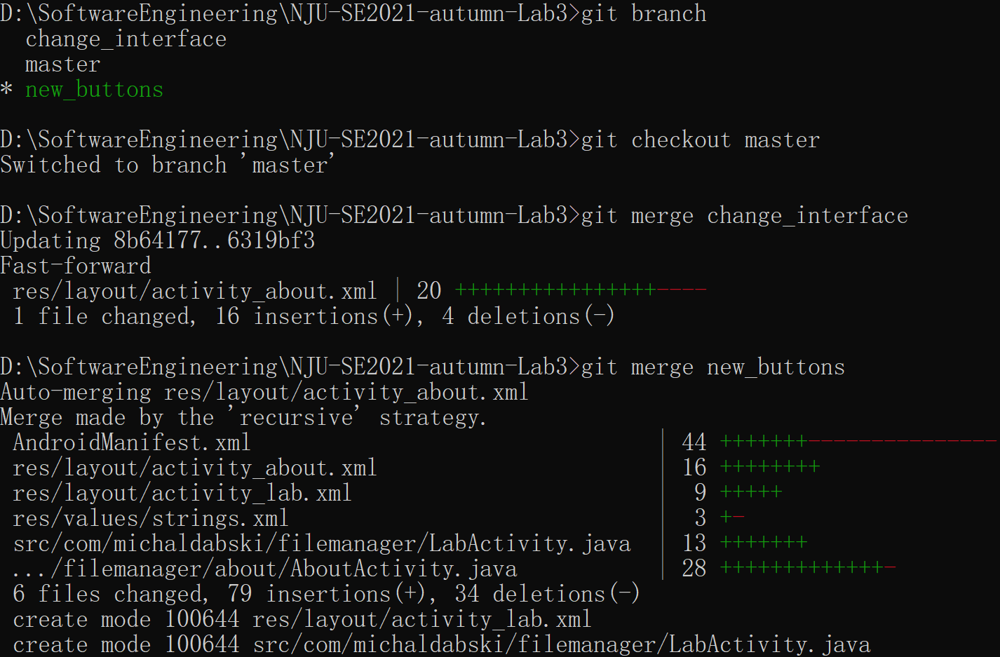
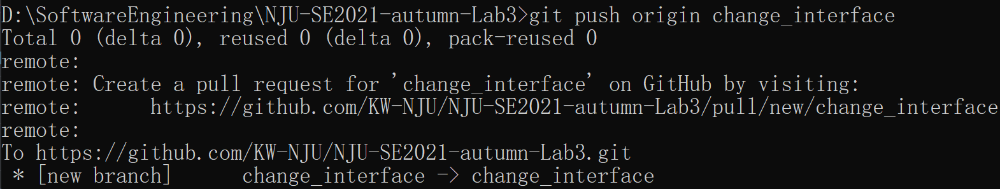
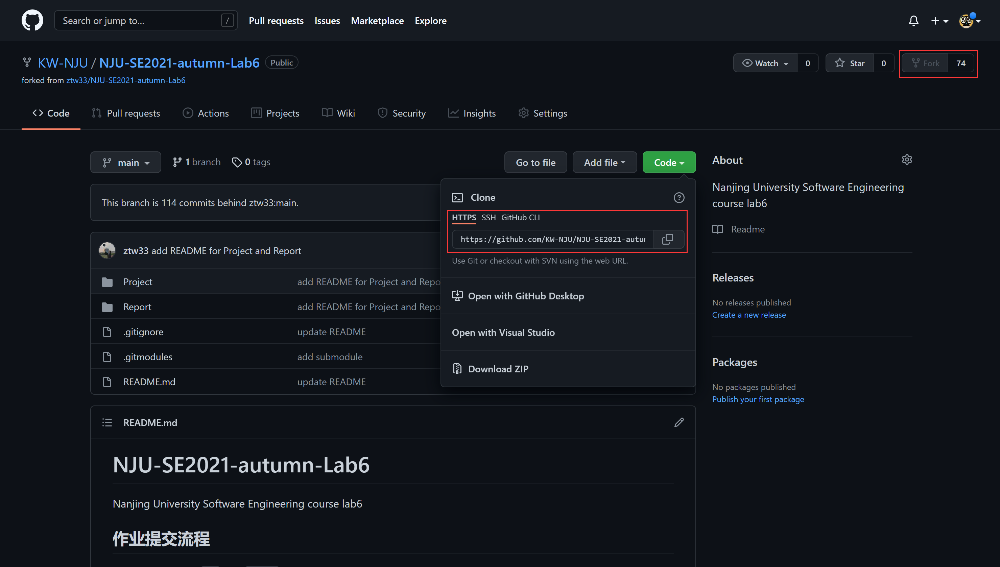

# 软件工程 Lab6 Report

## 安装 git，在本地将你的开源项目目录初始化为 git 仓库 (如已有.git 文件夹请先删除)
> 使用`git init`命令创建本地仓库，使用`git add`, `git commit`命令添加`.gitignore`文件。最后使用原始代码初始化仓库

## 在本地尝试修改、提交、回退等过程，在报告中展示你的操作，并使用 git diff, git log, git status 等命令展示操作前后的区别
> 修改`build.gradle`与`gradle-wrapper.properties`文件，分别使用`git diff`, `git log`, `git status`检测当前状态
>> 修改代码后：

>> 执行`git add .`后(git diff不再有内容):

>> 执行`git commit -m "gradle"`后（`git status`不再有内容）：

>> 执行`git reset --hard 8fcb94ddedad33962716f33de74688aadeefafa7`后（回退到上一级，`git log`记录减少了一次commit记录）

>> 观察可知：
>>> `git diff`命令主要展示git add前后代码的不同点
>>> `git log`命令主要记录每次git commit的信息
>>> `git status`命令主要记录已执行git add但正在等待commit的文件信息

## 根据实验三针对几个页面进行微调的任务，在本地为每个子任务创建一个分支并在各分支上进行开发，最终将所有修改合并到 master 分支上；如有冲突请尝试解决。在报告中展示你的操作，并使用 git log --graph 命令展示分支合并图
> 使用`git checkout -b [branch_name]`在本地创建新分支`change_interface`, `new_buttons`，使用`git branch`命令查询所有branch及当前所在branch

> 分别修改两个分支的工程代码，提交到对应分支

> 使用`git merge`命令将所有分支合并到`master`分支上

> 使用`git log --graph`命令展示分支合并图

## 给你的某个稳定版本的代码打上标签
> 使用`git tag`命令为合并后的`master`分支上的代码打上标签

## 注册 github 账号，在账号中创建远程仓库 (权限请设置为 public)；把本地的所有分支和标签推送到远端
> 创建远程仓库，将本地仓库与远程仓库关联

> 使用`git push origin [branch_name]`命令依次将`master`分支以外的分支推送到远程仓库中

> 使用`git push origin --tag`命令将上一步添加的`tag`推送到远程仓库中

> 登录github，打开远程仓库，检查分支与标签是否上传成功

## 使用 pull request 提交自己的代码和报告 (作业提交说明里细说) 
> 打开github上的远程仓库`NJU-SE2021-autumn-Lab6`，Fork至本账户，并clone到本地

> 在本机进入到`Project`目录下，执行`git submodule add https://github.com/KW-NJU/NJU-SE2021-autumn-Lab3 191220109-王珺`命令，将实验三代码克隆至工程文件夹中

> 在github上使用`pull request`提交代码及报告

## 在报告中回答以下问题：
### 使用 git 的好处？
> 便于处理在实际应用过程中遇到的一些常见问题，如将代码回退到之前版本等，避免因后续问题影响前期功能的实现

> 通过使用分支等操作，有助于更高效地管理自己的代码，便于同时开发不同功能。同时，不同模块间互不影响，有助于独立测试

> 使用git的git diff, git log, git status等操作有助于更快明晰代码修改前后的区别，以便更好理解不同分支间的逻辑关系，有助于工程模块化的实现

### 使用远程仓库 (如 github/gitee 等) 的好处？
> 远程仓库本身也具有代码管理功能，具有同git一样的代码管理功能

> 除此之外，远程仓库提供了较为稳定的网络仓库环境，可以在本地出现问题时充当备份的功能，及时恢复本地故障，避免造成更大损失

> 远程仓库有助于更好地实现团队开发，通过远程仓库，不同团队成员可以更高效便捷地实现代码分享与融合操作，有助于提高工作效率

> 远程仓库本身也是一个开源代码库，可以实现不同开发者间内容的共享，有助于促进技术交流与进步

### 在开发中使用分支的好处？你在实际开发中有哪些体会和经验？
> 使用分支有助于更好的实现代码模块化，通过引入分支，有助于实现对于不同模块功能的独立开发

> 使用分支有利于对不同功能模块进行独立测试，排除其它功能对新加入模块产生影响

> 使用分支有利于在某些独立模块出现问题时及时恢复现场，当某分支出现严重错误需要被整体放弃时，利用分支恢复现场不会对其它功能产生影响

> 使用分支有利于更好地实现团队开发，便于由不同团队成员独立开发不同模块功能，最终直接进行融合即可