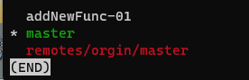
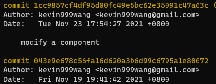
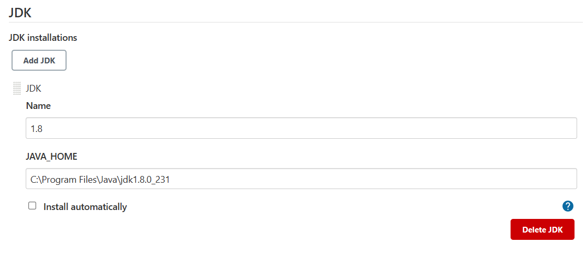

# 软件工程实验六: 项目协同开发管理与工具集成环境实验

191220111 王凯文

mailto:191220111@smail.nju.edu.cn

## 1.安装git

一开始尝试在`windows`上直接使用`git`，后考虑到使用习惯和管理的不便，遂使用`wsl1+ohmyzsh`的组合。
    
## 2.git使用

### 2.1 `git init`

当前目录下创建`git`仓库，或重新初始化，是开始使用`git`管理代码的第一步，本地分支初始默认为`master`。


### 2.2 `git remote`

对远程仓库进行操作

#### 2.2.1 `git remote add name url`
    
这条命令我比较常用，用于添加远程主机，相较`git clone`我更喜欢使用`git remote` + `git pull`

可以同时为一个本地仓库添加多个远程主机


#### 2.2.2 `git remote -v`


### 2.3 `git pull`

该命令取回远程主机某个分支的更新，再与本地的指定分支合并。

一般情况下，只需使用`git pull name branch`，该命令是获取远程分支，再与本地分支进行合并，相当于先`git fetch`，再`git merge`


### 2.4 `git branch`

#### 2.4.1 `git branch -m name`

修改当前分支的名字，有时候默认本地仓库初始化为`master`分支，而远端为`main`，我们可以修改分支名让本地远端对应分支命名保持一致，以简化后续操作。


#### 2.4.2 `git branch newBranchName`

创建新分支，也可使用`git checkout -b name`(创建新分支并切换到该分支)

想要在远端创建新分支，等同于在本地创建后推送到远端。


#### 2.4.3 `git branch -a`

该命令可以查看当前本地和远端的所有分支，并指出当前所在分支（*号指示）。





### 2.5 `git checkout`

#### 2.5.1 `git ckeckout name`

切换到该分支


实验3中我们增加一个新功能，就是先创建一个分支，如上图切换到该分支，进行常规的开发即可

#### 2.5.2 `git ckeckout -b name`

创建分支并切换到该分支


### 2.6 `git add && git commit`

`git add`作用为将修改的文件添加到暂存区，`git add .`是将当前目录下所有更改，`git add fileName`是添加某个文件或文件夹等，一般直接使用`git add .`。

`git commit`作用是提交暂存区的内容，


修改内容没有`add`前，我们可以用`git diff`和`git status`查看，会显示内容修改


修改内容`add`后，`git diff`会清空，`git status`状态发生改变

修改提交后，我们可以通过`git log`查看修改的日志，`git status`发生改变


## 3.实验三相关

实验三微调三个任务，所以创建了三个分支，分别是`addNewFunc-01`，`addNewFunc-02`，`addNewFunc-03`，前两个是修改了控件，第三个是创建了一个新控件并关联一个新页面，为了清晰地展示`git log`，每个分支只进行了少量的`commit`操作，

先换到主分支，再用`git merge`合并其他分支到主分支。

合并`addNewFunc-01`如下，没有遇到冲突，自动合并：

合并`addNewFunc-02`，因为初始分支都是由`master`的`init`创建出来，分支一作了部分修改后合并到主分支，再合并分支二时同一个文件产生了冲突，如下：


产生冲突后，在相应文件中可以看到冲突的具体位置，我们选择要接受的修改，手动解决冲突后。


使用`git status`可以查看当前的`git`状态，再做一次`git add/commit`提交即可解决冲突，完成合并。


合并`addNewFunc-03`如下，没有遇到冲突，自动合并：


`git log --graph` 命令展示分支合并图如下：

其中`*`表示一次`commit`，`|`表示分支前进，`/`表示分叉，`\`表示合入


## 4.版本打标签

对每一个更新的相对稳定的版本的`commit`，我们可以为其打上标签来标记，

```bash
## 可以使用如下命令打tag，-a会创建注释，并标明何人何时所打，-m添加注释，commit版本可以让我们对以前的版本追加标签
git tag -a <tagname> -m "message" <某个commit版本>
```

可以通过git log查看先前某个commit版本的版本号，只取其前几位可以区分即可。



之后，即可创建自己想要的tag


创建完后，我们可以通过git log查看tag。


可以使用git tag查看本地已经打的所有标签。


## 5.github远程仓库

使用github也有挺久的了（虽然可能不是很熟练），账号里新建public权限的仓库，与本地实验三建立链接后，使用git push将分支和tag都push到github仓库即可，

```bash
## 如下命令推送分支，name为远程仓库标签，branch_local是对应本地分支，branch_remote是要推送到远端的对应分支
git push name branch_local:branch_remote

## 如下命令将所有tags推送到远端
git push name --tags
```


可以在github仓库内看到，已同步。


## 6.Jenkins持续集成

近期以来，在各种代码托管平台，都能看到持续集成（CI/CD等）作为一个突出功能作为宣传，但自己因为没有使用场景，所以对其的了解很少，只是经常看到这样关键词，也大概了解到持续集成在真实场景中是团队经常使用的功能。

之前使用的最接近的场景可能就是使用github action根据分支的commit自动构建部署网站了。

1.安装Jenkins
 - 因为之前已经安装了JDK，所以直接安装Jenkins
 - 去[jenkins官方网站](jenkins.io)下载并安装windows版本即可
 - 按照安装流程设置一个自己喜欢的端口
 - 通过{127.0.0.1:port}访问Jenkins继续完成设置，
 - ANDROID_HOME 地址和 JAVA_HOME 地址在课程初始就已经设置，现设置Gradle地址
   - 先在[gradle官方网站](https://gradle.org/releases/)下载6.7.1版本（与项目版本一致）
   - 安装gradle：下载后解压到指定目录
   - 在系统环境变量中添加路径{C:\Program Files\Gradle\gradle-6.7.1\bin}
   - 重启终端中，查看gradle是否生效 

2.配置Jenkins
 - 在Jenkins网页管理面板Global Tool Configuration中设置Jdk和Gradle，还有git 
    
    
    

3.构建
 - create a job，新建任务，选择Freestyle 
 - 链接到github仓库 
 - 源代码管理中添加远程连接 
 - 添加github poll trigger（当github有push时，自动构建） 
 - 第一次手动构建，成功 

4.commit后自动构建
 - 之前更改已提交，为了演示，添加一行空行并commit 
 - 在github工程的settings中设置webhook


## 7.PR提交


## 8.回答问题

1.使用 git 的好处？
 - 

2.使用远程仓库 (如 github/gitee 等) 的好处？
 - 哪怕本地使用git记录了日志，备份了每一个版本，但仍旧不能避免本地环境崩溃可能带来的严重后果，所以将本地git推送到远程仓库，

3.

## 9.总结


自己平时也已经养成了使用git和远程仓库的习惯，但因为大多数场景下都是一个人的场景，多用于保存，备份代码，很少像实际开发那样有版本迭代，回退，合并等，使用的命令大多就那几个，所以对git的认知算不上完备，这次实验也算是拓展并稍微实践了一些更贴经工程场景的使用吧。
git发展至今，功能已经很完善了，我们可以通过-h来查看说明和参数的使用，很难将它们全部记住，要做的就是记住尽量多的常用命令，以及多实践使用，这样下一次-h之后可以很快上手。
