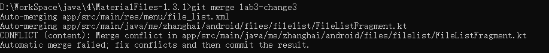
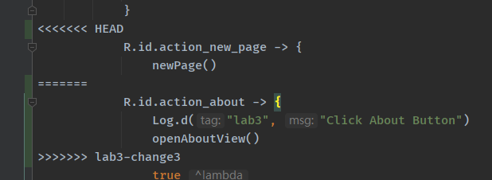
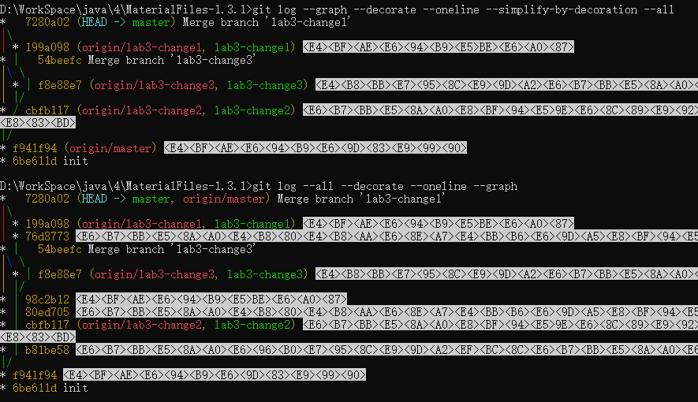
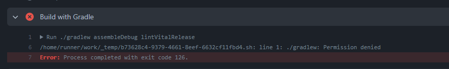

# 软件工程实验报告

## 一、实验名称

实验六 项目协同开发管理与工具集成环境实验

## 二、实验目的

+ 了解协同开发与持续集成过程
+ 学会使用项目协同开发管理工具 git/github
+ 了解持续集成并使用 jenkins 自动构建项目

## 三、实验过程

### 1. 初始化仓库

```bash
git init
```

执行以上代码将项目文件夹初始化为 git 仓库。

### 2. 创建分支

```bash
> git checkout -b lab3-change1
Switched to a new branch 'lab3-change1'
```

创建后查看分支

```bash
> git branch
* lab3-change1
  master
```

### 3. 修改部分内容并提交

#### 1) 暂存修改

```bash
git add .
```

#### 2) 提交修改

```bash
git commit -m  "添加一个控件来返回上层目录"
```

#### 3) 切换回master分支

```bash
git checkout master
```

#### 4) 用同样的方法创建另外的分支并完成功能添加

```bash
git checkout -b lab3-change2
git add .
git commit -m "..."
git checkout master
git checkout -b lab3-change3
git add .
git commit -m "..."
```

### 4. 合并分支

##### 用 merge 的方法

```bash
git checkout master
git meger lab3-change1
```

##### 用 rebase 的方法

```bash
git rebase lab3-change2
```

合并第三个分支出现冲突

```bash
> git merger lab3-change3
Auto-merging app/src/main/res/menu/file_list.xml
Auto-merging app/src/main/java/me/zhanghai/android/files/filelist/FileListFragment.kt
CONFLICT (content): Merge conflict in app/src/main/java/me/zhanghai/android/files/filelist/FileListFragment.kt
Automatic merge failed; fix conflicts and then commit the result.
```



### 5. 解决冲突

冲突内容如下



解决冲突后的内容（二者都保留）：


原因是第二个分支的修改和第三个分支的修改对同一个文件的同一部分做了修改，解决冲突后重新提交并合并

```bash
git add app/src/main/java/me/zhanghai/android/files/filelist/FileListFragment.kt
git commit -m "Merge branch 'lab3-change3'"
```

此时又修改 `lab3-change1` 分支的部分内容，重新合并该分支

```bash
git merge lab3-change1
```

最终的分支图如下（省去commit时的消息）：

```bash
> git log --all --decorate --oneline --graph
*   7280a02 (HEAD -> master, origin/master)
|\
| * 199a098 (origin/lab3-change1, lab3-change1)
| * 76d8773
* |   54beefc Merge branch 'lab3-change3'
|\ \
| * | f8e88e7 (origin/lab3-change3, lab3-change3)
| |/
* | 98c2b12
* | 80ed705
* | cbfb117 (origin/lab3-change2, lab3-change2)
* | b81be58
|/
* f941f94
* 6be611d init
```



### 6. 添加标签

```bash
git tag -a stable 7280a02
git push origin --tags
```

### 7. 自动化测试

在项目中添加以下文件并创建 github action

```yaml
# .github/workflows/android.yml
name: Android CI

on: [push]

jobs:
  build:

    runs-on: ubuntu-latest

    steps:
    - name: Check out repository
      uses: actions/checkout@v2
    - name: Set up JDK 11
      uses: actions/setup-java@v2
      with:
        distribution: 'adopt'
        java-version: '11'
    - name: Build with Gradle
      run: ./gradlew assembleDebug lintVitalRelease
```

遇到的问题



解决办法：

修改文件权限并重新提交。

参考：https://stackoverflow.com/questions/17668265/gradlew-permission-denied

## 四、总结

### 1. 使用git的好处

+ 可以方便的进行版本管理，方便开发时版本的分支、回退等操作。
+ 可以让程序员大胆的实现自己的想法而不必担心污染仓库无法回退，减少错误代码造成的损失。

### 2. 使用远程仓库的好处

+ 可以方便的实现多人合作开发、团队分支管理等。
+ 方便多设备开发，可以在公司、家庭等不同场景下通过远程仓库快速同步代码，不需要手动拷贝代码。

### 3. merge 和 rebase 的区别

merge 是合并的意思，rebase是复位基底的意思。merge会保留各个分支的所有节点信息，而rebase会将不同的分支合并成一个线性的操作。

参考 https://developer.aliyun.com/article/652579

### 4. reset与revert的区别

reset是版本回退，可以回退到之前 commit 的版本（通过修改HEAD指针），而revert是将修改的内容改回去，会创建一个新的 commit 并将HEAD指向该commit。
