# 实验六报告

> 191220116 王璇

## 一. Git基本操作

首先创建一个新的仓库演示Git操作，我将其命名为learngit

### git add 前后状态

刚开始，通过`git status`看仓库的状态

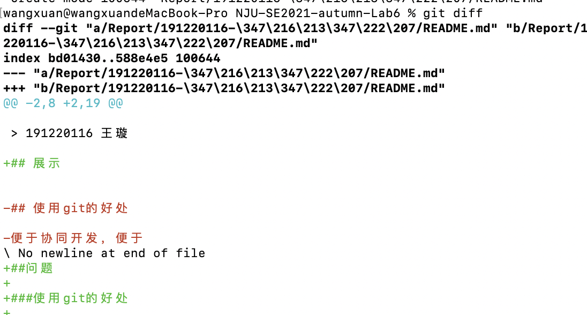

修改仓库里的文件内容，进行`git add`操作，继续看仓库的状态，此时可以发现有我们修改文件带来的变化

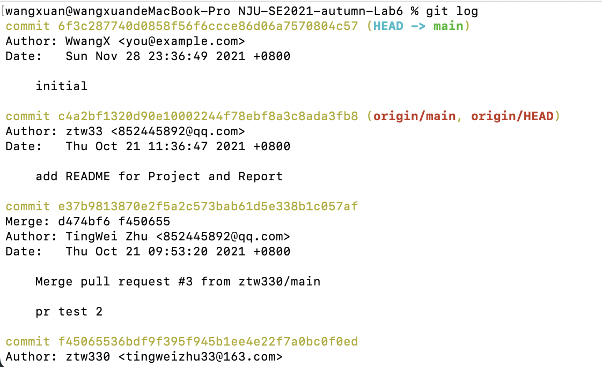

通过`git diff HEAD -- readme.txt`命令可以查看工作区和版本库里面最新版本的区别

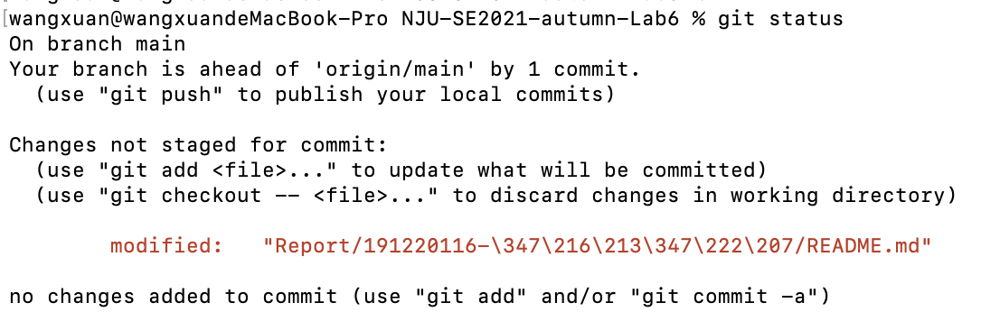

使用`git log`查看提交记录，因为我们这一阶段的操作没有涉及到提交，所以日志里的记录还是上一次提交的信息

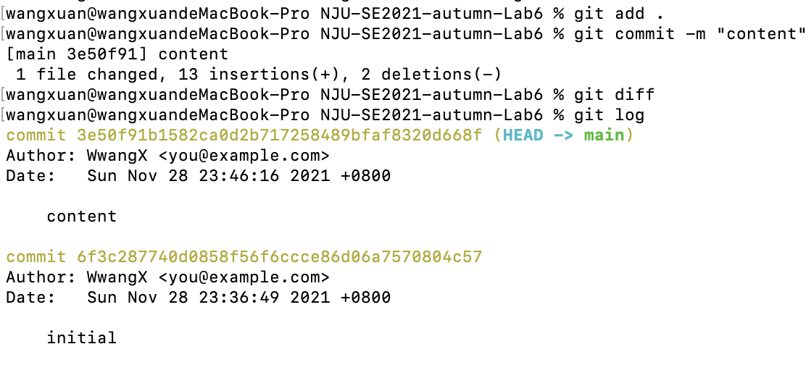

 ### git commit 前后状态

 `git add`后，我们就进行`git commit`相关操作，继续通过`git status`看仓库的状态，与之前`git add`前所示内容相同

 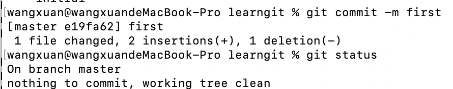

 通过`git diff HEAD -- readme.txt`命令可以查看工作区和版本库里面最新版本的区别，可以发现二者内容一致；使用`git log`查看提交记录，与我们commit信息一致

 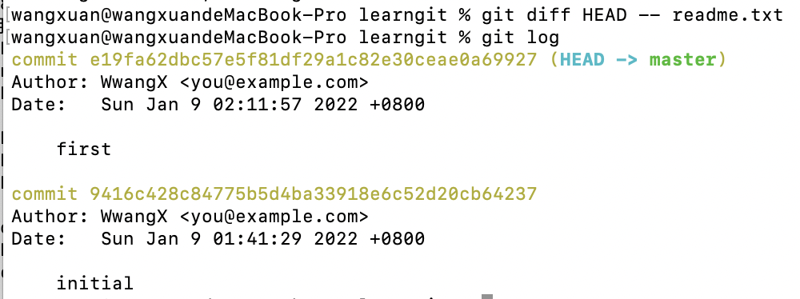

### git reset 前后状态

`git log`命令显示从最近到最远的提交日志，通过前面的信息展示，我们可以看到2次提交，如果我们准备把readme.txt回退到上一个版本，我们需要：首先，Git必须知道当前版本是哪个版本，在Git中，用HEAD表示当前版本，上一个版本就是HEAD^，上上一个版本就是HEAD^^，当然往上100个版本写100个^比较容易数不过来，所以写成HEAD~100。现在，我们要把当前版本回退到上一个版本，就可以使用git reset命令，用`git log`再看看现在版本库的状态，最新的那个版本已经看不到了。

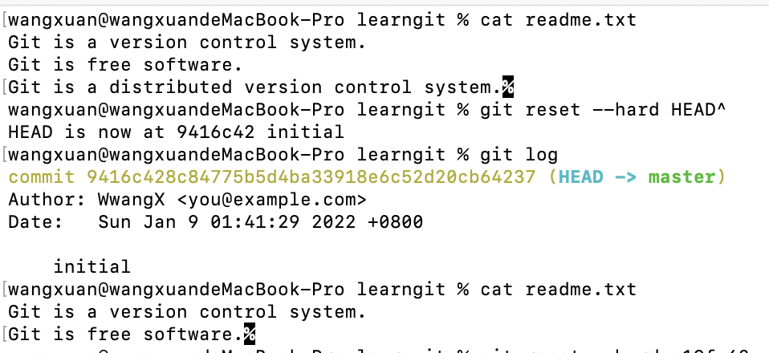

如果还想指定回到未来的某个版本，可以进行如下操作，用`git log`再看看现在版本库的状态，已经恢复原状

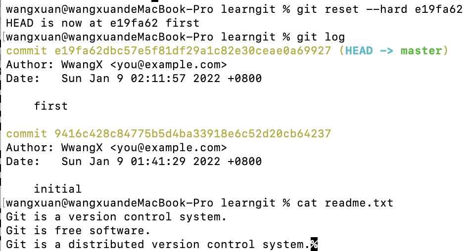

## 二. git 分支

### 创建分支

首先，我们创建dev分支，然后切换到dev分支；然后，用git branch命令查看当前分支，git branch命令会列出所有分支，当前分支前面会标一个*号。

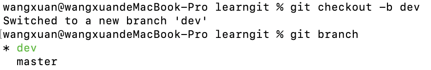

### 合并分支

然后，我们就可以在dev分支上正常提交，比如对readme.txt做个修改，加上一行内容；然后提交；现在，dev分支的工作完成，我们就可以切换回master分支；之后我们把dev分支的工作成果合并到master分支上：

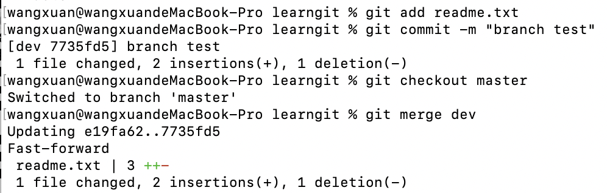

### 分支合并图

使用`git log --graph`命令展示分支合并图

## 三. git 标签

首先，切换到需要打标签的分支上；然后，敲命令`git tag <name>`就可以打一个新标签；可以用命令`git tag`查看所有标签

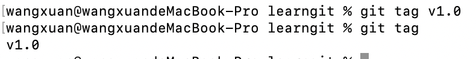

如果要对某次提交打标签，找到它对应的`commit id`，进行如下操作；可以用`git show <tagname>`查看标签信息

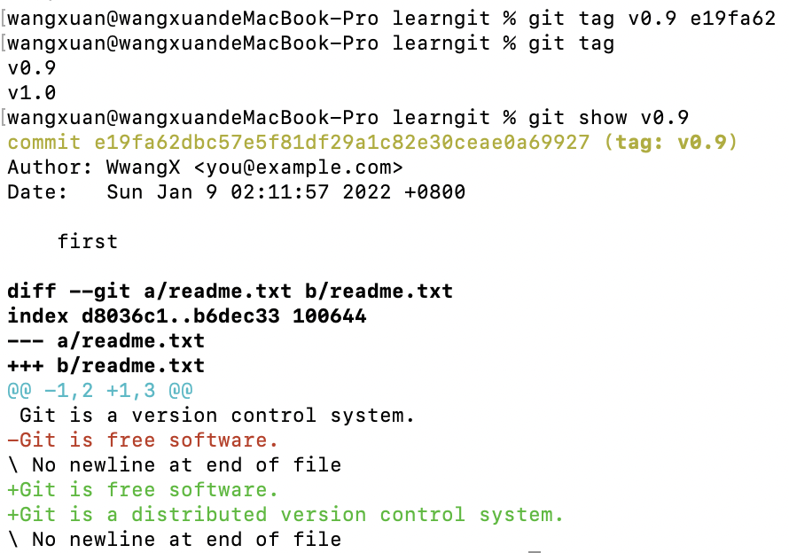

## 四. 遇到问题

问题：failed to push some refs to

解决方案：git push -u origin main

参考资料：https://stackoverflow.com/questions/24114676/git-error-failed-to-push-some-refs-to-remote

## 五. 思考题

### 使用git的好处？

1. 便于协同开发，即便于管理一个项目的多个版本及其修改记录的多版本开发、便于多人合作开发同一个项目、便于在不同设备上持续开发同一个项目，强调个体。

2. 速度快、灵活。即跟集中式版本控制系统SVN做对比，无论是在克隆clone代码还是切换分支、提交修改，这些步骤无论从逻辑机制和速度来说都有了极大的提高，为我们节省了不少宝贵的时间，而不需要SVN漫长的等待。

3. 公共服务器压力和数据量都不会太大。开发者可以提交到本地，每个开发者通过克隆（git clone），在本地机器上拷贝一个完整的Git仓库。

4. 任意两个开发者之间可以很容易的解决冲突。

5. 便于离线工作。

### 使用远程仓库 (如 github/gitee 等)的好处？

便于协同开发。作为一个分布式的版本控制系统，在Git中并不存在主库这样的概念，每一份复制出的库都可以独立使用，任何两个库之间的不一致之处都可以进行合并.用GitHub来举例，GitHub可以托管各种git库，并提供一个web界面，从另外一个项目进行分支的非常简易，为项目贡献代码也非常简单。

### 在开发中使用分支的好处？你在实际开发中有哪些体会和经验？

#### 使用分支的好处：

版本迭代更加清晰；

开发效率提升；

利于代码review的实现，从而使整个团队开发更加规范，减少bug率。

#### 我的体会和经验：

如果大家都在一个分支上开发，就会把大量时间花在解决冲突上，非常影响开发团队内部人员各自的开发；当有人优化自己负责的代码时，也可以通过分支进行独立的处理，不会影响到他人对完整代码的使用从而影响开发效率。

## 六. 附加思考题

### reset 和 revert 的区别

reset的英文原意就是重置，这里重置的是指针，就是重置head指针到指定的commit。revert的英文原意是使恢复原状，这里就是把文件内容恢复成指定commit的样子。

如果已经push到线上库，reset删除指定commit以后，git push可能导致一大堆冲突，但是revert不会。

如果在日后现有分支和历史分支需要合并的时候，reset恢复部分的代码依然会出现在历史分支里，但是revert方向提交的commit并不会出现在历史分支里。

reset是在正常的commit历史中，删除了指定的commit，这时HEAD是向后移动了。而revert是在正常的commit历史中再commit一次，只不过是反向提交，它的HEAD是一直向前的。

### merge 和 rebase 的区别

`git log`有区别，merge命令不会保留merge的分支的commit。