# 软件工程实验六报告
实验名称：项目协同开发管理与工具集成环境实验 

学号：191220117

姓名：王雪松

实验时间：2021.12.29-2022.1.9

指导教师：张天

## 一、实验名称
项目协同开发管理与工具集成环境实验
## 二、实验目的
- 了解协同开发与持续集成过程

- 学会使用项目协同开发管理工具 git/github

- 了解持续集成并使用 jenkins 自动构建项目
## 三、实验内容
1.协同开发
2.持续集成
## 四、实验过程和结果说明
1.安装git，在本地初始化git仓库，使用命令如下：

`git init` 

`git add README.md`

`git branch -M main`

然后将本地仓库与远程仓库关联

(这个过程比较随缘，需要多多尝试或者耐心等待一会)

2.在本地尝试修改、提交、回退等过程，在报告中展示相关操作，并使用 git diff, git log, git status 等命令展示操作前后的区别。

在README.md文件中添加如下一行：

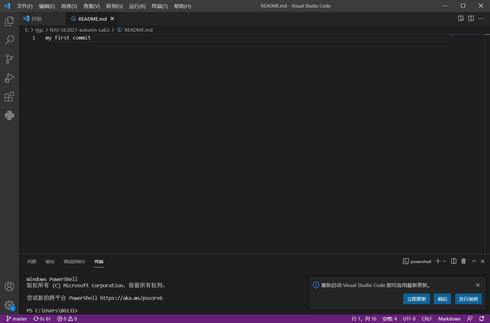

- 使用`git status`查看当前状态

可见README.md进行了改动，但是还没有进行`git add`

- 使用`git diff`查看改动之处

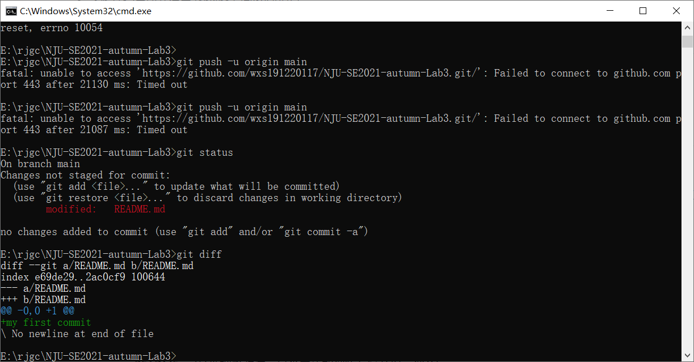

- 进行`git add`之后再使用`git status`查看当前状态

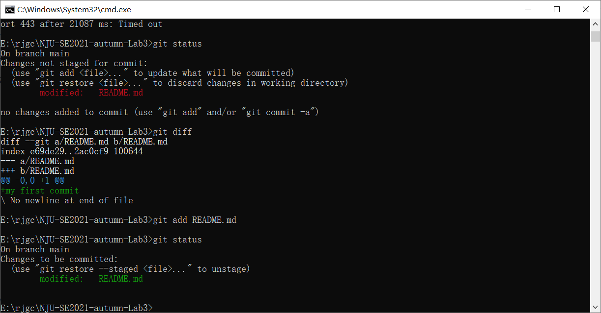

- `git commit -m`进行提交

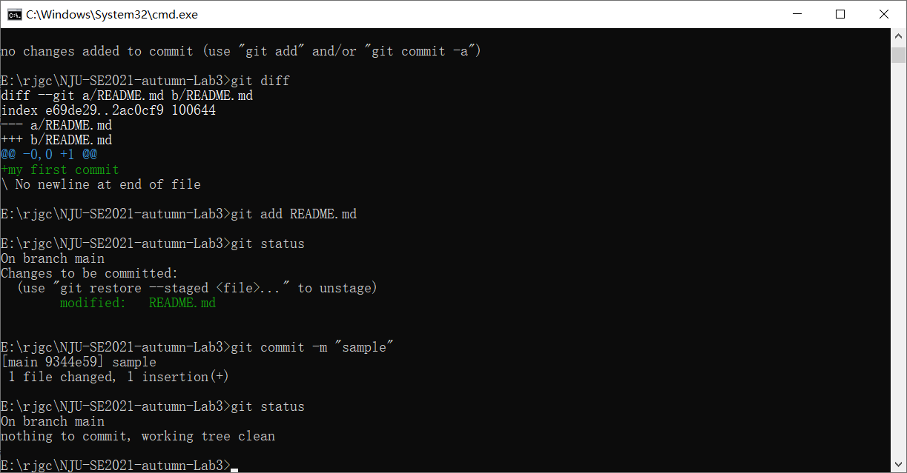

- 查看`git log`

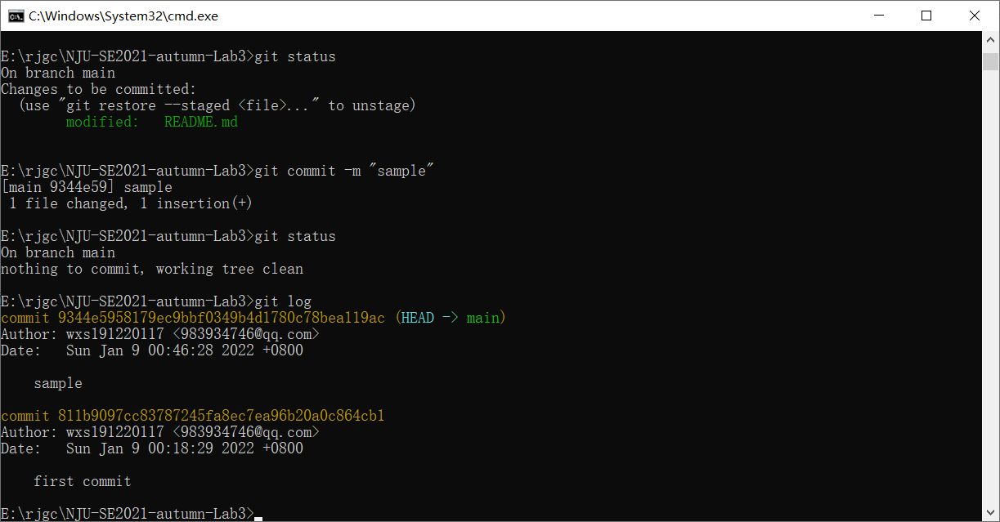

- 使用`git reset`命令进行版本回退

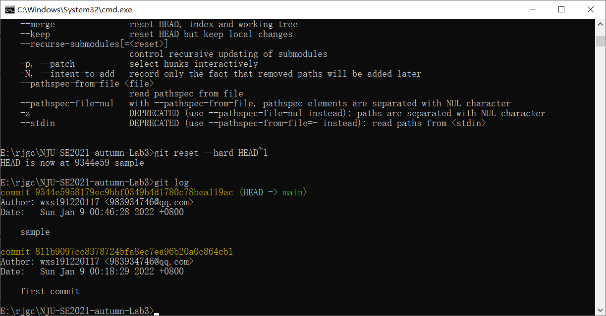

- 使用`git branch -b xxx`或者`git switch -c xxx`创建并且切换到相应分支

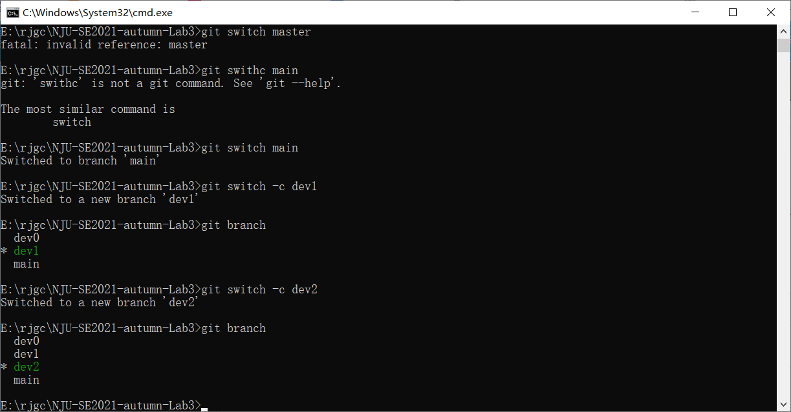

3.以上过程是`git`基本命令的演示和练习，下面我对自己的开源项目进行修改开发，并保存到各个分支中，最终对分支进行合并。
- 首先我将自己的开源项目文件夹起名为clear，先创建多个分支，名为`dev0` `dev1` `dev2`等等

- `git add clear`

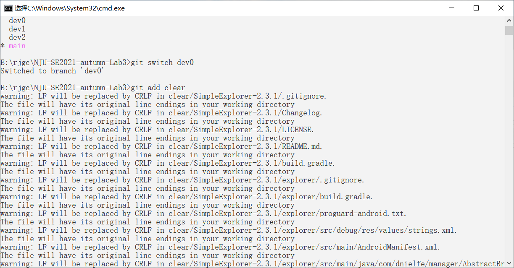

先进行`test commit`提交并push到远程仓库，测试一下关联是否成功。
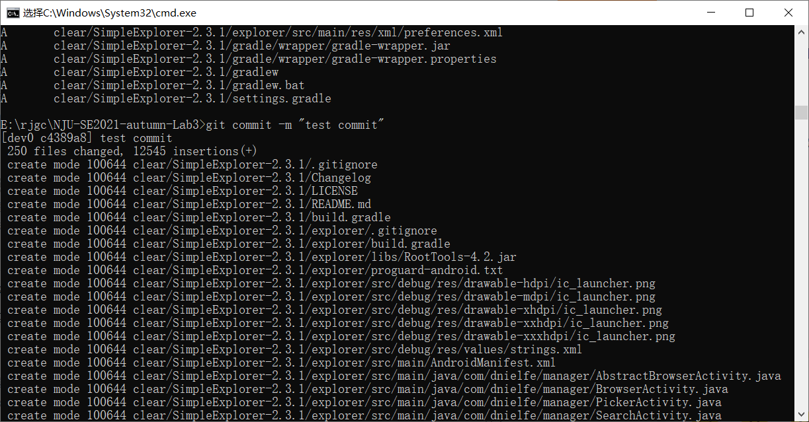

使用`git push origin dev0`命令

再登陆我的Github账号查看：
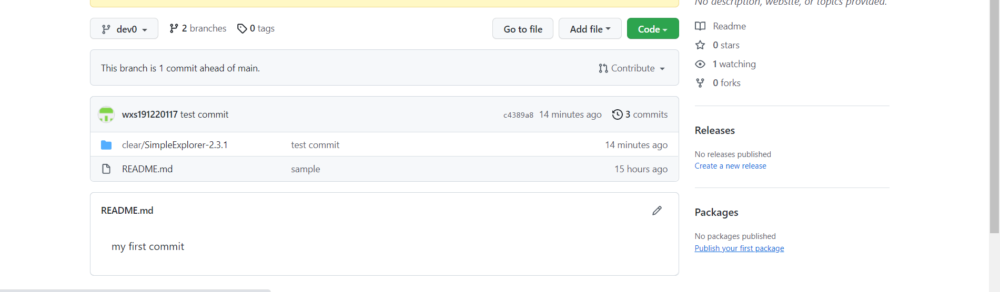
发现刚刚的操作的确push成功了，那么我便可以继续我的实验。

实验分支的总体思路是分别在dev0,dev1,dev2三个分支上面进行相应的修改，然后依次合并到dev0分支上，最后把dev0分支push上去。

- commit dev0
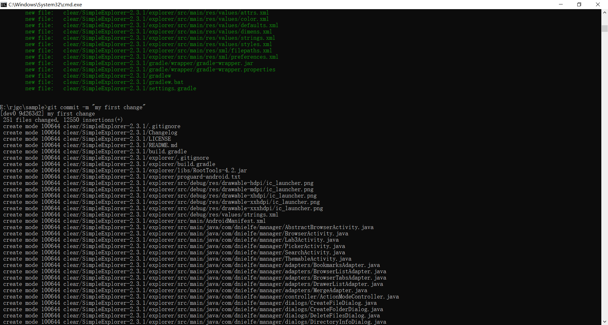
- commit dev1
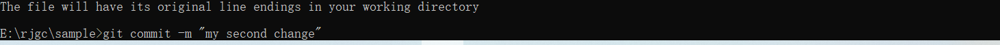
- commit dev2
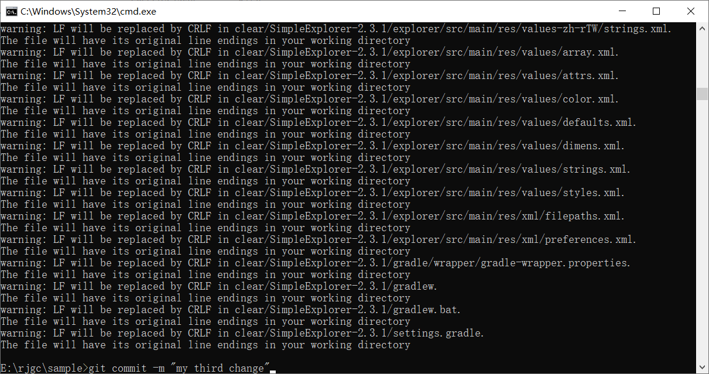
在这之后使用`git switch dev0`切换当前分支到dev0，再依次使用`git merge dev1` `git merge dev2`将这两个分支合并到dev0上，值得一提的是，在合并dev2分支的时候发生了冲突，这时我查看了廖雪峰老师的教程，进行了冲突解决，如下图所示：

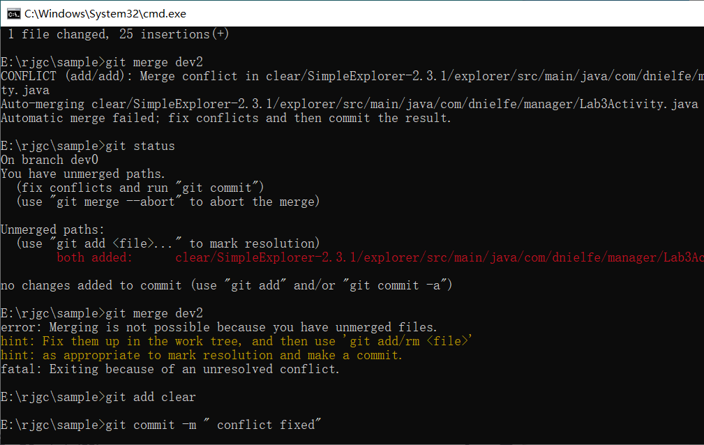
查看分支图：
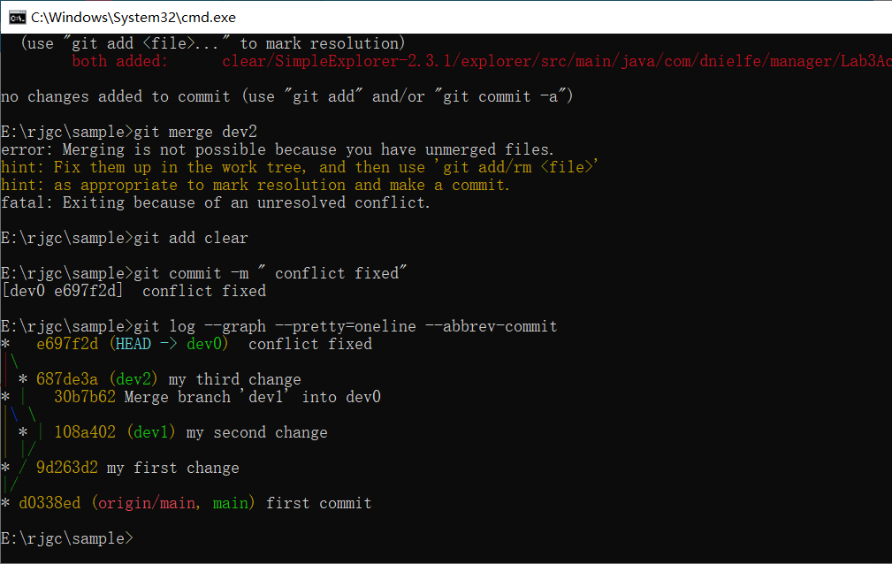
最终push之后在Github上面查看发现确实成功合并：
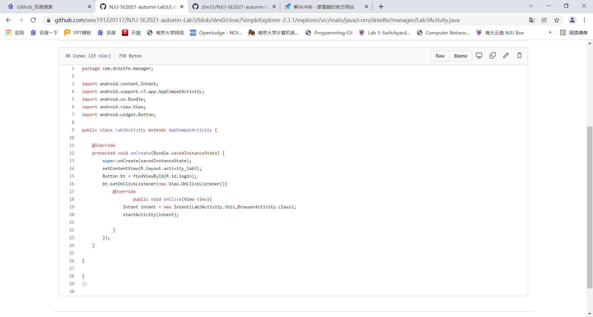
实验到此完成部分。

4.给某个稳定版本的代码打上标签
在dev0 分支下使用`git tag stable`打上标签

5.注册Github账号并连接远程仓库，这个步骤已经在之前的步骤中完成。

6.git/github其他进阶操作：

- `cherry-pick`

作用：是将指定的提交(commit)应用到其他分支；即在当前分支下使用git cherry-pick <commitHash>命令，会将指定的提交commitHash应用到当前分支，在当前分支产生一个新的提交。

实践：使用`git cherry-pick 4b45023`将提交应用到分支上，该分支上会产生一个新的提交。

- `stash`

作用：将当前工作现场“保存”起来，等以后恢复现场后继续工作。

实践：使用`git stash`保存现场后发现工作区是干净的，回到dev分支之后可以恢复现场。

- merge 和 rebase 的区别
merge的合并效果看起来就像一个新的“合并的提交”，rebase的合并效果是使得分支历史看起来像是没有经历过合并一样；

merge的结果能够体现出时间线，而rebase的结果会打乱时间线；

使用merge只需要解决一遍冲突，而使用rebase可能会需要多次解决冲突。

- reset 和 revert 的区别

1、reset是彻底回退到指定的commit版本，该commit后的所有commit都将被清除；而revert仅是撤销指定commit的修改，并不影响后续的commit。

2、reset执行后不会产生记录，revert执行后会产生记录。

- 思考题
1.使用git的好处

git是分布式的版本库，可以在自己的电脑里修改，操作，不需要依赖中心仓库。

git的多分支，版本回退，版本对比可以帮助代码的管理和修改。

2.使用远程仓库 (如 github/gitee 等) 的好处

不受限于本地硬盘，可以随时随地对工程进行开发。
团队合作更加方便，可以方便地对工程进行克隆并且在本地独立开发。
开源项目可以得到更多程序员的支持。

3.在开发中使用分支的好处？你在实际开发中有哪些体会和经验？
好处：对不同的子任务建立不同的分支进行开发实现，分支之间相互独立，在一个分支上只需要关注一个任务的实现；在项目的开发过程中，需要增加、修改或取消某个子任务时，只需要对应地建立、修改或删除一个分支，操作较为方便；最终将所有分支合并到主分支中，在此之前主分支不会被修改。

经验：在实际开发中，我们团队可以为每个功能实现创建一个分支，大家只需在小组范围内处理冲突问题，有效加速开发效率。

