# Lab6 项目协同开发管理与工具集成环境实验

## 191220121 吴光远

### 一、实验名称

项目协同开发管理与工具集成环境实验

### 二、实验内容

1. 安装git，在本地将你的开源项目目录初始化为git 仓库(如已有.git 文件夹请先删除)。
2. 在本地尝试修改、提交、回退等过程，在报告中展示你的操作，并使用git diff, git log, git status 等命令展示操作前后的区别。
3. 根据实验三针对几个页面进行微调的任务，在本地为每个子任务创建一个分支并在各分支上进行开发，最终将所有修改合并到master 分支上；如有冲突请尝试解决。在报告中展示你的操作，并使用git log --graph 命令展示分支合并图。
4. 给你的某个稳定版本的代码打上标签。
5. 注册github 账号，在账号中创建远程仓库(权限请设置为public)；把本地的所有分支和标签推送到远端。
6. 使用pull request 提交自己的代码和报告。

### 三、实验结果与说明

1. 修改、提交、回退：

   修改完输入git status查看修改的文件：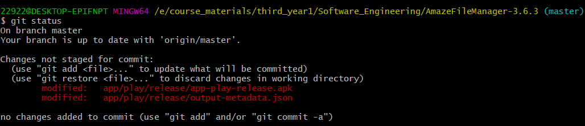

   输入git add . 后再输入git status：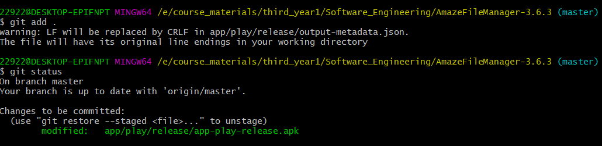

   接着输入git commit -m “xxx”，再输入git status：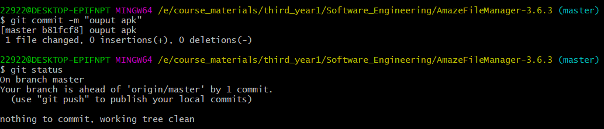

   此时输入git log: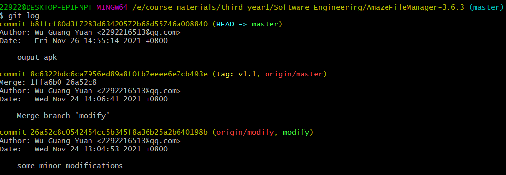

   如果想回退到上一个版本，输入git reset --hard HEAD^或者git reset --hard 8c6322即可：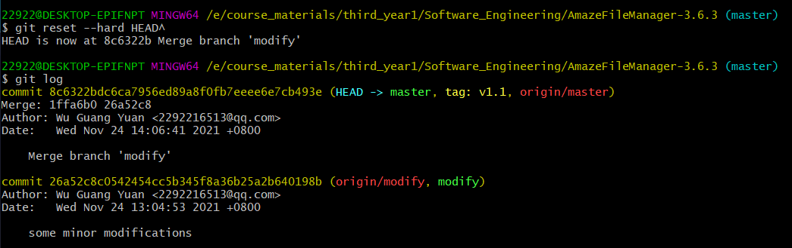

   可以看到回退到了上一个版本。

   如果此时想撤销回退，再输入git reset --hard b81fcf即可：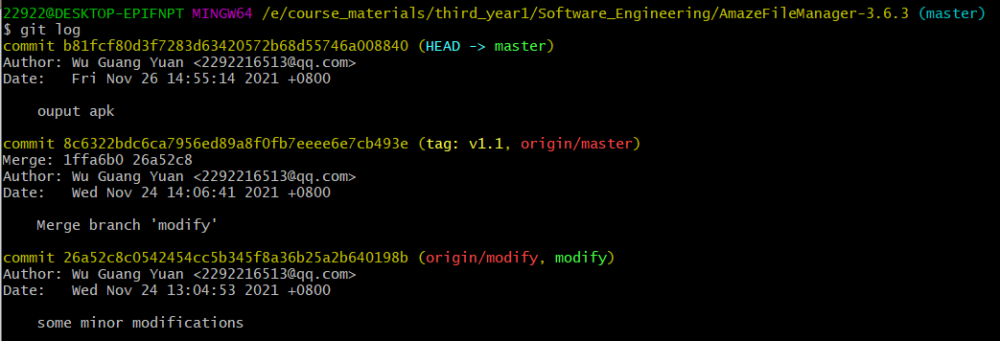

   可以看到撤回了之前的回退操作。

2. 创建分支并合并：

   使用git checkout -b 创建分支，使用git branch查看分支：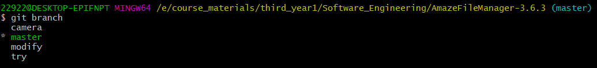

   在分支上完成修改并git add, git commit 之后使用git merge合并分支。合并分支前：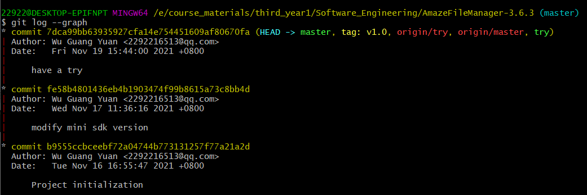

   先合并第一个分支camera：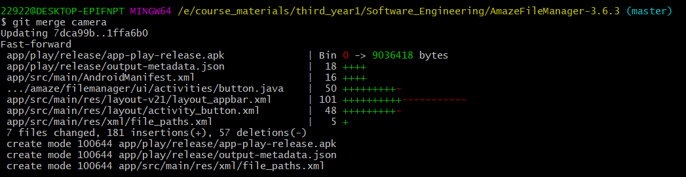

   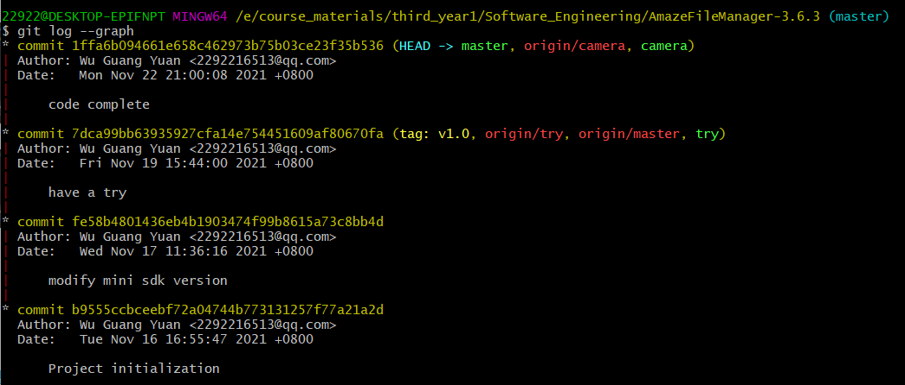

   再合并第二个分支modify：

   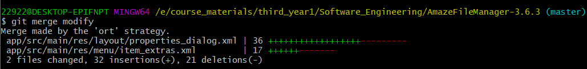

   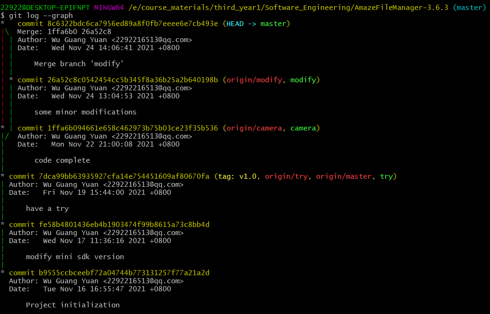

   由于两个分支修改的文件不同，没有出现冲突。

3. 打上标签：使用git tag打标签：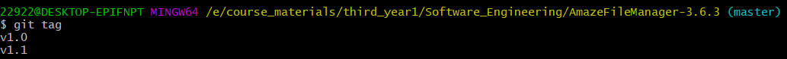

   也可以通过git log看到打标签的位置（见上上图）。

4. 使用git push和git push --tags分别将本地仓库推送到github：

   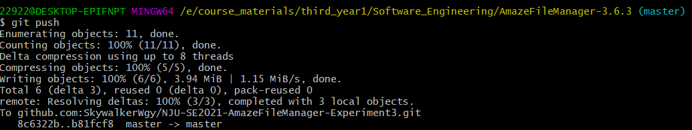

   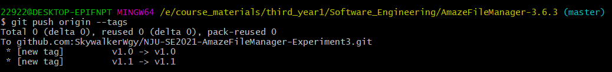

### 四、实验思考与反思

1. 使用git的好处？

   使用git可以通过简单明了的命令行语句来进行代码的管理与版本存储。我们可以通过git commit来保存一个版本，当以后修改代码出错也可以直接通过git reset回退版本，有着充足的试错空间。另外分支创建与管理也有益于多人协同开发合作。

2. 使用远程仓库（如github/giee等）的好处？

   使用远程仓库可以实现多设备开发。只要设备联网可以随时随地进行开发，而不用随身携带U盘等便携存储设备。同样也可以让分处各地的人通过网络实现协同开发。此外也起到代码备份的作用，如果本地机器因软硬件故障出现数据丢失仍然可以恢复。

3. 在开发中使用分支的好处？

   使用分支可以在不影响主版本运行的情况下进行代码的进一步开发，即是开发出现错误也可以删除分支避免影响主版本。同时也可以多人分别使用一个分支开发最后合并到主版本上实现多人协同开发。

4. 你在实际开发中有哪些体会和经验？

   要熟练记住各个命令语句，及时使用commit保存每一个可运行的版本便于后续开发出错回退。另外在加一个新功能的时候应该添加一个分支在分支上开发防止出错影响主版本。

