# 实验六报告

## 实验内容：

### 1.熟悉git

初始化仓库并首次提交，然后使用git log查看记录：

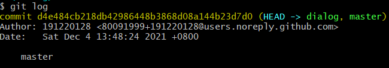

尝试修改一些文件，使用git status查看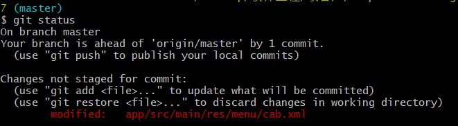

此时工作区发生了变化，使用git diff查看变化：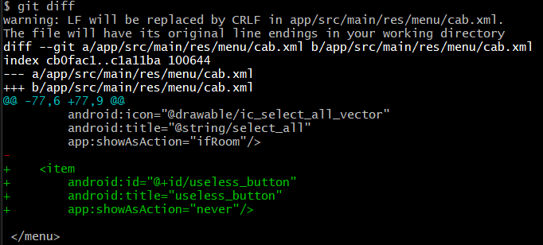

使用git add .和git commit提交

再使用git log查看提交记录：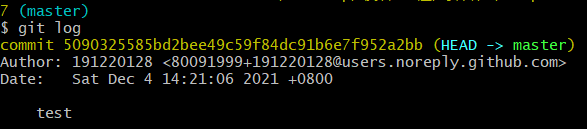

可以看到git历史已经被记录，接下来使用git reset --hard重置代码：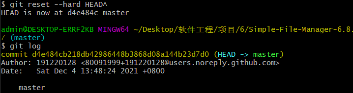

再查看git log时，发现提交记录已经清除。

### 2.实验3开发

首先创建一个分支并切换到该分支上：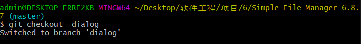

本次实验我实现了一个对话框点击的功能，再xml文件可kt文件中做了修改，然后使用git status查看：

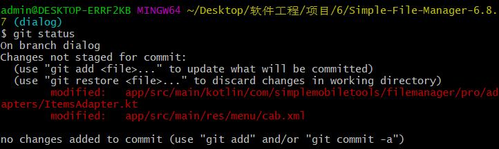

将修改commit后，切换回master分支，并将创建的dialog分支merge进来：

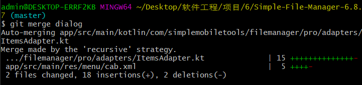

这样分支就merge成功了，本次merge操作没有产生冲突。使用git log --graph 展示分支合并图：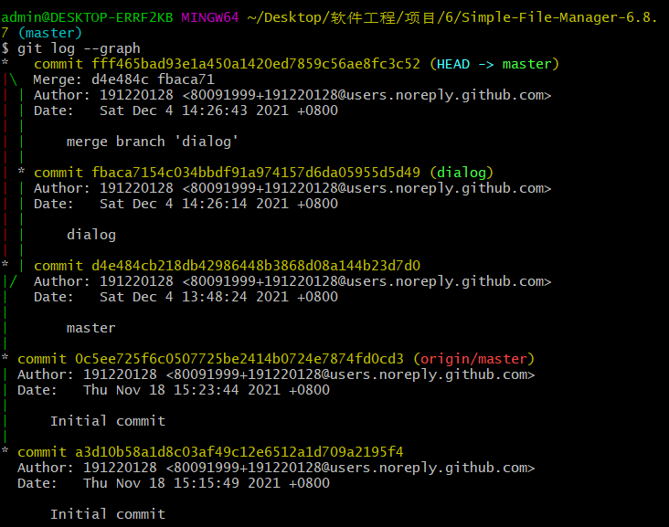

给该版本打上标签：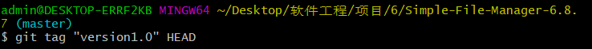

在push的时候加上tag参数即可将tag添加到github：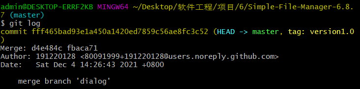

### 3.问题

##### 使用git的好处：

建立版本库，方便随时回退与修改

给项目创建分支，方便多人项目开发

##### 使用远程仓库的好处：

可以高效在线协同开发

建立数据云备份，防止数据丢失损坏

##### 在开发中使用分支的好处：

方便同一项目不同功能开发的同步进行

在实际开发中，我们团队可以为每个功能实现创建一个分支，大家只需在小组范围内处理冲突问题，有效加速开发效率

