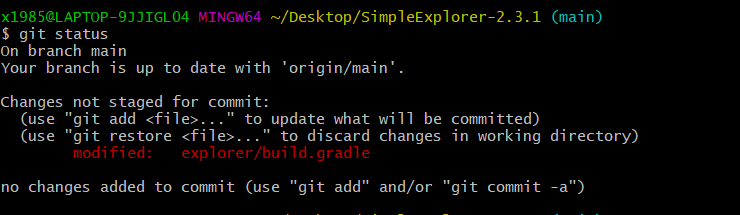
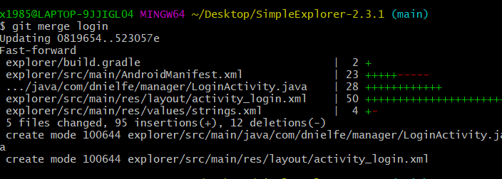

# 使用git管理项目过程
## 开发前：本地创建git仓库并与远程仓库关联
1. `git init` 将项目文件夹初始化为一个git仓库
2. `git add .` 将项目文件夹下所有的文件纳入git控制并且存储到暂存区
3. `git commit -m 'init'` 将当前暂存区内的内容提交到版本仓库
4. `git log`查看结果

5. `git remote add origin https://github.com/ComaX21/lab3-SimpleExplorer.git` 将本地git仓库与github远程仓库关联
6. `git branch -M main` 修改当前master分支名称为main
7. `git push -u origin main` 提交到远程仓库

## 开发中：
### 一. 修正编译产生的warning
1. `git status` 显示git仓库状态

3. `git diff` 显示当前工作区相对于暂存区内容的变化

4. `git add explorer/build.gradle` 将当前工作区的变化存到暂存区
5. 再次执行`git status`和`git diff`

6. `git commit -m "fix warning"` 提交暂存区的修改

### 二. 创建新分支开发新功能
1. `git branch login` 创建login分支
2. `git checkout login` 切换到login分支
3. 在login分支上开发登录功能完成后提交到login分支上
4. `git checkout main` 切换到main分支
5. `git merge login` 将login分支merge到main分支

6. `git log --graph` 查看分支树

## 开发后：
1. `git tag v1.0` 给当前版本打上标签
2. `git push` 提交到远程仓库

## 回答
### 使用 git 的好处？  
1. 版本库本地化，支持离线提交，相对独立不影响协同开发。每个开发者都拥有自己的版本控制库，在自己的版本库上可以任意的执行提交代码、创建分支等行为。例如，开发者认为自己提交的代码有问题？没关系，因为版本库是自己的，回滚历史、反复提交、归并分支并不会影响到其他开发者。
2. 更少的“仓库污染”。git对于每个工程只会产生一个.git目录，这个工程所有的版本控制信息都在这个目录中，不会像SVN那样在每个目录下都产生.svn目录。
3. 把内容按元数据方式存储，完整克隆版本库。所有版本信息位于.git目录中，它是处于你的机器上的一个克隆版的版本库，它拥有中心版本库上所有的东西，例如标签、分支、版本记录等。
4. 支持快速切换分支方便合并，比较合并性能好。在同一目录下即可切换不同的分支，方便合并，且合并文件速度比SVN快。
5. 分布式版本库，无单点故障，内容完整性好。内容存储使用的是SHA-1哈希算法。这能确保代码内容的完整性，确保在遇到磁盘故障和网络问题时降低对版本库的破坏。
### 使用远程仓库 (如 github/gitee 等) 的好处？  
便于多人协同开发同一个项目

### 在开发中使用分支的好处？你在实际开发中有哪些体会和经验？  
1. 版本迭代更加清晰
2. 开发效率提升
3. 利于代码review的实现，从而使整个团队开发更加规范，减少bug率