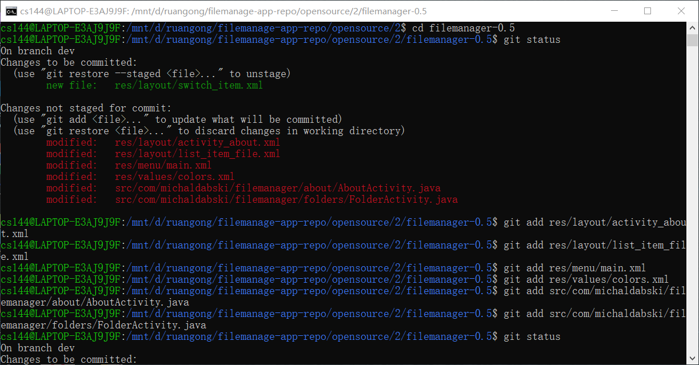
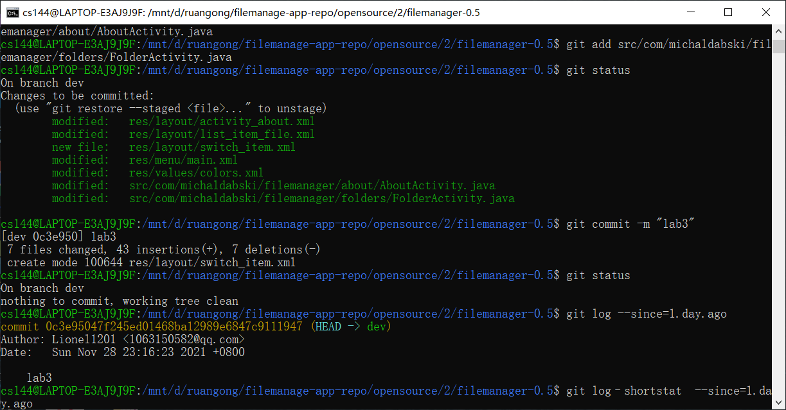
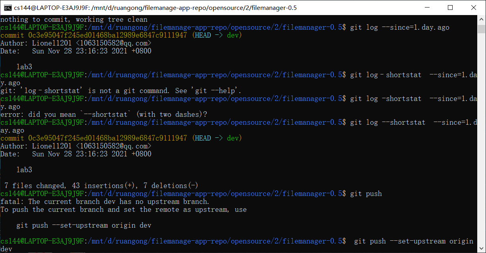
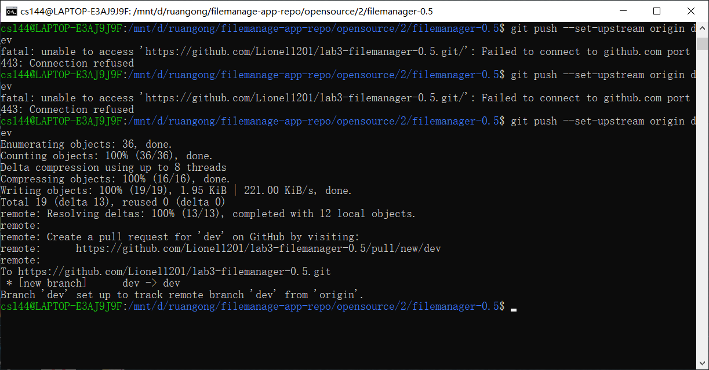

### 软件工程实验6报告

#### git的使用

`git init`  初始化仓库

`git add`  将文件添加到暂存区

`git status`  查看仓库当前状态，是否有更改的文件

这张图中显示当前在分支dev上，并且有文件修改过，还没有更新，然后使用git add将文件添加到暂存区

`git commit` 提交暂存区到本地仓库

这里将文件git add后，再使用git status，显示修改的文件已经在暂存区了。

然后将文件git commit，再使用git status，显示文件都已经在本地仓库了

`git log` 查看历史提交记录

这里显示了提交的人，日期，还有修改的内容

`git push` 上传远程代码并合并

这里显示上传成功

#### 回答问题

##### 使用git的好处

1.可以及时保存自己的代码，可以记录自己代码的修改。

2.可以创建不同的分支，在不同的分支上实现自己想要的功能然后合并，并且保证有一份源代码不会被  	修改

##### 使用远程仓库的好处

1.将代码托管在远程仓库，即使自己的本地出了问题，比如代码丢失了，也有远程仓库里的代码兜底

2.远程仓库方便让开发者可以远程办公，在远程仓库上一起进行代码的保存和修改

##### 在开发中使用分支好处？你在实际开发中有哪些体会和经验？

1.使用分支可以保留一份源代码，防止修改过程中丢失最初的版本

2.使用分支可以让许多人一起进行开发，每个人在自己的分支上工作，提高了效率

3.我体会到使用分支可以很方便地进行代码回退，不需要另外保存代码