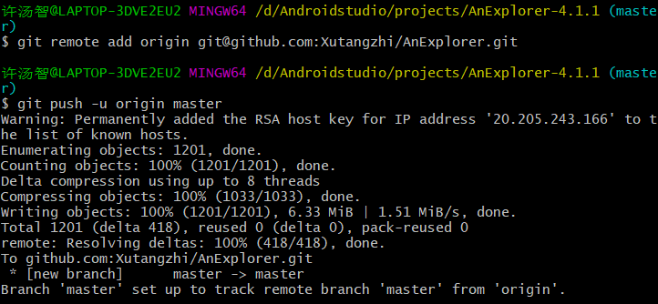

# 实验六: 项目协同开发管理与工具集成环境实验

191220136 	计算机科学与技术系	许汤智

### 一、实验名称

项目协同开发管理与工具集成环境实验

### 二、实验目的

- 了解协同开发与持续集成过程
- 学会使用项目协同开发管理工具git/github
- 了解持续集成并使用jenkins 自动构建项目

### 三、实验内容

1. 安装git，在本地将你的开源项目目录初始化为git 仓库(如已有.git 文件夹请先删除)

2. 在本地尝试修改、提交、回退等过程，在报告中展示你的操作，并使用git diff, git log, git status 等命令展示操作前后的区别

3. 根据实验三针对几个页面进行微调的任务，在本地为每个子任务创建一个分支并在各分支上进行开发，最终将所有修改合并到master 分支上；如有冲突请尝试解决。在报告中展示你的操作，并使用git log --graph 命令展示分支合并图

4. 给你的某个稳定版本的代码打上标签

5. 注册github 账号，在账号中创建远程仓库(权限请设置为public)；把本地的所有分支和标签推送到远端

6. 使用pull request 提交自己的代码和报告

### 四、实验过程与说明

1. **在目录初始化git仓库，`git init `后，用`git add .`和`git commit-m 'origin version'`命令后，文件夹如下：**

2. **在本地尝试修改、提交、回退等过程，在报告中展示你的操作，并使用git diff, git log, git status 	等命令展示操作前后的区别**

   修改文件后，用`git diff `命令来比较工作区与暂存区的区别。

   

   用`git add .`将修改提交到暂存区后，用`git status`查看变化信息。

   

   用`git add .`和`git commit`提交几次后，用`git log`查看提交信息。

   

   针对版本回退，用`git reset --hard HEAD^`命令进行版本回退到当前的上一个版本，用`git log`显示版本的区别。可见版本回退到上一个版本了。

   

3. **根据实验三针对几个页面进行微调的任务，在本地为每个子任务创建一个分支并在各分支上进行开发，最终将所有修改合并到master 分支上；如有冲突请尝试解决。在报告中展示你的操作，并使用git log --graph 命令展示分支合并图**。

   为子任务创建一个按钮创建一个dev分支，并切换到该分支下进行开发。

   

   为子任务创建一个用于拍摄的按钮创建一个dev2分支。

   

   分支情况如下：

   

   完成任务后，合并两个分支，均没有发生冲突，情况如下：

   

   

   使用`git log --graph`命令展示分支合并图。展示如下：

   

4. **给你的某个稳定版本的代码打上标签**

   用`git tag v1.0`命令给master分支打一个`v1.0`的标签，然后用`git tag`查看标签情况。

   

5. **注册github 账号，在账号中创建远程仓库(权限请设置为public)；把本地的所有分支和标签推送到远端**

   推送到远端过程如下。

6. **使用pull request 提交自己的代码和报告**

   略

7. **在报告中回答以下问题：**
   **• 使用git 的好处？**

   能更方便的管理自己的代码并对代码的修改情况有详细的了解，并且在项目写错并且记不得之前的修改时，是救命的利器。

   **• 使用远程仓库(如github/gitee 等) 的好处？**

   1、更加安全，当本地文件丢失或被篡改后，可通过远端仓库进行回调。

   2、更加便携，可以用不同的设备对同一项目进行开发。

   3、便于分享，世界各地的人都可以通过你的远程库对项目进行修正与改善。

   **• 在开发中使用分支的好处？你在实际开发中有哪些体会和经验？**

   1、安全，不用担心分支上的代码修改对主分支上的代码有影响。

   2、便于多人的协同开发，可以对不同任务进行同时开发，最后合并即可。

   我在实验中可以对不同的子任务同时开发而不用考虑其他任务的影响。
