# Experiment6 项目协同开发管理与工具集成环境实验

| 学号 | 姓名 | 联系方式 |
| :-------: | :----: | :--------------: |
| 191220137 | 严思远 | 1363650301@qq.com |

## 1.安装git，在本地将你的开源项目目录初始化为git 仓库(如已有.git 文件夹请先删除)

由于之前已经安装过git，故安装过程省略。

在本地打开开源项目`Simple-File-Manager-6.8.7`，使用`git init`命令将其初始化为git 仓库，然后输入`git add .`和`git commit -m "init"`，提交项目中的所有文件作为初始文件。

## 2.在本地尝试修改、提交、回退等过程，在报告中展示你的操作，并使用git diff, git log, git status 等命令展示操作前后的区别

为了展示这一过程，我在本地创建了一个`test.txt`文件，并输入“origin test”作为初始内容：

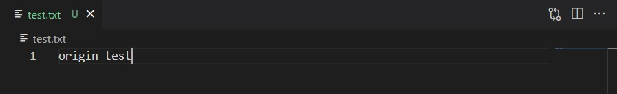

输入`git add .`和`git commit -m "origin test"`进行提交：

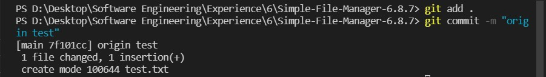

然后我们将`test.txt`文件中的内容改为“modified test”：

输入`git diff`命令来查看修改前后区别：

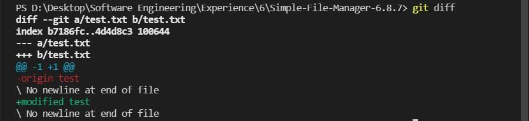

输入`git status`命令来查看当前状态：

可见此时对`test.txt`文件的修改并未提交，于是输入`git add .`和`git commit -m "modified test"`进行提交：

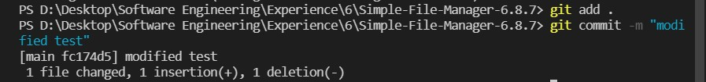

再次输入`git status`命令来查看当前状态：

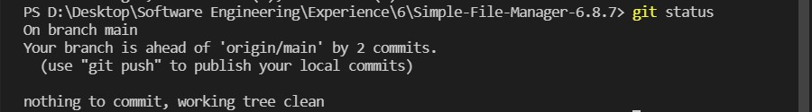

新的修改已经提交成功，此时可以输入`git log`命令来查看提交记录：

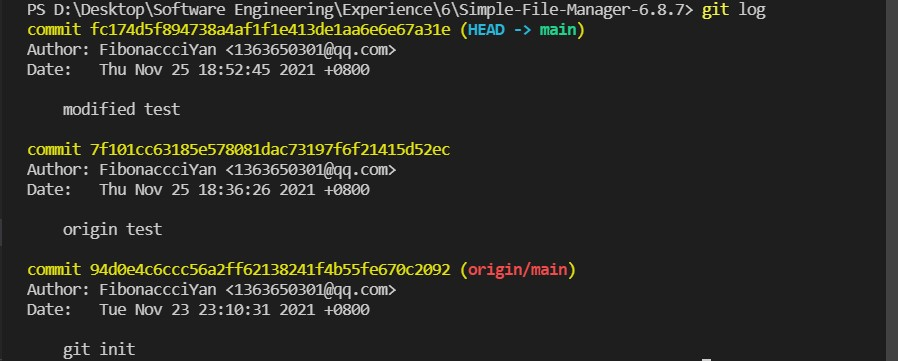

为了回退到“origin test”版本，我们使用`git reset --hard head^`：

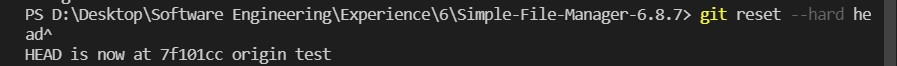

再次使用`git log`命令：

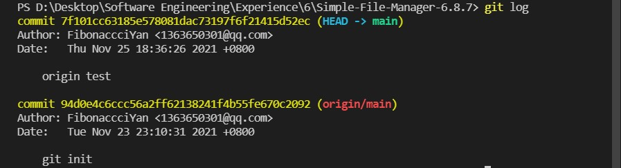

可见此时git状态已经回退到“origin test”版本了。

## 3.根据实验三针对几个页面进行微调的任务，在本地为每个子任务创建一个分支并在各分支上进行开发，最终将所有修改合并到master 分支上；如有冲突请尝试解决。在报告中展示你的操作，并使用git log --graph 命令展示分支合并图

+ ### 子任务一：

    将“search”、“add to favourite"和“remove from favourite"的显示方式由“ifRoom”改为“always”：

    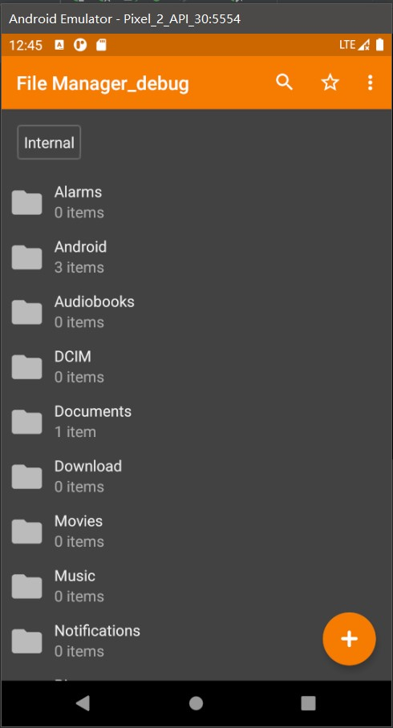
    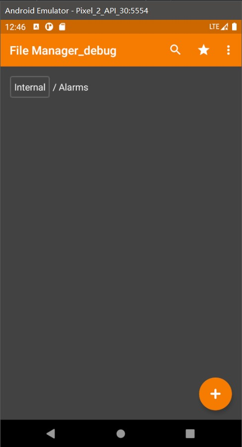

+ ### 子任务二：

    增加“changes”按钮，点击该按钮会跳转到“changes description”界面：

    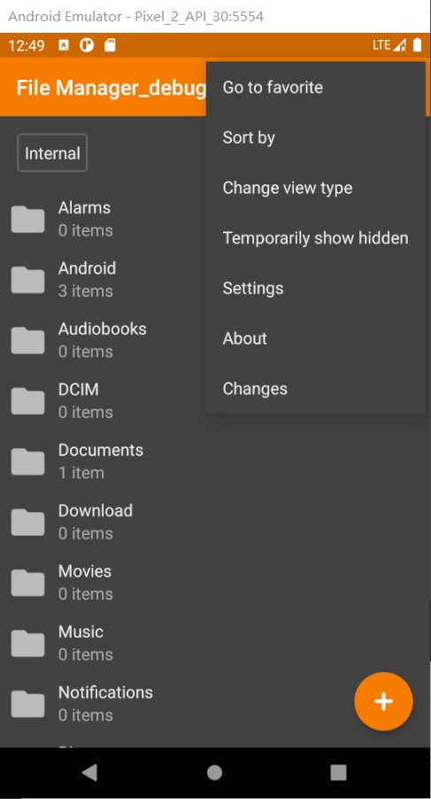
    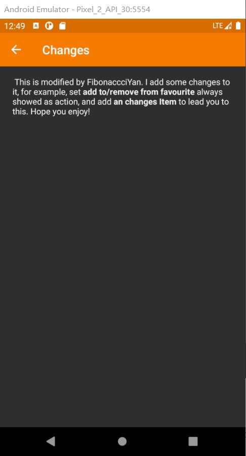

+ ### 合并分支：

    + 首先合并`branch1`：

    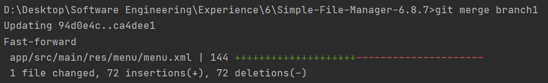

    合并成功！

    + 再合并`branch2`：

    

    此时在`app/src/main/res/menu/menu.xml`文件中出现了冲突。
    
    打开该文件查看冲突，发现是因为`branch1`中没有添加“changes” item以及`branch2`中没有修改“search”、“add to favourite"和“remove from favourite"的显示方式，于是对应修改后，再次使用`git add`和`git commit`命令，结果如下：

    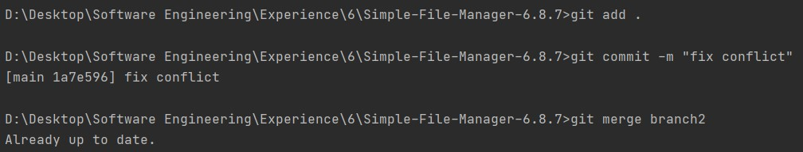

    至此，所有分支都合并完成。使用`git log --graph`命令：

    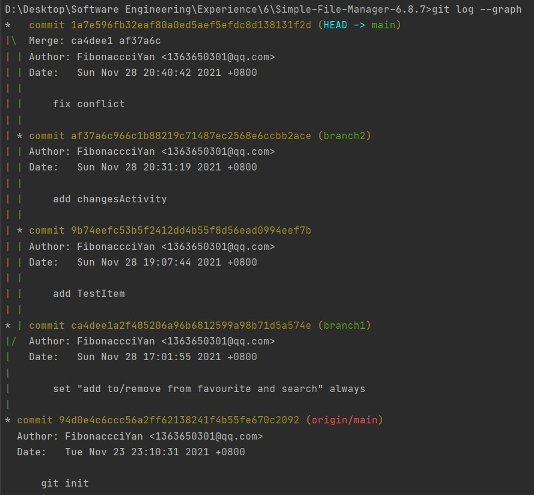

## 4.给你的某个稳定版本的代码打上标签

合并完成后，打上`v1.0.0`的标签：

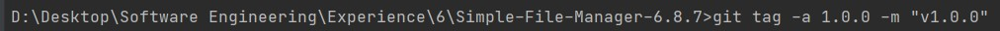

## 5.注册github 账号，在账号中创建远程仓库(权限请设置为public)；把本地的所有分支和标签推送到远端

略。

## 6.使用pull request 提交自己的代码和报告

略。

## 7.在报告中回答以下问题：

+ ### 使用git 的好处？

    能够方便地进行代码的版本控制。在养成经常`git add`和`git commit`的习惯后，一旦代码出错，能够快速回退，而不必在代码中寻找修改过的地方并还原，提高开发效率。

+ ### 使用远程仓库(如github/gitee 等) 的好处？

    + 代码远程托管，防止因本地存储故障丢失代码；
    + 便于团队合作开发，代码共享。

+ ### 在开发中使用分支的好处？你在实际开发中有哪些体会和经验？

    便于多人针对不同任务进行合作开发，各人只需专注于当前任务而不必考虑其他分支的影响，最终统一合并、处理冲突即可。

## 8.如果你额外学习并实践了关于git/github 的其他进阶操作(如merge 和rebase 的区别、reset 和revert 的区别、stash, cherry-pick 的使用等)，可在报告中展示

merge 和rebase 的区别：

+ merge会保留两个分支公共的提交，并与两者最新的提交进行三方合并，生成一个新的提交；

+ rebase会把操作分支的修改合并到目标分支上，并舍弃操作分支上的提交，最终的提交记录会变成一条线

## 9.额外内容：使用Jenkins进行持续集成开发

+ ### 在本机安装 jenkins，并在全局工具配置和系统设置中配置好 JDK 地址、Gradle 地址、ANDROID_HOME 地址和 JAVA_HOME 地址

    + JDK 地址：

        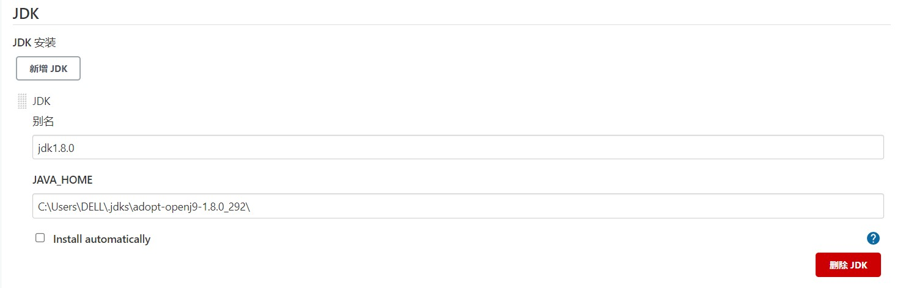

    + Gradle 地址：

        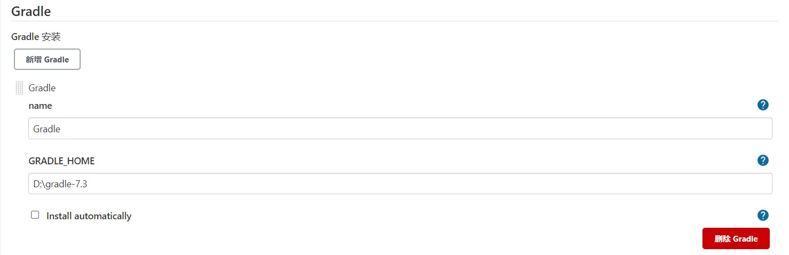

    + ANDROID_HOME 地址与JAVA_HOME 地址：

        由于之前已经配置好了，故不多做展示。

+ ### 新建任务，在源码管理中填写自己项目的 github 地址，对项目进行一次构建

    执行第一次构建结果如下：

    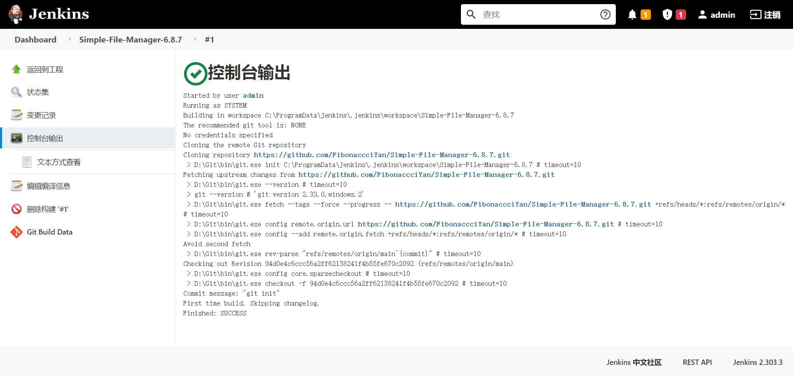

+ ### 修改代码再次推送到 github 仓库中，再次对项目进行构建

    再次执行构建结果如下：

    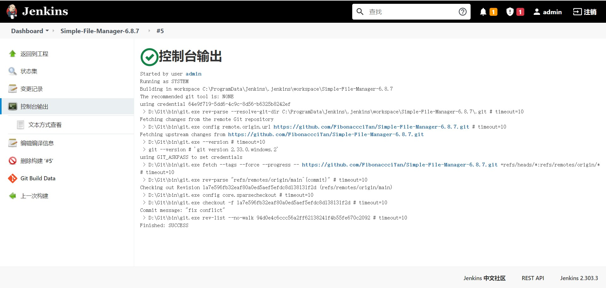