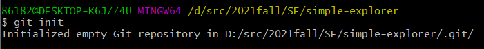
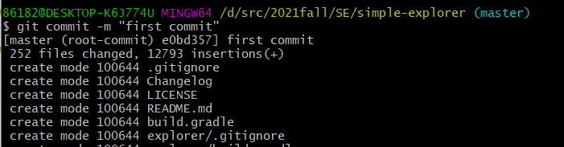
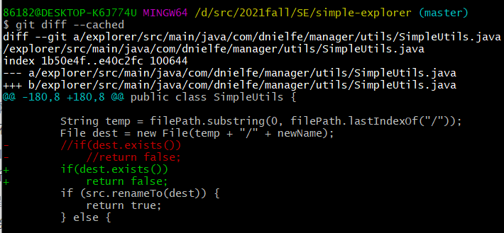
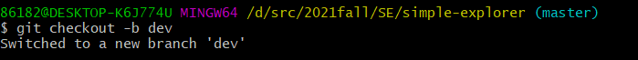
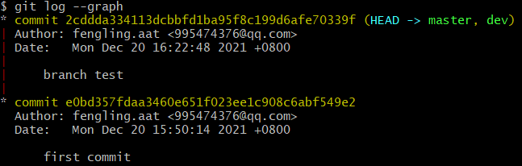
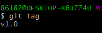
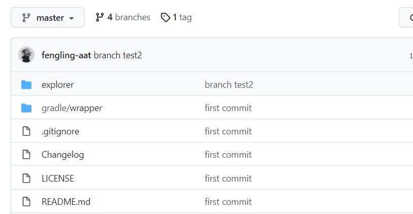

# 项目协同开发管理与工具集成环境实验

​																																													191220138 杨飞洋

### 版本控制

1. **初始化**

   用git打开文件夹，输入

   ```
   git init
   ```

   

   

2. **提交**

   依次输入

   ```
   git add .
   ```

   ```
   git commit -m "first commit"
   ```

   部分截图如下：

   

   

3. **check**

   输入

   ```
   git status
   ```

   

   

   ```
   git diff
   ```

   

   可以看到没什么结果，这条指令的意思是比较当前工作区和上次commit的版本，现在我没有改动过源码，自然也不会有结果了。

   接下来我改动一处代码，再add一下，用带参数的命令如下

   ```
   git diff --cached
   ```

   这条命令的意思就是比较刚刚add的版本即在暂存区的版本和上次commit的版本也即HEAD指针指向的版本。结果如下：

   

   

   ```git reset
   git reset
   ```

   这条语句的意义是重置暂存区的文件与上一次的提交(commit)保持一致，工作区文件内容保持不变。

   显然现在再去使用

   ```
   git diff --cached
   ```

   就没有效果了，如下：


### 分支控制

1. **创建分支，新分支名为dev**

   ```
   git checkout -b dev
   ```

   

   用

   ```
   git branch
   ```

   查看当前分支

   

   

2. **修改一处源代码，进行提交**

   

   

   接下来，用

   ```
   git checkout master
   ```

   回到主分支。

   用

   ```
   git merge dev
   ```

   合并，效果如下：

   

   

3. **check一下**

   

   

   再多创建几个分支，用于存储实验三的修改代码，分支情况如下：

   

   

4. **打标签**

   ```
   git tag v1.0
   ```

   
   
   
   
5. **解决冲突**

   很多时候不同分支会对同一文件进行修改，导致冲突，如下：

   

   冲突文件如下：

   

   手动解决冲突：

   

   查看日志：

   

   

### 提交到自己的github

先在本地有了自己的Git仓库，也想在github创建一个Git仓库，让这两个仓库进行远程同步，这样github的仓库可以作为备份，也可以让他人帮助协作。

现在自己的github上创建一个仓库，命名为`SimpleExplorer`

用

```
git remote add origin git@github.com:fengling-aat/SimpleExplorer.git
```

```
git push -u origin master
```

就可以将本地库的所有内容推送到远程库上。

还要将所有的branch和tag上传上去，用加一下参数就好了，用以下命令：

```
git push -u origin --all
```

```
git push -u origin --tags
```


在github上查看一下，正常。




### 提交PR

1. fork提交仓库到自己的github，clone到本地

2. 本地在report文件夹下新建自己的文件夹放置实验报告以及ref引用文件夹。

3. `cd Project`，使用

   ```
    git submodule add https://github.com/fengling-aat/SimpleExplorer 191220138-杨飞洋
   ```

   将自己github上的仓库添加到project文件夹中

4. ```
   git add\commit\push
   ```

   上传到自己fork的项目里去

5. 在github中自己fork的项目里提交PR，提交前需要先更新fork的仓库，确保无冲突，在pull request


### git的进阶操作

1. **merge和rebase的区别**

   `git merge`和`git rebase`都是用来合并分支的。

   merge 是合并的意思，rebase是复位基底的意思。
   假设现在我们有这样的两个分支,test和master，提交如下：

   ```
        D---E test
       /
   A---B---C---F master
   ```

   在master执行`git merge test`然后会得到如下结果：

   ```
        D--------E
       /          \
   A---B---C---F---G    test , master
   ```

   在master执行`git rebase test`,然后得到如下结果：

   ```
    A---C---D---E---C `---F` test , master
   ```

   **实践：**

   - **merge**

     

   - **rebase**

     

     

2. **reset和revert的区别**

   1. reset：reset用于回退版本，可以遗弃不再使用的提交
   2. revert：在当前提交后面，新增一次提交，抵消掉上一次提交导致的所有变化，不会改变过去的历史

   **实践**

   - **revert**

     

   - **reset**

     

     

3. **stash的使用**

   stash：将修改的代码先暂存起来，让本地仓库回到最后一次提交时的状态，便于代码的更新管理，主要避免修改文件与最新代码的冲突。

   **实践**

   


### 回答以下问题

- **使用git的好处？**

  1. 可以更好地进行代码管理，可以管理多版本的代码。
  2. 出现问题时可以版本回退，有效恢复代码。
- **使用远程仓库的好处？**
  1. 有利于开源资源的公开与共享。
  2. 远程仓库也帮助管理代码，即便本地代码丢失，也可以从远程仓库找回。
  3. 远程仓库的存在也有利于团队开发、协同开发。
- **在开发中使用分支的好处？你在实际开发中有哪些体会和经验？**
  1. 分支的存在方便团队可以同时开发不同的功能并且进行独立的测试。
  2. 分支可以更加高效，一个分支出现的bug并不会影响其他分支的工作。
  3. 在本次实验中，由于本地的版本、环境兼容性的问题，时常会出现编译不成功的情况，此时当某一次运行成功，及时将当时的代码push到远程仓库，可以很好地进行回退。由于每个分支都是对应了一个功能点的改动，这样分组很清晰，如果不想要了，直接删除分支就好了，尽量让每个分支修改的功能不重叠，这样合并时效率很高。


### 实验总结

git和github是十分关键的工具。
