# 项目协同开发管理与工具集成环境实验

​																																													191220138 杨飞洋

### 版本控制

1. 初始化

   用git打开文件夹，输入

   ```
   git init
   ```

   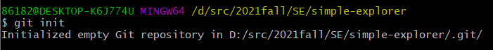

   

2. 提交

   依次输入

   ```
   git add .
   ```

   ```
   git commit -m "first commit"
   ```

   部分截图如下：

   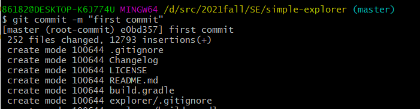

   

3. check

   输入

   ```
   git status
   ```

   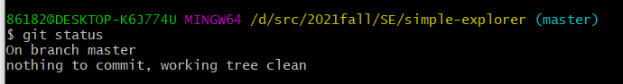

   

   ```
   git diff
   ```

   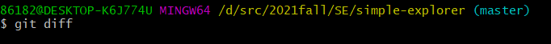

   可以看到没什么结果，这条指令的意思是比较当前工作区和上次commit的版本，现在我没有改动过源码，自然也不会有结果了。

   接下来我改动一处代码，再add一下，用带参数的命令如下

   ```
   git diff --cached
   ```

   这条命令的意思就是比较刚刚add的版本即在暂存区的版本和上次commit的版本也即HEAD指针指向的版本。结果如下：

   

   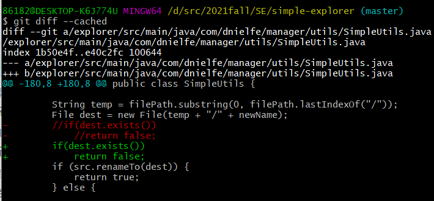

   ```git reset
   git reset
   ```

   这条语句的意义是重置暂存区的文件与上一次的提交(commit)保持一致，工作区文件内容保持不变。

   显然现在再去使用

   ```
   git diff --cached
   ```

   就没有效果了，如下：

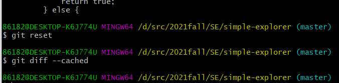


### 分支控制

1. 创建分支，新分支名为dev

   ```
   git checkout -b dev
   ```

   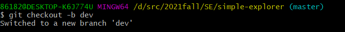

   用

   ```
   git branch
   ```

   查看当前分支

   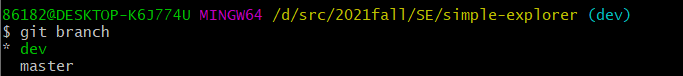

   

2. 修改一处源代码，进行提交

   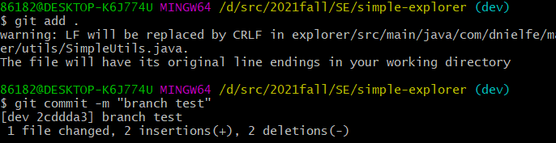

   

   接下来，用

   ```
   git checkout master
   ```

   回到主分支。

   用

   ```
   git merge dev
   ```

   合并，效果如下：

   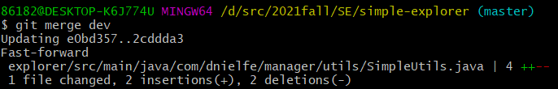

   

3. check一下

   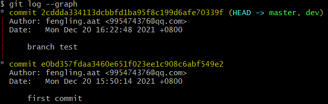

   

   再多创建几个分支，用于存储实验三的修改代码，分支情况如下：

   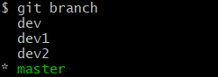

   

4. 打标签

   ```
   git tag v1.0
   ```

   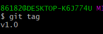

### 提交到自己的github

先在本地有了自己的Git仓库，也想在github创建一个Git仓库，让这两个仓库进行远程同步，这样github的仓库可以作为备份，也可以让他人帮助协作。

现在自己的github上创建一个仓库，命名为`SimpleExplorer`

用

```
git remote add origin git@github.com:fengling-aat/SimpleExplorer.git
```

```
git push -u origin master
```

就可以将本地库的所有内容推送到远程库上。

还要将所有的branch和tag上传上去，用加一下参数就好了，用以下命令：

```
git push -u origin --all
```

```
git push -u origin --tags
```


在github上查看一下，正常。

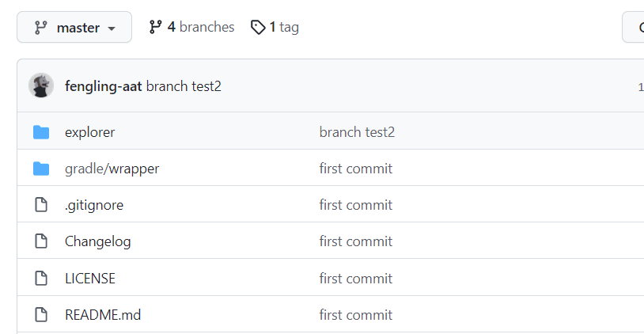


### 提交PR

