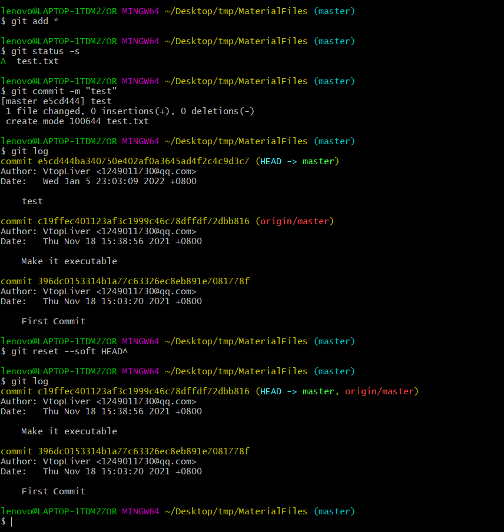
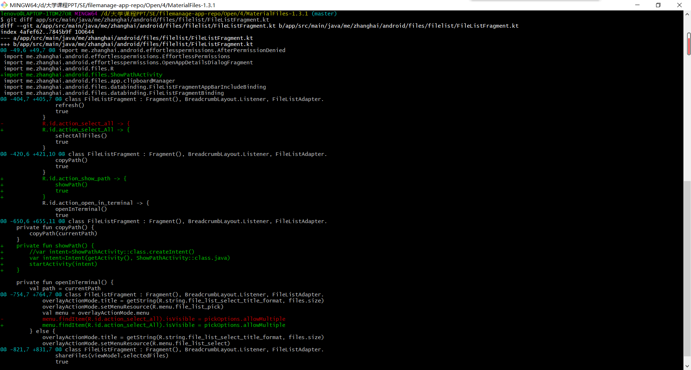
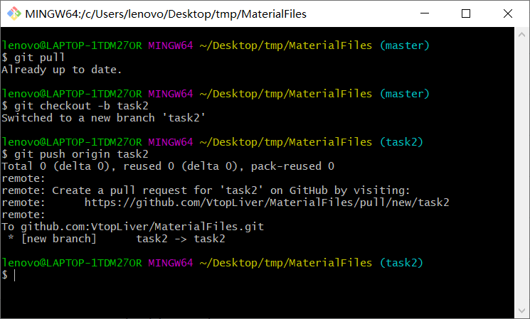
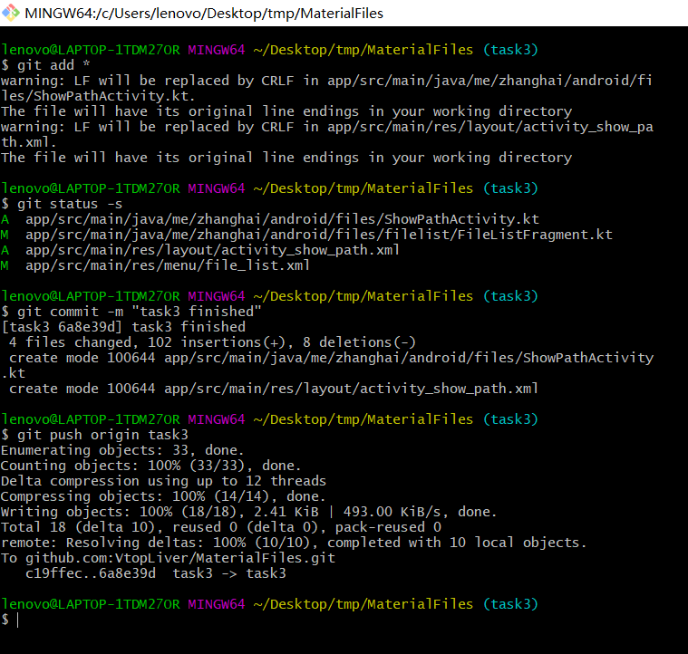
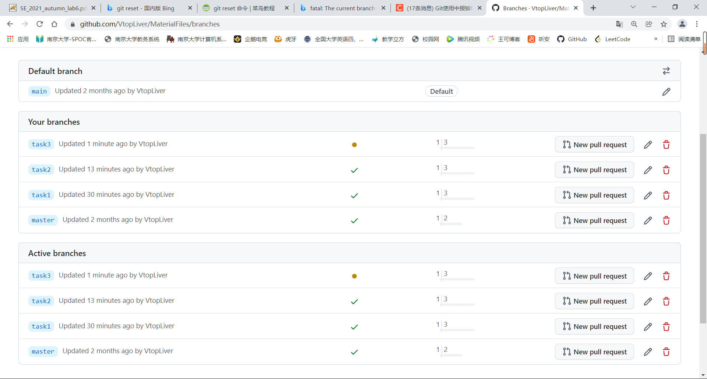
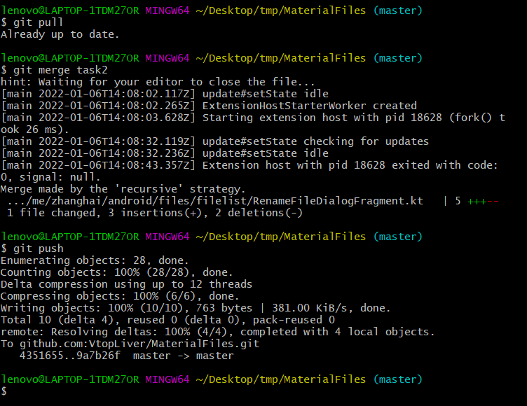
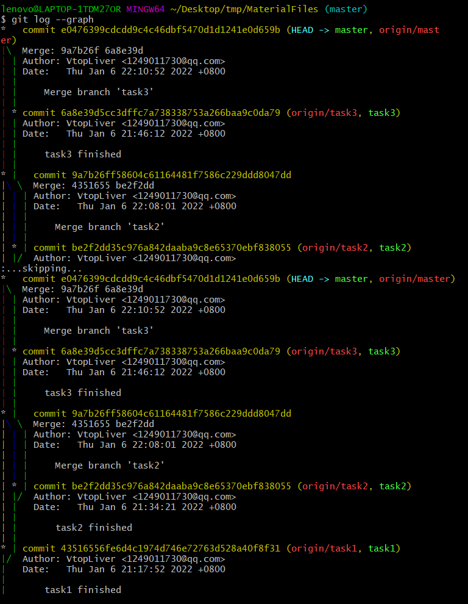
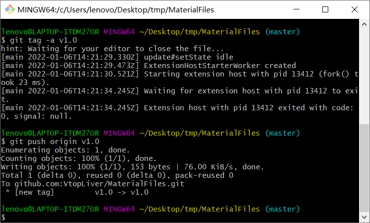

# Lab6实验报告

191220144 尹凯

## 本地操作实例

前言：我将项目目录初始化为了git仓库，然后在GitHub上创建并关联了本地仓库，主分支为master分支，首先将未经修改的项目源码push了上去

描述：为了熟悉操作，我在项目目录下创建了一个名为text的txt文档

首先执行`git add *`操作，由于原来的项目已经被我push到远端，`git add`的缓冲区内只有test文件，所以我使用了`git status -s`来查看缓存区的内容；然后使用`git commit -m`操作来提交；执行`git log`操作可以看到提交的过程；单纯执行`git reset HEAD`可以删除缓存区的内容，而执行`git reset --soft HEAD^`操作则能够回滚到commit之前。

此外，我还用`git diff`比较了实验三的最终版本的原版

## 创建子分支并分别开发

建立分支和提交的过程操作都比较类似，这里各举一例说明

首先`git pull`拉取代码，然后使用`git checkout -b`创建并转到该分支，最后`git push`同步到远程仓库

然后是提交操作

执行`git add`将修改的内容放入缓存区,`git commit`提交，`git push`推送到远端

开发完成后GitHub上的情况：

## 合并子分支

操作同样比较类似，仍然举一例说明

关键操作:`git merge`合并分支

另外，本次实验我未遇到需要解决冲突的情况

使用`git log --graph`展示合并结果：

## 打标签

`git tag -a`操作标记，`git push`同步

## 思考题

### 使用git的好处

1. 可以方便的进行代码的版本管理，随时进行版本后退；

2. 可以方便的建立、切换分支，方便修订代码和多人协同开发；
3. 可以进行代码备份，防止数据丢失

### 使用远程仓库的好处

1. 便于备份，保障数据安全
2. 有利于代码共享和开源，促进开源发展
3. 方便进行多人协同开发

### 使用分支的好处

1. 保证主分支的完整性和可用性
2. 分支之间的互不影响这种特性可以提高团队合作的效率
3. 使版本迭代更加清晰
4. 实际经历：本次实验中，我新建页面的操作一直出bug，但由于我使用了分支管理，前两个修改控件的操作并没有受到影响

### merge和rebase的区别

merge会将两个分支进行合并，创建出一个新版本，保留被合并分支的commit记录；

而rebase则是“变基”，将一个分支的commit记录加在另一个后面，永远是一条直线。

### reset和revert的区别

git revert 仅仅是撤销某次提交，而git reset会将撤销点之后的操作都回退到暂存区中