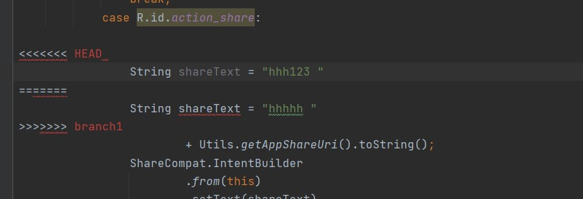
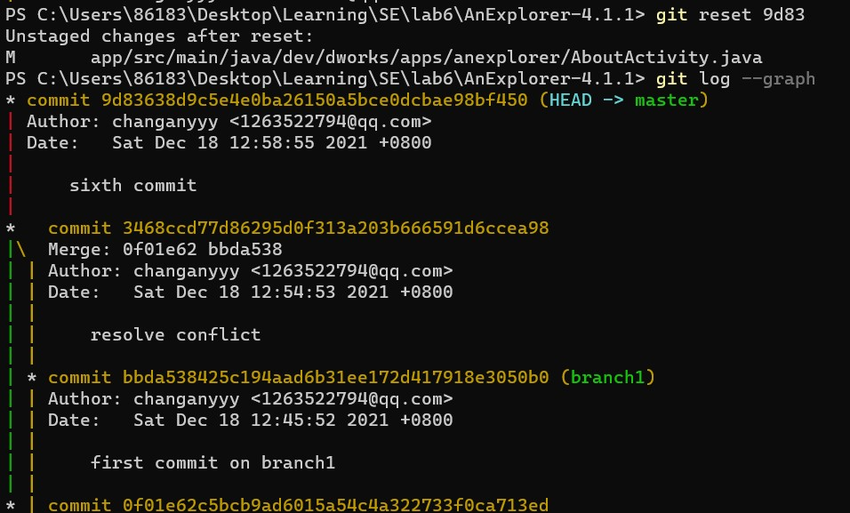

# 实验报告：lab6项目协同开发管理与工具集成实验环境

## 实验过程

首先我在原始目录里面`git init`，并且用`git add .`和`git commit -m 'first commit'`，进行本地库的第一次提交（commit没截图）

好，现在我们在未修改的情况下再次进行提交，可以看出，`git`检查出我的文件未修改

下面我们对文件进行修改，我在`app/src/main/res/menu/activity.xml`里面添加了一个组件。如下图所示。

下面我们对修改过的代码进行提交，可以看出，`git`检测到了我对`xml`文件的修改！

我再次修改了一点，然后提交。下面我用`git log`进行检查。可以看出，我进行了三次提交，并且提交时候的文本也显示了出来。

下面用`git status`检查一下，说明我刚刚`commit`完，并且在`master`分支。

下面我再次修改一点，看一下`git diff`的区别。可以看出，我把一个文件的文本"`mofify`"改成了"`hhh`"

下面我来创建新的分支`branch1`，看一下`log`，可以看出`branch1`和`master`都指向第四次commit。

下面我在`branch1`上面进行修改和提交，可以看出branch1前进了一个版本。

然后我切换回`master`又提交了一个版本，这时两个分支的内容是不同的，在`master`分支上进行`merge`，发现有文件文件冲突。

下面我对文件进行修改，解决了冲突之后可以看见成功合并了分支

下面我们用`git log --graph`来进行检查，可以清晰地看见在不同分支的提交情况还有合并情况！

我在下面又进行了两次修改和提交，如图

从下面的`log`可以看出，`master`前进了两个版本，现在我进行回退到`sixth commit`这个版本，也就是提交号`9d83`对应的版本，回退后的结果如图，可以看出第七次`commit`的那个版本已经消失了，回退到了第六次`commit`版本。

现在我决定把`9d83`号提交标记为`v1`版本！可以看出，成功标记！

下面我在`github`上创建了远程仓库：`se-lab6`

输入命令把本地库推送到远程

下面是`github`的远程仓库界面，可以看到成功了。

## 回答问题

### 1.使用git的好处

答：使用git有很多好处，总结为如下几点：

- 可以进行代码备份，防止我主机上的代码丢失
- 多人开发比较方便
- 在改的代码改的面目全非的话，就可以回退到之前的版本
- 创建分支很简单，不会影响主分支
- 在熟悉指令之后进行版本控制非常方便

### 2.使用远程仓库的好处

答：好处如下：

- 可以进行代码备份。
- 可以多人协作进行代码开发。
- 也可以向开源社区贡献代码

### 3.使用分支的好处

答：

- 使用分支可以在不影响主版本的前提下进行功能开发，即使开发出现问题也不怕，开发成功后就可以进行合并

- 可以进行多人协作开发，最后`merge`到主分支里面去

- 在实际开发中，我常常使用分支进行操作，比如我在写编译原理实验的时候，在开发不同附加功能的时候，就会开启不同的分支。或者在完成不同的实验的时候，也会用不同的分支，如图：

  

### 4.`merge`和`rebase`的区别

答：`merge`是对两个分支的头进行合并（头尾相同，身体不同），合并成一个头。而`rebase`会把你当前分支的`commit`放到公共分支的最后面。就好像这个分支是从公共分支延展出来的一样（拉成一条直线，头尾相接，身体一条线）。

### 5.`reset`和`revert`的区别

答：对于已经把代码`push`到远程仓库，回退本地代码其实也想同时回退远程仓库代码，回退到某个指定的版本，让远程和本地代码保持一致，就用`revert`。而还没有`push`的时候，就用`reset`

