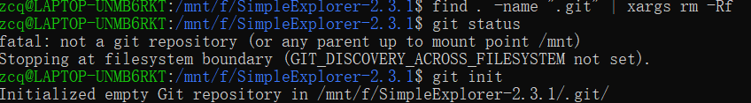
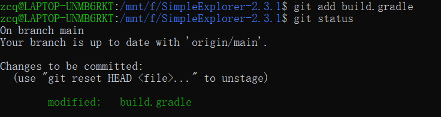
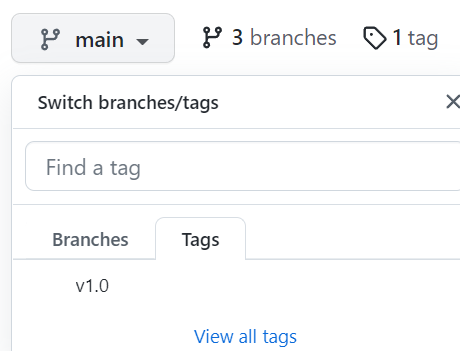
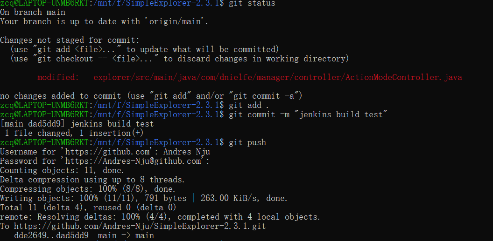
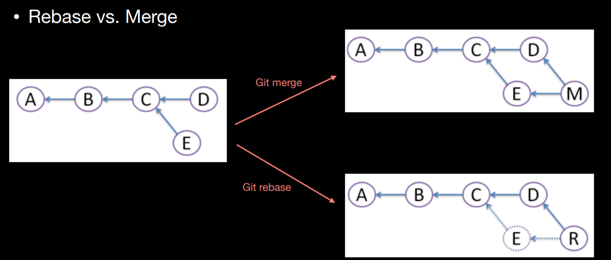

# 南京大学计算机科学与技术系

## 软件工程实验报告

**实验名称：项目协同开发管理与工具集成环境实验**                

**学  号：191220152**                 

**姓  名：张城铨**                 

**指导教师：张天**                 

**实验地点：基础实验楼乙208**                 

**实验时间：2021.11.18**  

### 一. 实验名称

**项目协同开发管理与工具集成环境实验**

### 二. 实验目的

- 了解协同开发与持续集成过程。

- 学会使用项目协同开发管理工具 `git/github`

- 了解持续集成并使用`jenkins`自动构建项目。

### 三. 实验环境

- 软件： `APP: SimpleExplorer-2.3.1`

- 硬件： `Android`版本：`Android 11.0 `

​			         虚拟机：`Pixel 2 API 30`

### 四、实验内容

- 安装 `git`，在本地将你的开源项目目录初始化为 git 仓库 (如已有`.git` 文件夹请先删除)

  - 

    首先在开源项目目录下清除之前已有的`git`仓库

  - 

    然后`git init`创建新的本地仓库，并连接到远程仓库，`git add .`将目录下所有文件加入本地仓库

    再`git commit`刚才`add`进来的文件并打上备注`code first submit`

  - 

    创建远程仓库后官网指导中有一个`git branch -M main`的操作修改了当前`master`分支的名字为`main`（网上查了之后推测大概是`master`涉及黑人敏感词？）
    
  - 先`push`初始代码上去

    

- 在本地尝试修改、提交、回退等过程，在报告中展示你的操作，并使用 `git diff`, `git log`, `git status` 等命令展示操作前后的区别

  - 修改`build.gradle`：添加最后一行：`"// test changes"`

    

  - 查看当前状态，显示该文件被修改，但没被`staged`

    

  - 使用`git add build.gradle`再查看状态，显示已经加入`stage`，等待被提交`commit`

    

  - 使用`git commit -m "test change"`指令提交

  - 然后使用`git diff 上一次commit 当前commit`将两次commit的不同比较，显示了`build.gradle`中的改动

    

  - 使用`git reset 上次commit号`回退到上一次的`commit`也就是修改`build.gradle`之前，显示`build.gradle`有改动没有被`staged`，说明回退成功

    

- 根据实验三针对几个页面进行微调的任务，在本地为每个子任务创建一个分支并在各 分支上进行开发，最终将所有修改合并到 master 分支上；如有冲突请尝试解决。在报 告中展示你的操作，并使用 git log --graph 命令展示分支合并图 

  - 子任务1：分支`NewButton` 使用`git checkout -b <branch name>`创建并切换到新的分支上去

    

    该分支功能修改完毕后进行add和commit操作：

    

    然后切换回一开始的main，使用`git log`显示没有了刚才在`NewButton`分支上的commit内容，说明确实回到了main

    

  - 子任务2：分支`NewDeleteButton` 创建操作同上

    完成代码修改后用`git add, git commit`提交

    

  - 回到main分支，将两个分支的代码合并到main上

    
    
  - 使用`git log --graph`指令查看合并后的结果

    

    可以看到graph上明显有一条绿色的线拉出去了，最后和main的红线汇到一起，但是创建了两个分支只有一条线拉出去，思考了一下，感觉是因为merge第一个分支的时候，一开始的main分支并没有做任何修改，所以第一个分支直接续在了main分支的红线上，所以看上去就像是少了一个分支的线

- 给你的某个稳定版本的代码打上标签

  - 使用`git tag <tag> <commit id>`命令

    

    给最新的commit打上标签`“v1.0”`

- 注册 `github` 账号，在账号中创建远程仓库 (权限请设置为 `public`)；把本地的所有分支和标签推送到远端 

  - 创建远程仓库并与本地仓库相关联前面与开始提到过，不再赘述

  - 将本地所有分支和标签推送到远端：

    - 使用`git push origin [branch_name]`命令将两个分支推送到远程仓库

      
      
      
      
    - 使用`git push origin --tag`将刚才的标签`push`到远端

      

    - 最后`git push`将主分支main推送上去（这里直接用git push是因为main分支是default分支），查看最后结果，三个branch，一个tag

      

      

-  使用 `pull request` 提交自己的代码和报告

- 在本机安装`jenkins`，并在全局工具配置和系统设置中配置好`JDK` 地址、`Gradle` 地址、`ANDROID_HOME` 地址和`JAVA_HOME` 地址

  - 根据网上教程在`windows`下安装了`jenkins`，设置端口号为8080，后面可以通过`http://localhost:8080/`来访问：

    - 注册账号后进入主界面

      

  - 点击Manage Jenkins，再点击Global Tool Configuration进入配置界面

    - 配置`JDK`

      

    - 配置`gradle`，这里用的是`gradle2.10`，和`app24`的一致

      

    - 系统变量中设置`ANDROID_HOME` 地址和`JAVA_HOME` 地址（`JAVA)HOME`之前配置过，这次只要配置`ANDROID_HOME`，在`path`中添加`%ANDROID_HOME%\tools`）

      

- 新建任务，在源码管理中填写自己项目的`github` 地址，对项目进行一次构建

  - 在首页点击`new job`按钮，新建一个项目名为`SimpleExplorer-2.3.1`，类型为`Freestyle project`

    
    
  - 填写自己的git远程仓库信息和自己的账号密码

    

  - 最后点击`build now`按钮进行构建

    

- 修改代码，再次推送到`github` 仓库中，再次对项目进行构建

  - 因为代码已经修改好了，所以就简单加了个空行，并推送到远程仓库中

    

  - 再次构建项目，成功

    

- 项目构建过程中遇到的问题：

  一直报下图中的错误

  

  上外网查了之后发现是windows本地`git`版本太低，只有`2.17`，重装了最新版的`2.34`后解决。

### 五、在报告中回答以下问题：

- 使用 `git` 的好处？
  - 分布式开发，本地进行版本控制，发布时只要`push`到远程即可
  - 适合多人开发、版本迭代，
    - 创建分支
    - 冲突解决机制

-  使用远程仓库 (如 `github/gitee` 等) 的好处？
  - 远程仓库在开发过程中可以作为本地仓库的备份，本地文件丢失时可以从远程`pull`
  - 在本地仓库的设备不在身边时，也可以直接从远程仓库`clone`一份
  - 适合团队多人开发，高效实现代码共享和合并
  - 开源代码库

- 在开发中使用分支的好处？你在实际开发中有哪些体会和经验？
  - 使用分支可以分别**独立地**开发和测试不同功能，在某些功能出现问题时不会影响到其他功能模块
  - 每个功能模块独立开，适合多人开发

- 如果你额外学习并实践了关于` git/github` 的其他进阶操作 (如 `merge `和 `rebase `的区 别、`reset` 和 `revert` 的区别、`stash`, `cherry-pick` 的使用等)，可在报告中展示

  - `merge`与`rebase`

    

    (图片来自上海交通大学`IPADS`组`Tutorial3_git`课件)

    两者都是合并代码，但是`merge`是新建一个`commit`，将其合并的几个`commit`作为其`parent`，而`rebase`，其翻译过来为“变基”，也就是上图中若以E为基和D合并，那么会有一个新建commit是合并了E和D，然后E所在的这个分支就会被删除

  - `reset`和`revert`

    - `reset`是将`HEAD`指针移向之前的某一次commit，在git log中后面的那些commit就看不到了（其实还是存在的，只是移动了指针，没有删除节点，所以还是可以通过reset再回去）
    - `revert`是新建一个commit节点，该节点和之前的某一次commit相同

