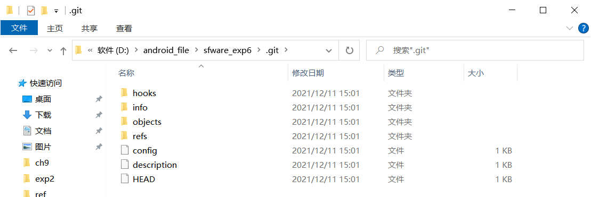
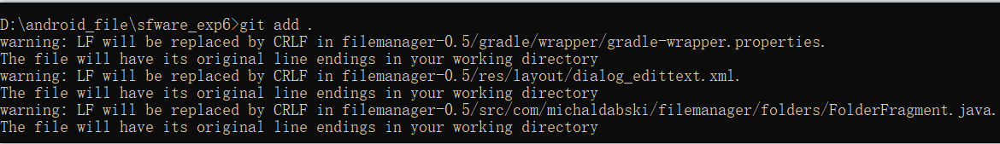
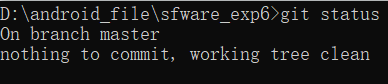
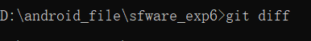
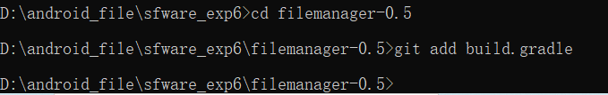
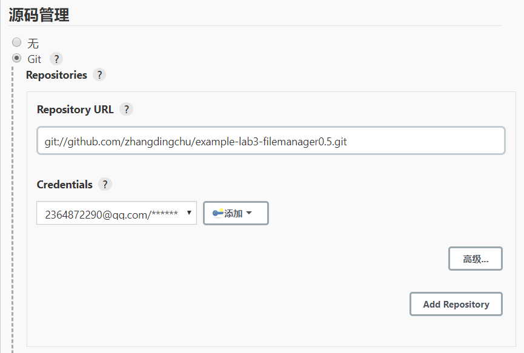

# 软工实验六实验报告

## 姓名：张丁楚

## 学号：191220153

## 专业：计算机科学与技术

## 实验名称：项目协同开发管理与工具集成环境实验

实验目的：

• 了解协同开发与持续集成过程

• 学会使用项目协同开发管理工具 git/github

• 了解持续集成并使用 jenkins 自动构建项目

实验内容：
• 安装 git，在本地将你的开源项目目录初始化为 git 仓库 (如已有.git 文件夹请先删除)

• 在本地尝试修改、提交、回退等过程，在报告中展示你的操作，并使用 git diff, git log, git status 等命令展示操作前后的区别

• 根据实验三针对几个页面进行微调的任务，在本地为每个子任务创建一个分支并在各 分支上进行开发，最终将所有修改合并到 master 分支上；如有冲突请尝试解决。在报 告中展示你的操作，并使用 git log --graph 命令展示分支合并图

• 给你的某个稳定版本的代码打上标签

• 注册 github 账号，在账号中创建远程仓库 (权限请设置为 public)；把本地的所有分支 和标签推送到远端

• 使用 pull request 提交自己的代码和报告 (作业提交说明里细 )

• 在报告中回答以下问题：

• 使用 git 的好处？

• 使用远程仓库 (如 github/gitee 等) 的好处？

• 在开发中使用分支的好处？你在实际开发中有哪些体会和经验？

• 如果你额外学习并实践了关于 git/github 的其他进阶操作 (如 merge 和 rebase 的区别、reset 和 revert 的区别、stash, cherry-pick 的使用等)，可在报告中展示

实验结果：

1. 安装 git，在本地将你的开源项目目录初始化为 git 仓库
   
    如下图为初始化效果：

   
   

2. 在本地尝试修改、提交、回退等过程，在报告中展示你的操作，并使用 git diff, git log, git status 等命令展示操作前后的区别
   
   初始提交（文件夹里为空）：
   

    第二次提交（初始版本的APP）：
    

    将初始版本的开源APP更改为实验三修改的开源APP后（即修改了原先的代码后）：

    git diff:
    

    git status:
    

    git log:
    

    git add .
    

    git diff:
    

    git status:
    

    git log:
    

    git commit -m "second":
    

    git diff:
    

    git status:
    

    git log:
    

    版本回退：
    git reset --hard eba5754:
    

    git diff:
    

    git status:
    

    git log:
    

    总结：在修改完代码后，使用git diff会产生提交的版本和现在修改的版本的不同，会把所有修改的部分都使用红色字体标出来。

    使用git status后会用红字标明修改的文件和添加的文件（提交的版本与当前的版本）并提示你add和commit。

    git log只是标明在当前提交版本中的HEAD指针的位置和当前提交过的版本的相关信息。

    在git add .后。使用git diff未出现提示。

    使用git status后会用绿字标明修改的文件和添加的文件（提交的版本与当前的版本）并提示你commit。

    git log与上相同。

    在git commit 后。使用git diff未出现提示。

    使用git status后会用提示你不需要提交，工作区已清空。

    git log会产生新提交后的版本的相关信息。

3. 根据实验三针对几个页面进行微调的任务，在本地为每个子任务创建一个分支并在各 分支上进行开发，最终将所有修改合并到 master 分支上；如有冲突请尝试解决。在报 告中展示你的操作，并使用 git log --graph 命令展示分支合并图

    我创建了四个分支（加上master）。操作如下：

    （1）建立除master以外的三个分支：
    

    

    

    （2）进入bran1分支，对代码进行修改，然后提交。
    

    （3）进入bran2分支，做同上的操作。
    

    （4）对bran3分支做出同样的操作。
    

    （5）切换到master分支，进行merge合并bran1。
    

    （6）合并bran2：
    

    由此可见，产生了冲突。

    打开文件，查看冲突。
    

    将冲突修改：
    

    git add[相应的文件]
    

    提交
    

    （7）合并bran3，进行类似的操作。

    产生冲突：
    

    修改冲突：
    

    提交
    

    （8）使用 git log --graph 命令展示分支合并图
    

4. 给你的某个稳定版本的代码打上标签。
   
   使用git tag命令打上标记。
   

5. 注册 github 账号，在账号中创建远程仓库 (权限请设置为 public)；把本地的所有分支 和标签推送到远端
   
    (1)在账号中创建远程仓库.
    

    （2）推送：
    

6. 使用git的好处：
   （1）大部分操作在本地完成，不需要联网。

   （2）与Linux命令全面兼容。

   （3）分支操作非常快捷流畅。

   （4）尽可能的添加数据和版本而不是删除数据和修改数据。

    （5）不仅能保存目录和文件的当前状态，还能够保存每一个提交过的历史状态。

    （6）在保存每一个版本的文件信息的时候要做到不保存重复数据，以节约存储空 间，提高运行效率。

    （7）查看修改人、修改时间、修改内容、日志信息。
    
    （8）将本地文件恢复到某一个历史状态。

7. 使用远程仓库 (如 github/gitee 等) 的好处？
   
   （1）可以在远程永久保存所有的版本控制信息，所有的版本数据信息，即使电脑崩掉数据也会保存。

   （2）方便大家共享数据信息，方便查阅资料。

   （3）可以很方便的查看所有保存在远程仓库的数据信息和版本信息。

   （4）大家可以协同开发。

   （5）可以在开发团队中对参与开发的人员进行权限的控制。

8. 在开发中使用分支的好处？你在实际开发中有哪些体会和经验？
   
   开发中使用分支的好处：

    （1）可以多人协同开发，然后再通过merge合并多人开发的结果。

    （2）一个人可以使用多个分支，可以把需要的版本放在不同的分支中，这样想回退版本的时候其实可以通过切换分支的方式来进行。

    （3）所有人不必都在master分支上进行开发，使得隔离性增强。

    （4）解决冲突比较方便，因为有冲突的地方都被标明了，这就不需要去看上万行的代码来找冲突了。

    （5）更能清晰的看到版本的迭代关系。

   实际开发中的经验和体会：

    （1）可以多人并行不相互违背的修改服务器端的同一个文件。每个人通过分支的方式修改文件的一小部分就可以很方便的同时修改一个文件并且隔离性还很好。

    （2）允许开发团队在工作过程中多条生产线同时推进任务，进一步提高效率。

    （3）通过merge的方式标明冲突，省了寻找冲突的时间。

    （4）可以简洁的看到不同版本信息和数据信息。

9.  如果你额外学习并实践了关于 git/github 的其他进阶操作 (如 merge 和 rebase 的区别、reset 和 revert 的区别、stash, cherry-pick 的使用等)，可在报告中展示。
   
    （1）stash:

    git stash:能够将所有未提交的修改（工作区和暂存区）保存至堆栈中，用于后续恢复当前工作目录。

    

    git stash pop：将当前stash中的内容弹出，并应用到当前分支对应的工作目录上。

    

    git stash list：查看当前stash中的内容

    

    git stash apply：将堆栈中的内容应用到当前目录，不同于git stash pop，该命令不会将内容从堆栈中删除

    

    git stash clear：清除堆栈中的所有 内容

    

    （2）reset 和 revert 的区别

    git reset:此命令有三个参数，分别是soft,hard,mixed.

    soft:仅仅是在本地库移动HEAD指针。

    添加一行注释。
    

    使用soft参数回退。
    

    发现工作区中的修改并没有改变。
    

    mixed:soft+重置暂存区。

    接上。使用git add .命令添加到暂存区。之后使用带参数mixed的reset命令。使用git status查看发现git add .被撤销了。
    但是工作区的代码是不变的。
    

    hard:mixed+重置工作区。

    使用带参数hard的reset命令。使用git status查看信息。发现工作区的代码也回退到了以前的版本。
    

    git revert:

    使用git revert回退到之前的某个版本。
    

    解决冲突：

    继续revert后发现多出来了一个commit。
    

    总结：
    git revert 和 reset 最本质的区别为两点：

    revert 使用一个新的commit 来回滚你希望回滚的commit， reset 是直接HEAD 指向回退的commit。

    revert 只会回滚你希望回滚的哪一个commit的操作，不会影响其他的，reset 由于指针回退了，因此这个commit 之后的commit都会消失。

    （3）cherry-pick

    可以挑选一个或多个分支进行合并。
    

    解决完冲突后可以继续合并：
    
    
    

    也可以放弃合并，回归原始状态。--abort
    .

    总结：cherry-pick可以将多个分支合并起来，如果有冲突，再解决完冲突之后可以--continue继续合并，也可以--abort终止合并。

    （4）merge和rebase的区别：

    再上面的实验中发现：merge是将两个分支的commit合并起来形成一个新的commit。解决冲突的方式需要:git add .和git commit.

    rebase：

    使用git rebase进行合并。冲突后进行修改可得一下结果。
    
    命令如下：git rebase cherry2.

    产生冲突修改后：git add . +git rebase --continue.
    .

    查看分支结果可得：

    合并完成后结果：
    .

    未合并两者的结果：
    .

    .

    总结：merge和rebase合并冲突的方式不一样，一个需要一个commit，而一个不需要。其次，rebase再合并完成后会删掉一个commit，添加一个commit，而merge只会产生一个commit。

10. 在本机安装 jenkins，并在全局工具配置和系统设置中配置好 JDK 地址、Gradle 地址、 ANDROID_HOME 地址和 JAVA_HOME 地址 • 新建任务，在源码管理中填写自己项目的 github 地址，对项目进行一次构建 • 修改代码再次推送到 github 仓库中，再次对项目进行构建
    
    (1)安装jenkins：
    .

    （2）配置地址：

    JAVA_HOME 地址：
    .

    Gradle 地址：（这里选择了直接Gradle自动安装）
    .

    （3）新建任务：

    新建项目的配置：
    .

    此处由于build失败，日志中写出无法连接origin,经查找办法，将https改为git得以解决

    第一次构建的结果：
    .

    （4）修改代码再次推送到 github 仓库中，再次对项目进行构建。
    
    推送如下：
    .

    再次构建：
    .

   