# 1. 实验6 项目协同开发管理与工具集成环境试验 

191220155 张浩宇

## 1.1. 实验内容

初始化仓库 
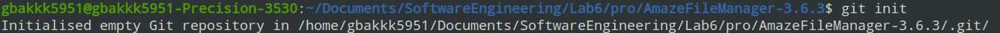  

添加原始文件
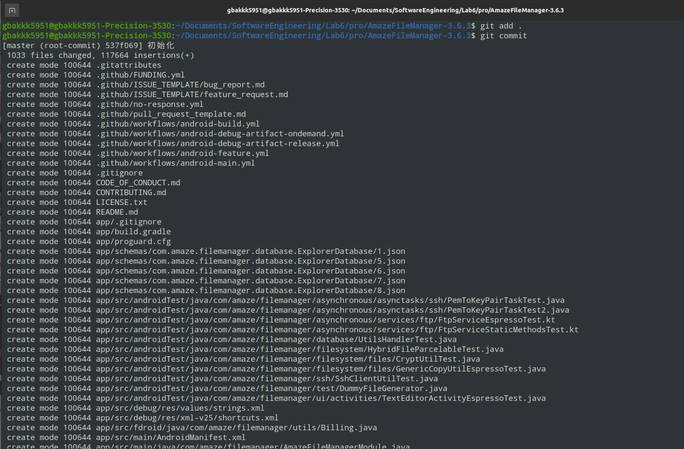  

编辑.gitignore

  
研究git log, git reset, git status
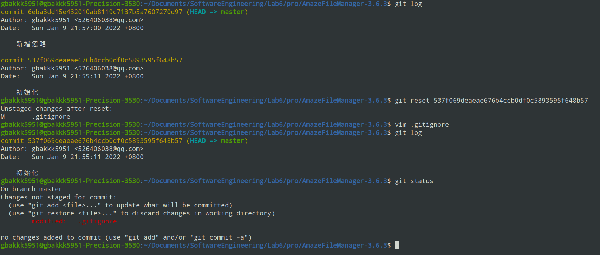  

用git reflog找回reset之前的版本
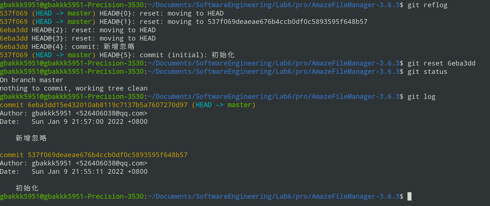  

创建第一组修改的分支，修改后提交
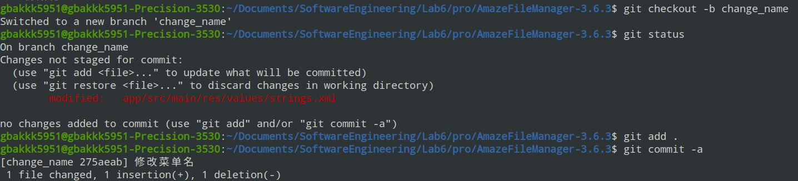  

创建第二组修改对应的分支，由于打错了名字，进行了分支的删除，其实可以直接修改名字
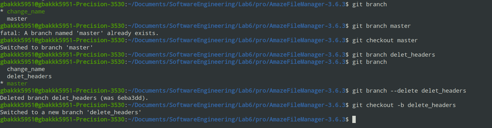  

用git diff 查看了第二组修改的分支修改了哪些文件
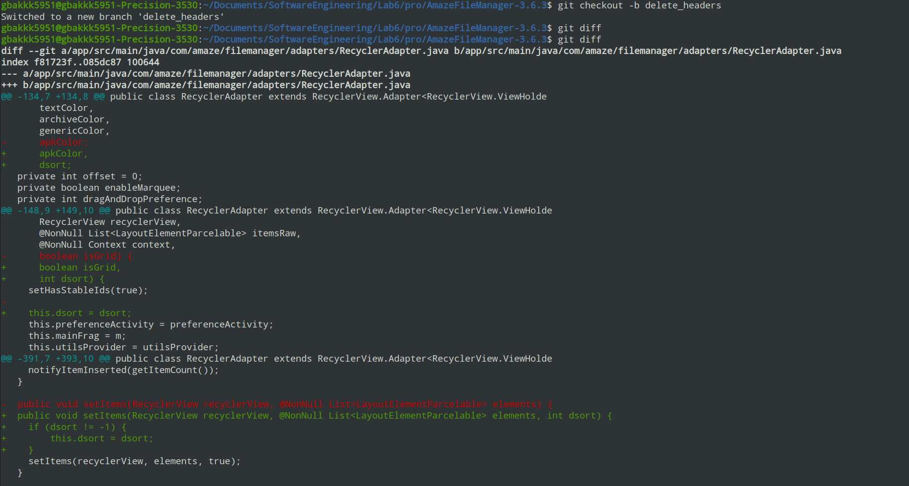  

将两组修改的分支合并到master上
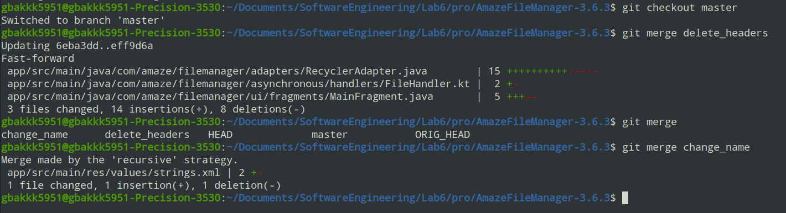  

添加远程仓库
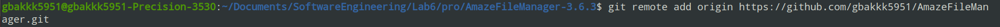  

完成上传
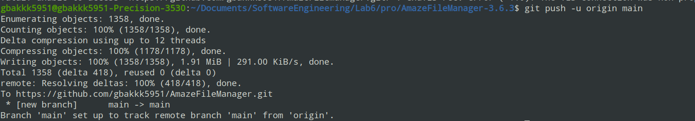  
添加submodule
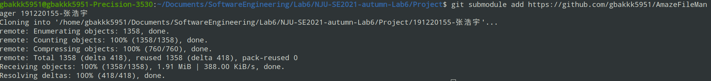  

## 1.2. 实验总结

• 使用 git 的好处？  

git拥有丰富强大的版本控制功能，可以方便地进行差异对比，切换到历史上的版本，可以很好地组织管理软件开发，方便分析代码的开发过程。
比如当前版本不能正确运行时，可以一条指令退回之前版本，并通过diff查找修改过的地方以方便定位。

• 使用远程仓库 (如 github/gitee 等) 的好处？  

（1）能够提供备份，减少代码丢失的风险。
（2）如果作为开源软件，可以与全球的程序员一起分享
（3）能够在线进行协作开发

• 在开发中使用分支的好处？你在实际开发中有哪些体会和经验？  

（1）方便管理，不同分支有不同的目的
（2）对于不成熟的分支，即可以保留，在之后继续开发，又可以切换到其他分支

体会和经验：比如我想修改多个功能，如果不使用分支的话，所有操作都在一个线性的版本上开发，可能会导致各个功能互相影响，
而分别开发再逐步merge可以方便整合各个功能。