# 实验六 项目协同开发管理与工具集成环境试验

## 姓名：张津榕

## 学号：191220158

首先进行`git init`初始化为git仓库    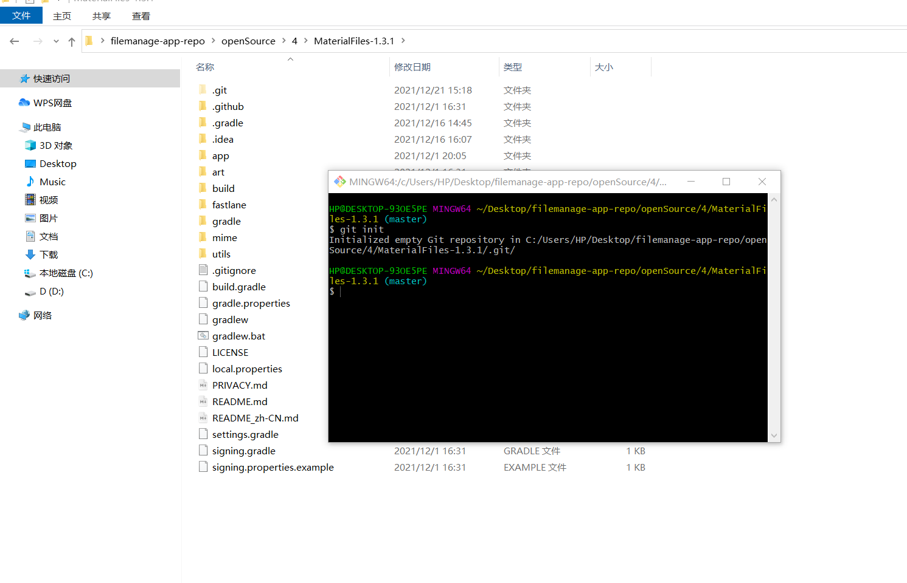

  

再远程连接git仓库  

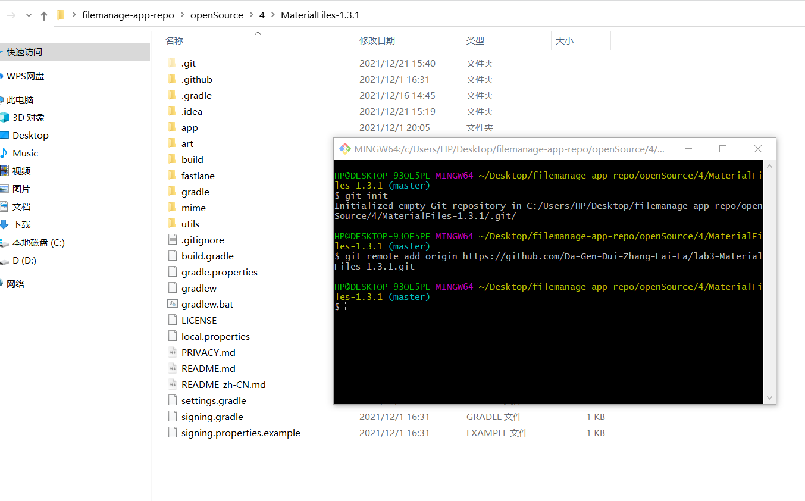

`git add --all`后`git commit` ，很多文件都被commit进去了   

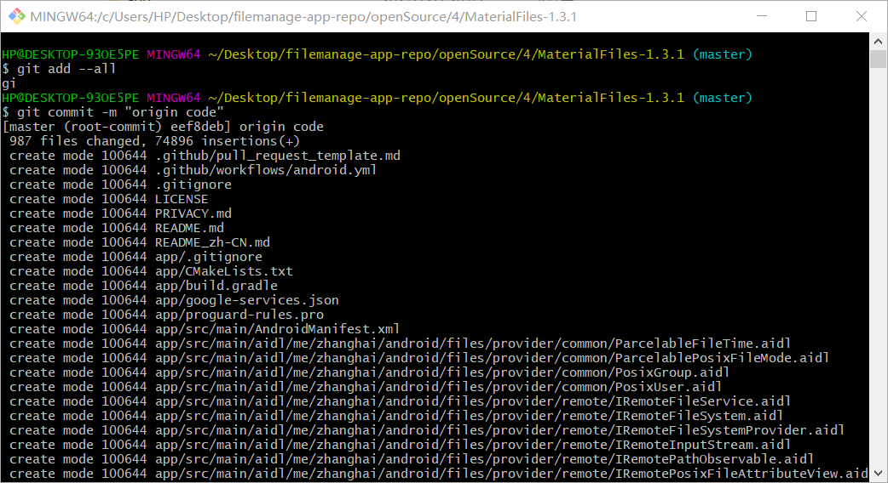

查看`git status `   

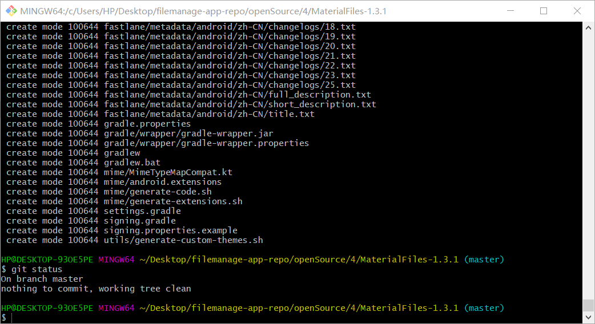

  作为测试，新建文本文档111.txt，内容为111并执行`git add, git status `    

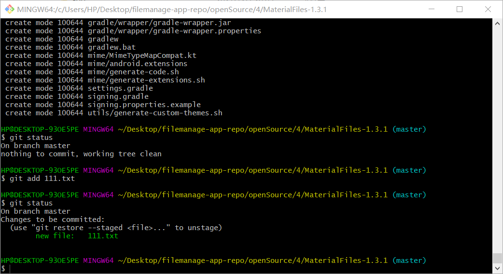  

可以看到，出现提示,111.txt未被commit  

输入`git log`查看  

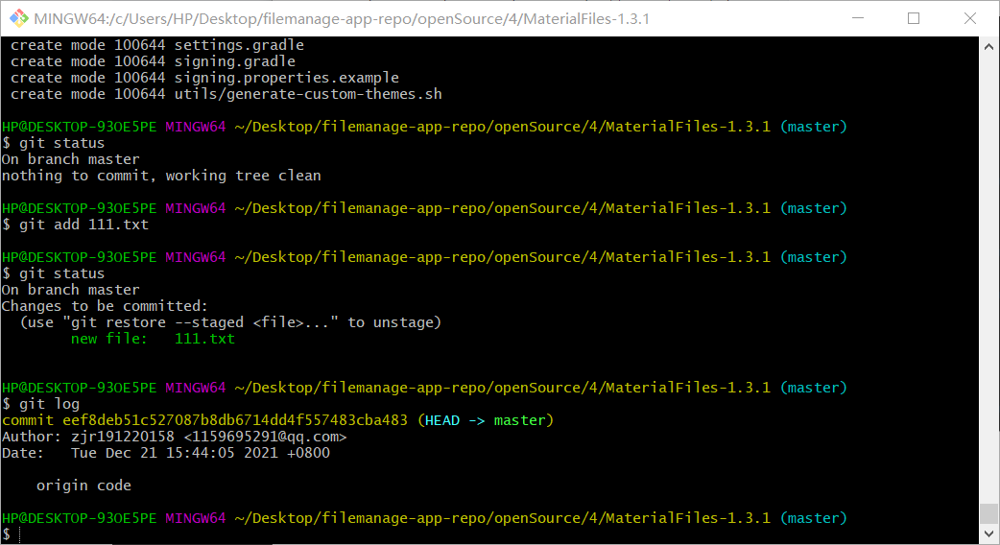

输入`git diff`，没反应，将111.txt内容修改为191220158后再`git diff ` 

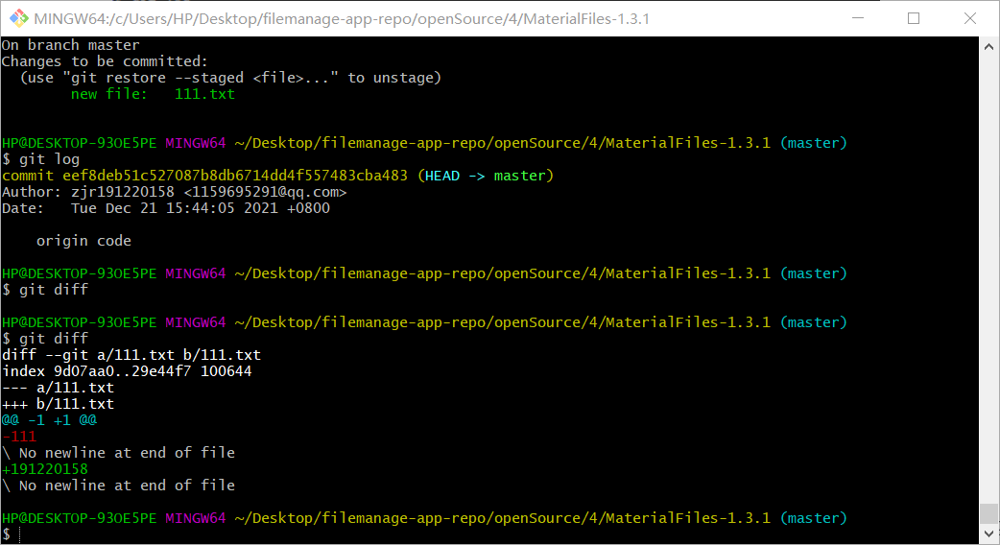

输入`git reset 111.txt` ，再git status查看  

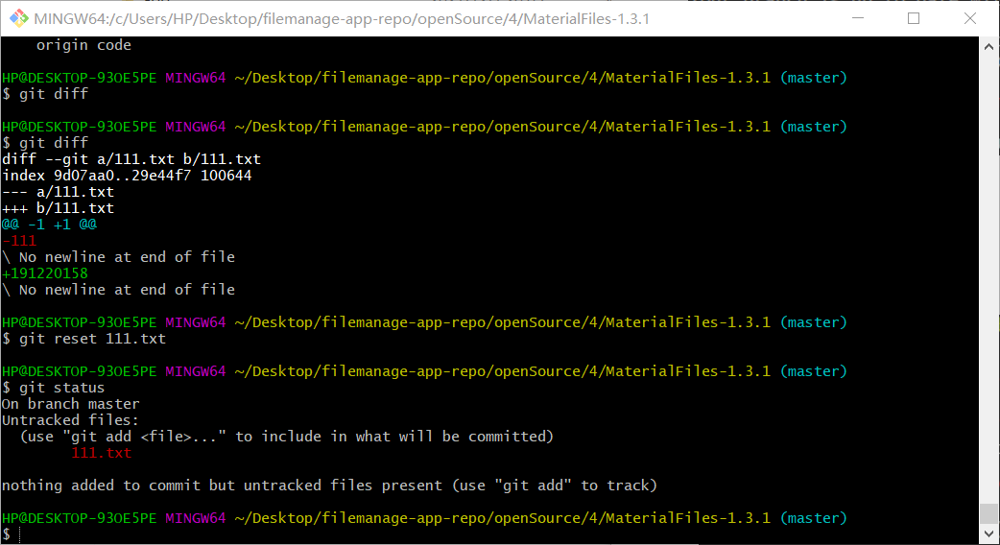

  

`git push`,将未修改的代码push入github  

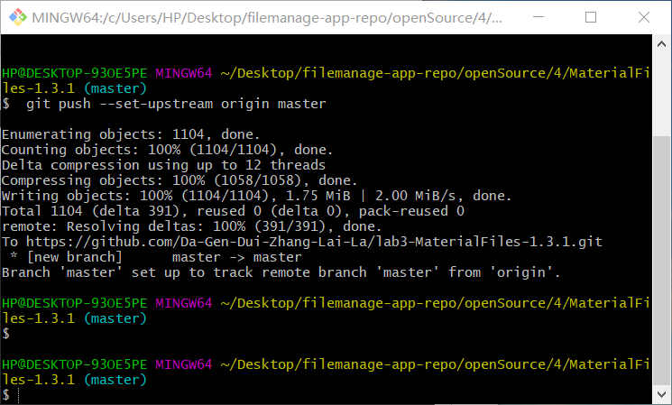

`                       git branch` 构建分支  

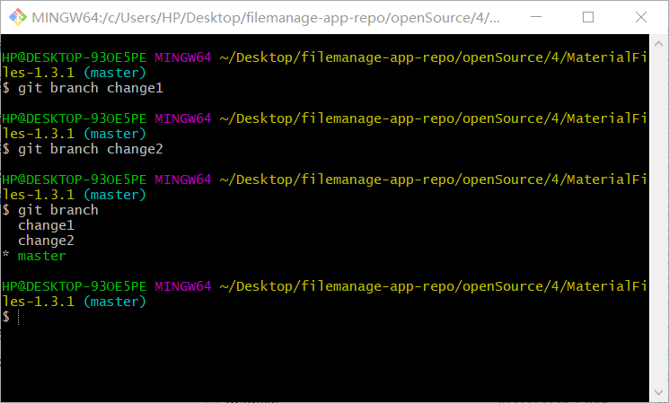

  

`                     git checkout change2`切换分支  

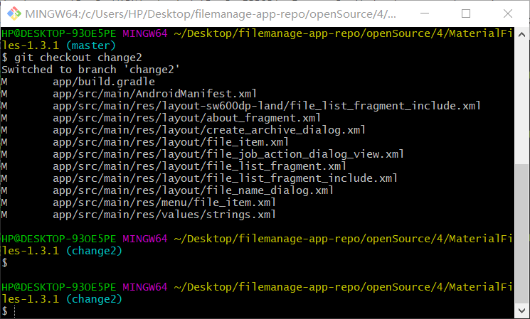

  

在构建两个分支的前提下，完成实验，并合并分支  

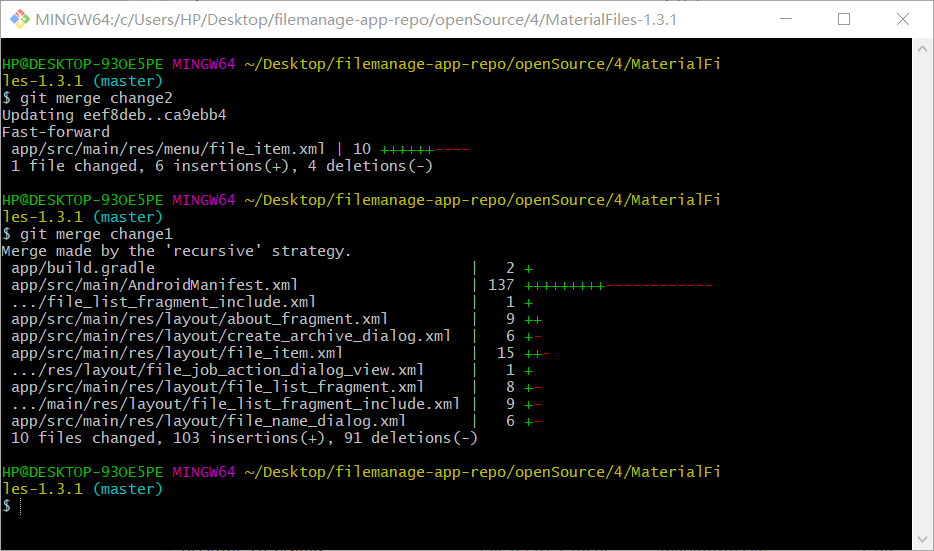

  

随后采用 `git log --graph` 查看合并情况  

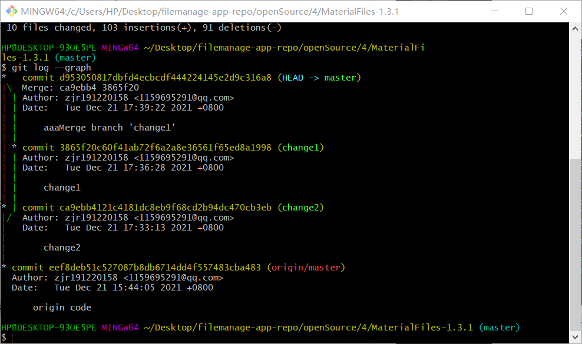

  

此时已是稳定版本，`git tag`打上标签  

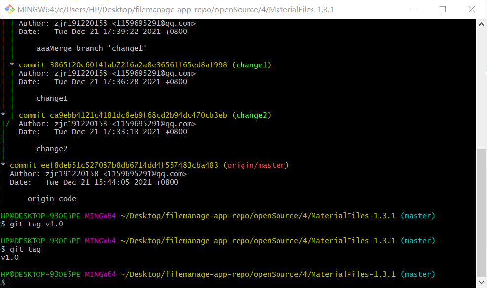

  

执行`git push`，将修改好的代码push入仓库即可  

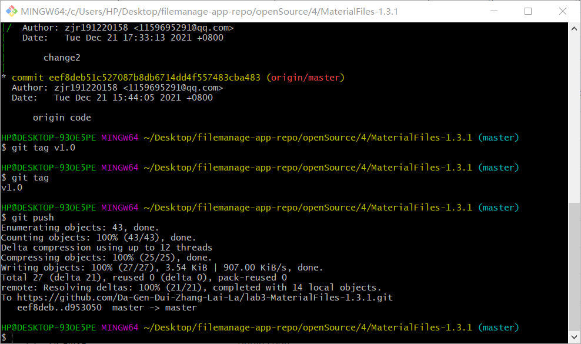

## **实验总结**

- **使用git的好处？**

  ​        利用git可以方便地进行版本管理，时刻进行回退，避免误操作带来不可逆的损失；同时git拥有方便的分支操作，各个分支进度独立，以免前人修改的代码对后人的实验产生影响，便于多人协作开发。 

- **使用远程仓库（如github/gitee等）的好处？**

  ​        远程仓库可将代码传送到网络上备份，保证了代码安全；同时分享代码既便于多人协作开发，也便于程序员之间的交流，促进思想的碰撞。

- **在开发中使用分支的好处？你在实际开发中有哪些体会和经验？**

  ​       每个分支互不干扰，互相独立，完成任务后可以直接merge到主分支里，简单，快捷，稳定，极大地方便了多人协作开发。

  ​       实际开发中，我利用两个分支完成不同的子任务后merge到主分支里，就得到了所需的项目，有效地帮助我完成了任务。

