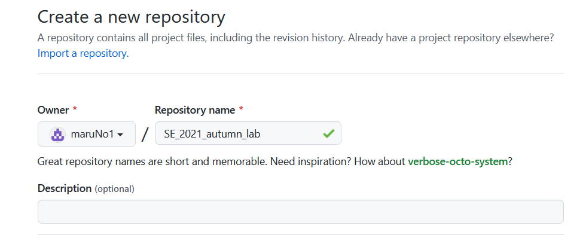
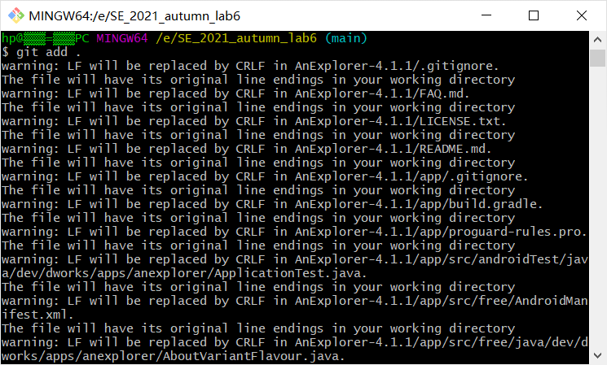
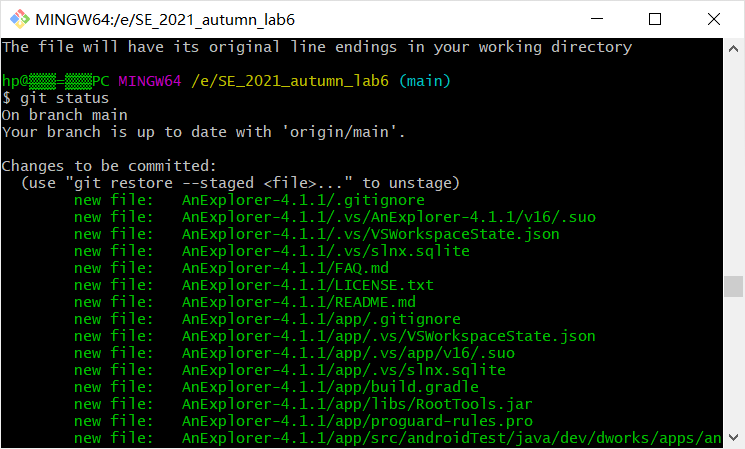
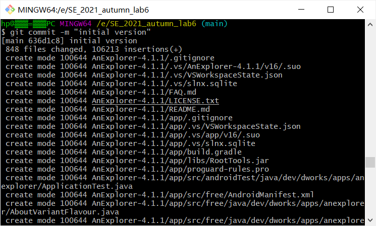
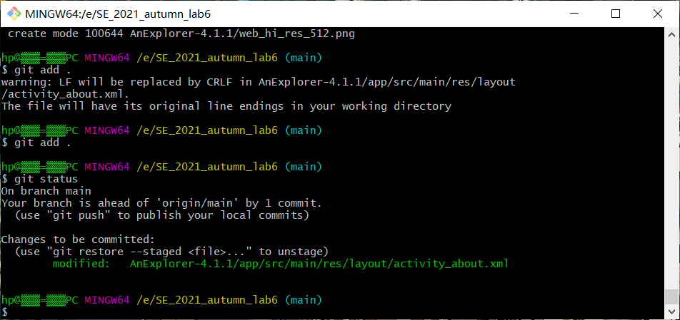
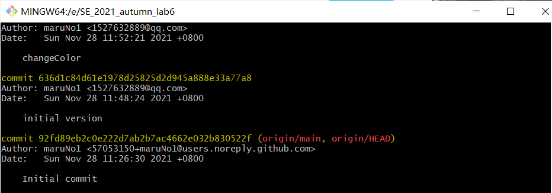
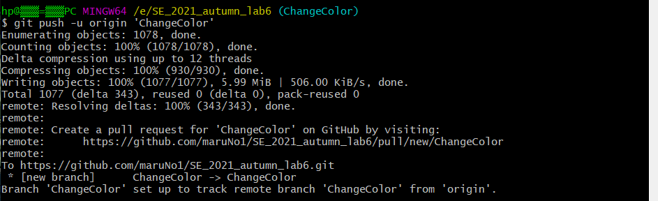
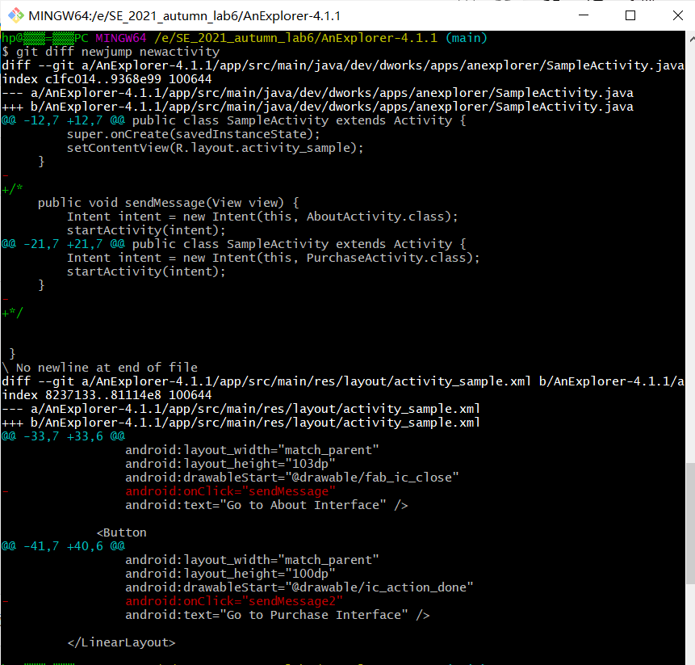
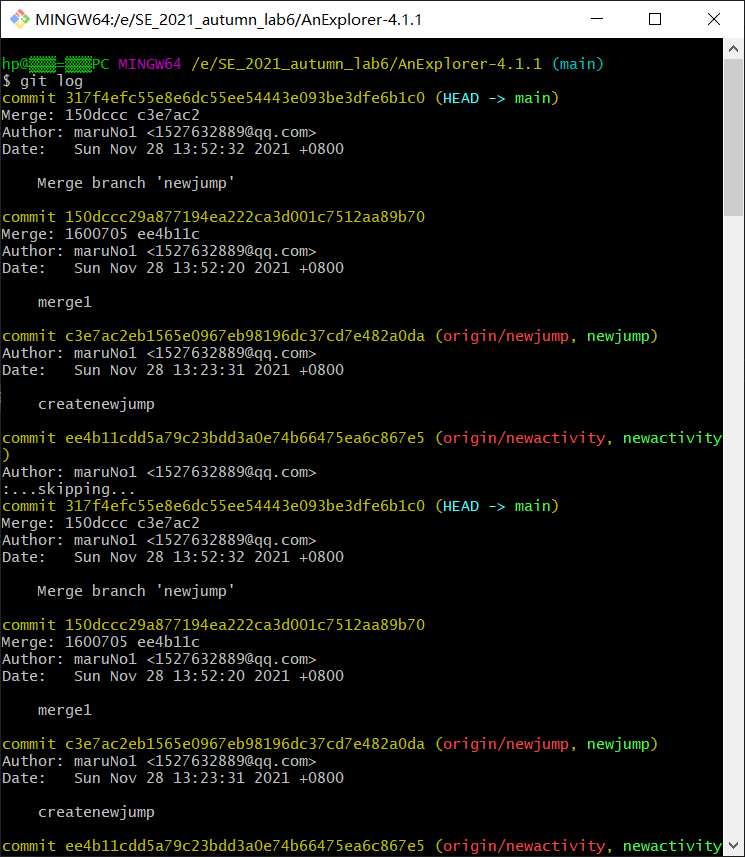
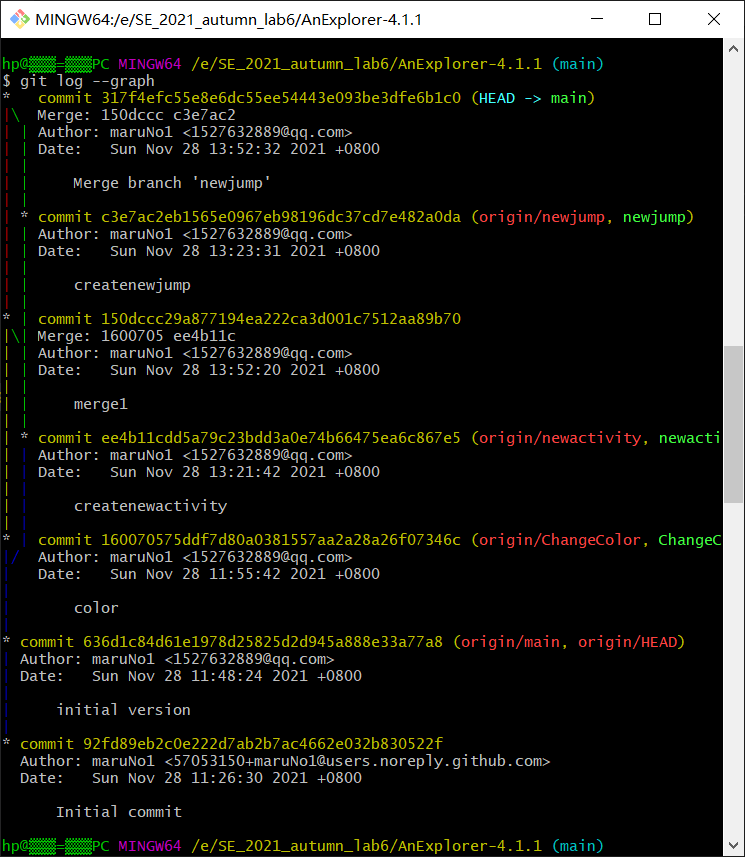

# 实验六实验报告

### 191220159 张久霖

## 1.实验目的

? 了解协同开发与持续集成过程

? 学会使用项目协同开发管理工具 git/github

? 了解持续集成并使用 jenkins 自动构建项目

## 2.实验内容

? 安装 git，在本地将你的开源项目目录初始化为 git 仓库 (如已有.git 文件夹请先删除)

? 在本地尝试修改、提交、回退等过程，在报告中展示你的操作，并使用 git diff, git
log, git status 等命令展示操作前后的区别

? 根据实验三针对几个页面进行微调的任务，在本地为每个子任务创建一个分支并在各
分支上进行开发，最终将所有修改合并到 master 分支上；如有冲突请尝试解决。在报
告中展示你的操作，并使用 git log --graph 命令展示分支合并图

? 给你的某个稳定版本的代码打上标签

? 注册 github 账号，在账号中创建远程仓库 (权限请设置为 public)；把本地的所有分支和标签推送到远端

? 使用 pull request 提交自己的代码和报告

? 在报告中回答以下问题：

    ? 使用 git 的好处？
    ? 使用远程仓库 (如 github/gitee 等) 的好处？
    ? 在开发中使用分支的好处？你在实际开发中有哪些体会和经验？
    ? 如果你额外学习并实践了关于 git/github 的其他进阶操作 (如 merge 和 rebase 的区别、reset 和 revert 的区别、stash, cherry-pick 的使用等)，可在报告中展示

## 3.实验过程
### 3.1 初始化仓库
在远程建立仓库并在Git Bash中 ```git clone``` 到本地进行修改


```
git clone https://github.com/maruNo1/SE_2021_autumn_lab6.git
```
### 3.2 将初始文件添加到暂存区
使用 ```git add``` 命令


Warning原因：Linux系统和Windows系统的换行符不同
### 3.3 查看当前暂存区状态
使用 ```git status``` 命令


### 3.4 提交当前修改
使用 ```git commit``` 命令


### 3.5 回退
先进行修改，并添加到暂存区；
使用 ```git status``` 查看，可以看到绿字标出了本次修改的文件


提交这次修改后，使用git log命令查看这几次提交过程


使用 ```git reset``` 命令回退到上个版本


### 3.6 为每个子任务创建一个分支
使用 ```git checkout``` 命令创建子分支


修改后重复的一系列 ```git add、git commit ```即可；
这里也可以使用 ``` git push -u origin 'ChangeColor' ``` 命令将分支传给远程仓库；



### 3.7 合并分支
重复进行上一步操作知道为所有的子任务都创造出子分支后；
使用 ```git diff``` 命令查看不同分支间的不同


先使用 ```git checkout``` 命令回到main中


再使用 ```git merge``` 命令将另外三个分支合并到main中
用 ```git log``` 查看合并信息


使用 ```git log --graph``` 命令展示分支合并图



### 3.8 给稳定版本打上标签

使用 ```git tag``` 命令为commit打标签


## 4 思考题

### Q1：使用git的好处？
### A1：
    1.在本地建立一个版本库，可以在本地开发过程中随时管理自己的代码版本，便于随时回退版本；
    2.可以建立分支，直接在分支上修改某一部分的代码后再进行提交和合并，避免了在一个分支上开发所有部分的麻烦；
    3.git支持远程协作、可以同步本地和远程仓库，更方便多人协作。

### Q2：使用远程仓库 (如 github/gitee 等) 的好处？

### A2：
    1.便于团队的协作开发。
    2.将数据保存在远端，可以避免本地设备原因导致数据丢失，降低风险和损失。


### Q3：在开发中使用分支的好处？你在实际开发中有哪些体会和经验？

### A3:
    1.不同版本代码的开发互不影响，可同时进行，提高了开发效率。
    2.保护了主分支的干净稳定、完整可用，也使得项目的版本迭代更加清晰。
