# 一、使用git/github进行协同开发

## 1.git操作展示

### 基本操作

在git仓库中使用`git checkout -b` 创建并切换至新分支

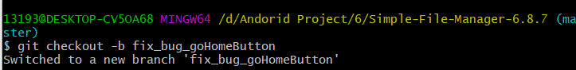

修改代码后，使用`git status`查看状态，查看到有修改后未加入暂存区的文件

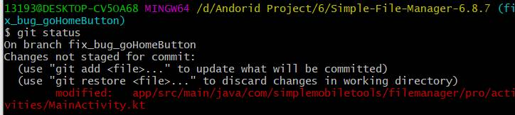

执行`git add`和`git commit`操作

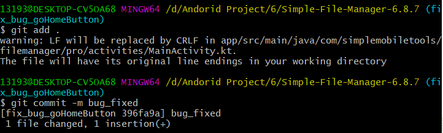

再使用`git status`和`git log`命令查看，可以看到新分支的指针向前移动了（HEAD指针也随之向前移动）。

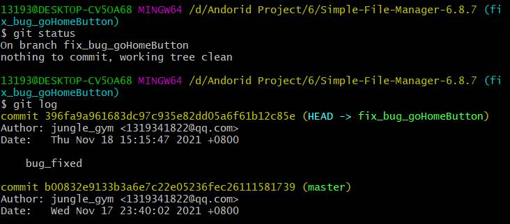

打开冲突文件，可以看到文件中内容发生变化，新增了需要**手动解决冲突**的部分

这里使用的是VSCode，其中的Git插件提供了较为方便的手动合并分支的功能，本次实验中，选取的是"accept     ....."

当然，实际代码开发中，可能遇到更为复杂的情况，如需要用对两个分支中的语句使用`if-else`逻辑合并在一起等，这时就无法直接使用插件的功能完成合并，需要手动修改文件进行合并。

接下来使用`git switch`切换回master分支

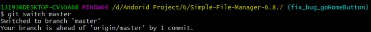

进行`git merge`操作合并分支

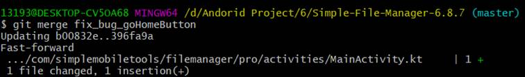

使用`git tag`给稳定版本打上标签

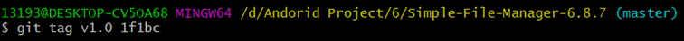

最后使用`git log –-graph`查看所有分支以及合并的标签

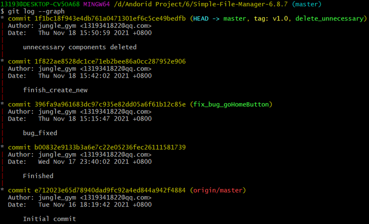

使用`git push --all origin`把本地的所有分支和标签推送到远端

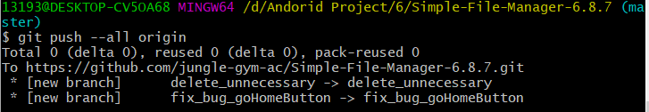

### 同步上游仓库的修改

下面展示一下进行`pull request`前如何同步上游仓库的修改：

首先使用`git remote -v`查看上游仓库信息。

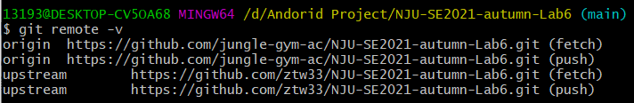

使用`git fetch upstream`获取上游仓库中的更新

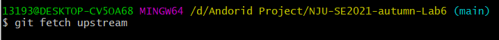

此时上游仓库中的分支已经被抓取到本地，我们可以通过`git log`查看一下

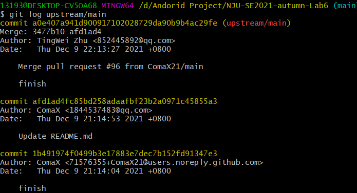

接下来，使用`git merge`将上游仓库中的`upstream/main`分支合并即可。

## 2.我学习的git进阶操作

`git rebase`和`git merge`的区别：

- `git merge`将两个分支的提交合并为**网状**结构的提交记录，保留了被合并分支的提交记录。

- `git rebase`则将被合并的分支的所有提交记录拼接在当前分支的所有提交记录之后，形成**线性**的提交记录。

## 3.思考题回答

- 使用git 的好处
  - git是分布式版本控制系统，每台设备上均有完整版本库，使得git相对于集中式版本控制系统更加灵活。
  - git的版本管理功能，能够很方便地追踪和保存目录下所有代码文件的**修改、新建和删除**，能够很方便地保存和管理不同版本的提交，随时可以回退到之前的版本或撤销修改。
  - git的分支管理功使我们能够非常方便的创建和管理不同的分支，在各个分支间自由穿梭，分支的合并也非常方便。也为多人协作提供了便利。

-  使用远程仓库(如github/gitee 等) 的好处
  - 使用远程仓库，可以方便地实现开发过程中的**多人协作、多设备协作**，使得开发者可以无视地理位置、随意选择不同的设备进行开发。
  - 将代码储存在远程仓库中，防止了因为设备故障、设备丢失、不小心删除或重置了设备上的git仓库等问题而导致丢失代码的问题。
-  在开发中使用分支的好处？你在实际开发中有哪些体会和经验？
  - 我在开发时使用不同的分支，能够**使代码的不同版本间的结构和关系更加清晰**。使用分支后，不同版本间的关系图从一条直线变成了**树状结构**。
  - 进行开发时，每个分支可以**用于实现不同的功能模块、进行不同的尝试**，这样**在每个分支上开发的目标更加清晰**，产生错误等情况时也无需修改主分支。
  - 使用分支方便了**多人协作**，每个开发者可以在不同的分支上进行开发而互不影响。

## 二、持续集成

尚未完成。计划后续进行实验六时完成。