# SE_2021_Autumn-lab6 实验报告

实验名称：项目协同开发管理与工具集成环境实验

姓名：张蔚

学号：191220165

## 一、初始化

安装git，在本地将你的开源项目目录初始化为git仓库

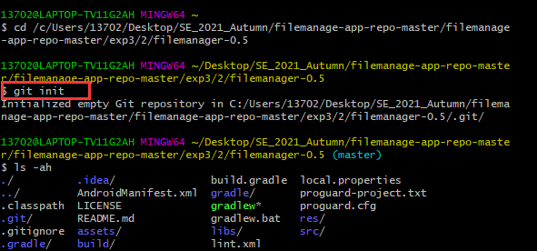

## 二、在本地尝试各种git指令

- 首先在另一个git仓库中进行（test.txt文档中的内容为：NJU_SE_2021_Autumn）：

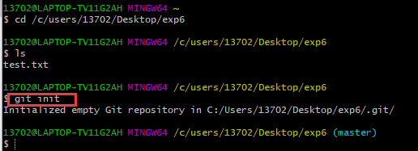

- 使用add添加并commit，输入git diff，git log，git status命令：

- 修改test.txt文档中的内容为：SE_2021_Autumn（此时还未add添加），输入git diff，git log，git status命令：

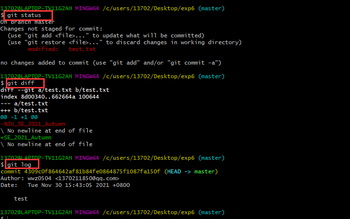

- 使用add添加，输入git diff，git status命令：

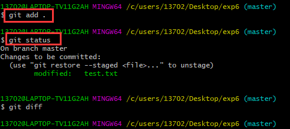

- 使用commit，输入git diff，git log，git status命令:

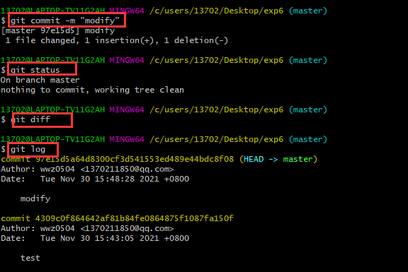

- 回退到上一版本，输入git log命令：

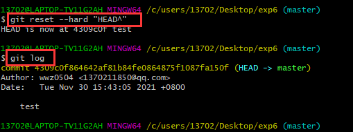

## 三、实验三开发

- 根据实验三，在本地共创建了三个分支，依次在分支下进行修改，commit后push到远端：

（get checkout -b “  ” 切换到分支下进行修改）

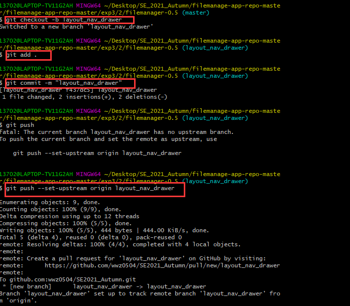

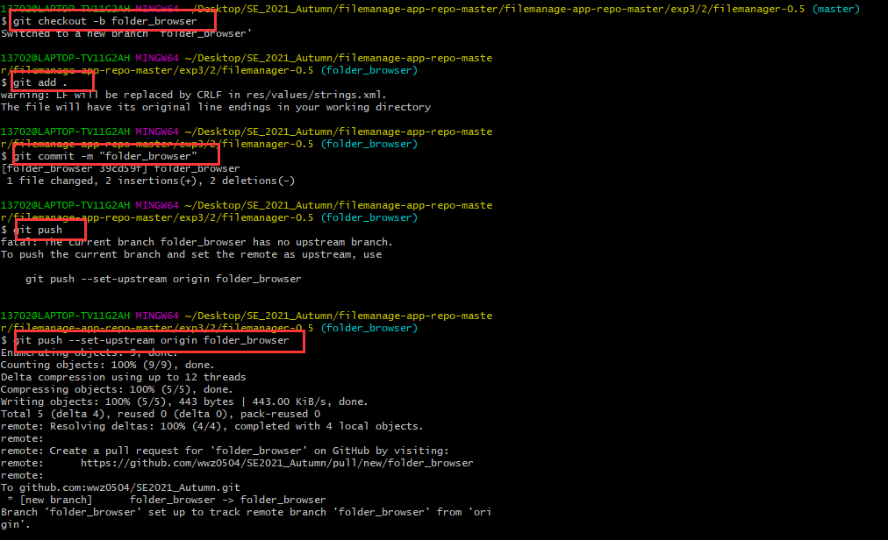

- 可以使用git branch命令查看分支，并使用git merge合并三个分支：

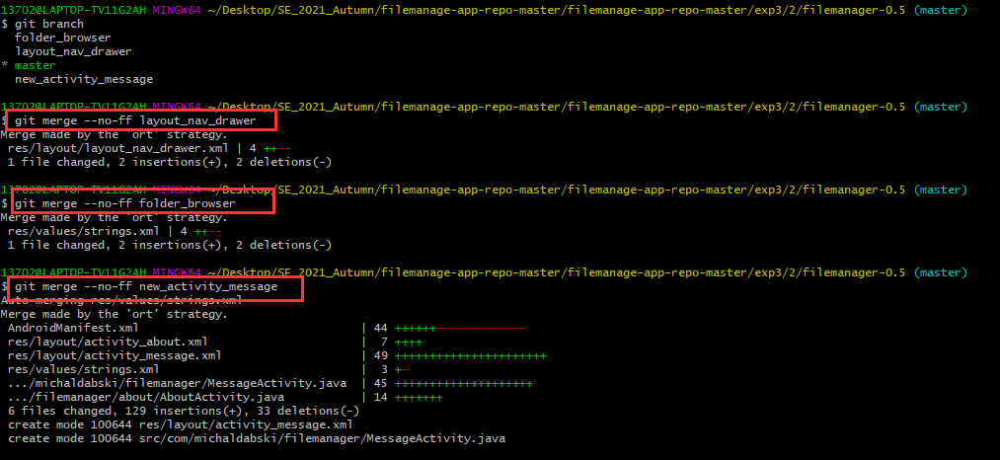

- 使用git log --graph命令查看分支合并图：

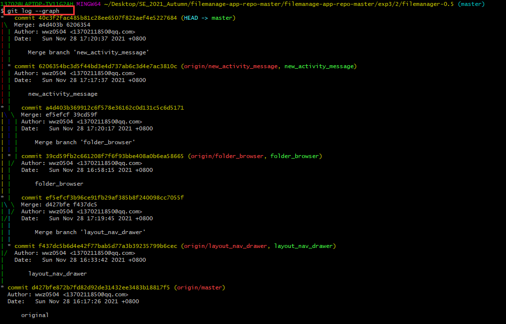

## 四、添加标签

- 使用git tag打上标签：

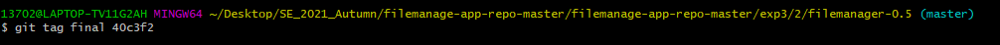

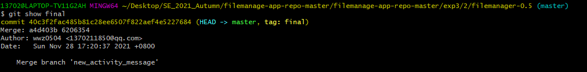

- 使用push上传到远端：

## 五、思考题

#### 1. git的好处？

- <u>本地拥有版本库，随时进行版本后退</u>

可以先把一部分写好的代码commit到本地库，后面再完成另一部分代码后再次commit到本地库，这个时候我们想要回退到前一个代码版本，直接在本地操作即可；

- <u>非常简单的建立分支</u>

比svn更快速的分支切换，因为分支都在本地；

- <u>速度更快</u>

无论是在克隆clone代码还是切换分支、提交修改，这些步骤无论从逻辑机制和速度来说都有了极大的提高；

- <u>指定和若干不同的远端代码仓库进行交互</u>

根据需要设定不同的协作流程，比如层次模型式的工作流。

#### 2. 使用远程仓库的好处？

- 将自己的代码保存在远程仓库中，方便备份和随时查看。
- 方便多设备开发，在不同场景下通过远程仓库快速同步代码。
- 方便多人开发、团队合作，有利于代码的资源共享。

#### 3. 在开发中使用分支的好处？你在实际开发中有哪些体会和体验？

- 版本迭代更加清晰
- 同时并行推进多个功能开发，开发效率提升
- 利于代码review的实现，从而使整个团队开发更加规范，减少bug率

#### 4. merge和rebase的区别

merge命令不会保留merge的分支的commit；rebase会合并之前的commit历史;

处理冲突的方式：

使用merge命令合并分支，解决完冲突，执行git add .和git commit。这个时候会产生一个commit。
使用rebase命令合并分支，解决完冲突，执行git add .和git rebase ，不会产生额外的commit。

#### 5. reset和revert的区别

git revert是用一次新的commit来回滚之前的commit，git reset是直接删除指定的commit。
在回滚这一操作上看，效果差不多。但是在日后继续merge以前的老版本时有区别。因为git revert是用一次逆向的commit“中和”之前的提交，因此日后合并老的branch时，导致这部分改变不会再次出现，但是git reset是之间把某些commit在某个branch上删除，因而和老的branch再次merge时，这些被回滚的commit应该还会被引入。
git reset 是把HEAD向后移动了一下，而git revert是HEAD继续前进，只是新的commit的内容和要revert的内容正好相反，能够抵消要被revert的内容。

如下图所示：

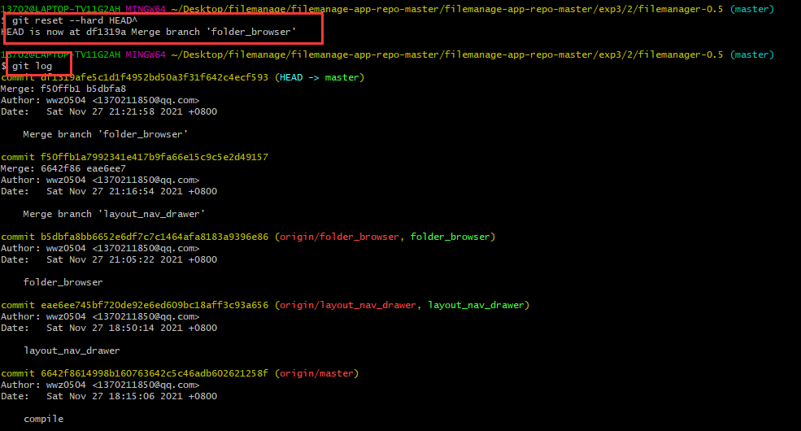

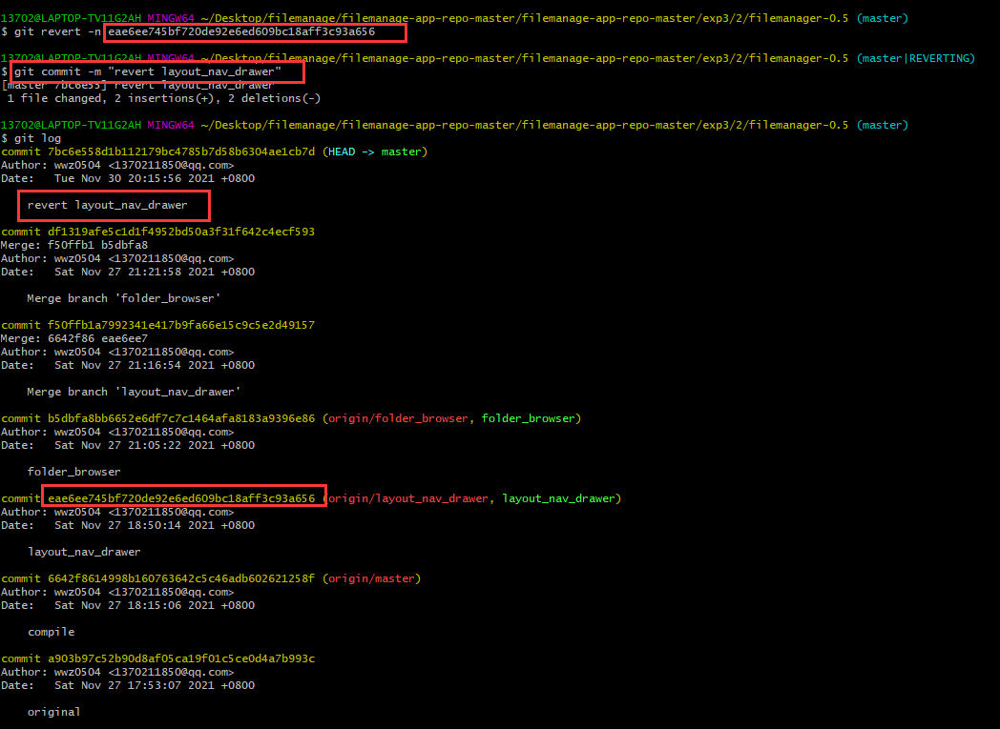

