### 软件工程实验六：项目协同开发管理与工具集成环境实验

###### 学号：191220170			姓名：张弋			邮箱：2358413808@qq.com

#### 实验目的

- 了解协同开发与持续集成过程
- 学会使用项目协同开发管理工具 git/github
- 了解持续集成并使用jenkins自动构建项目

#### 实验内容

- 了解协同开发
- 了解Git命令及其作用并做尝试
- 了解版本控制和分支管理以及开发策略并对开源项目进行修改
- 了解远程仓库并向开源社区贡献代码

#### 实验结果

1. 安装 git，在本地将你的开源项目目录初始化为 git 仓库 (如已有.git 文件夹请先删除)

2. 在本地尝试修改、提交、回退等过程，在报告中展示你的操作，并使用 git diff, git log, git status 等命令展示操作前后的区别

   **修改：**

   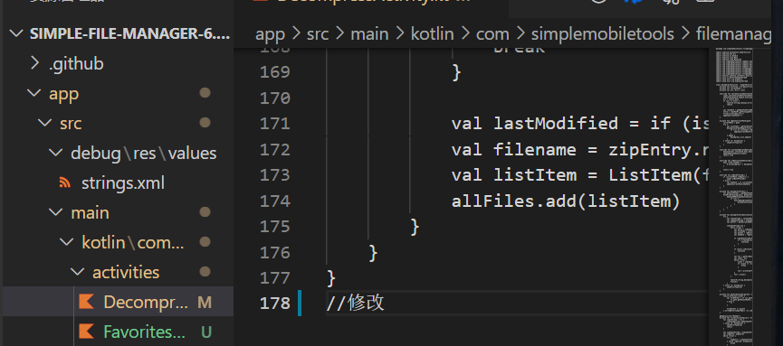

   **暂存并用git status命令进行查看：**

   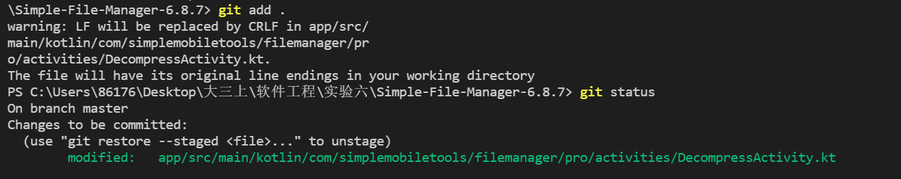

   **提交并用git status、git log命令进行查看：**

   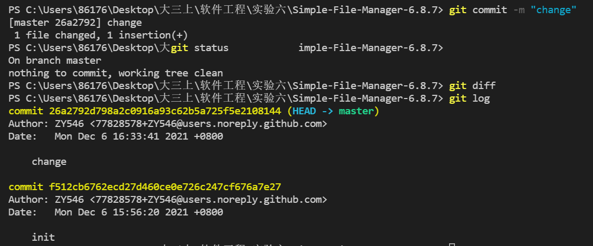

   **回退并用git diff命令进行查看，再次修改文件后再次用git diff命令查看：**

   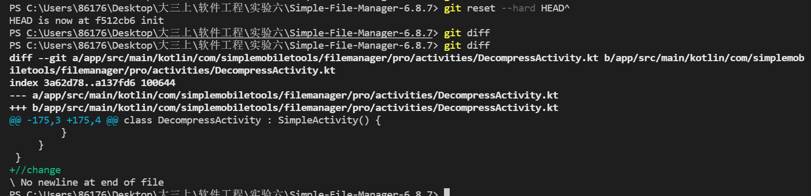

   

3. 根据实验三针对几个页面进行微调的任务，在本地为每个子任务创建一个分支并在各分支上进行开发，最终将所有修改合并到 master 分支上；如有冲突请尝试解决。在报告中展示你的操作，并使用git log --graph 命令展示分支合并图

   **操作过程（子任务以其中一个为例）：**

   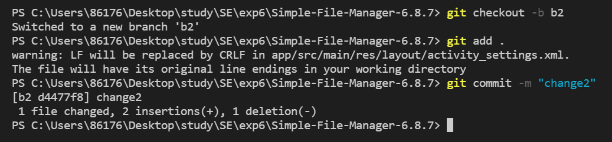

   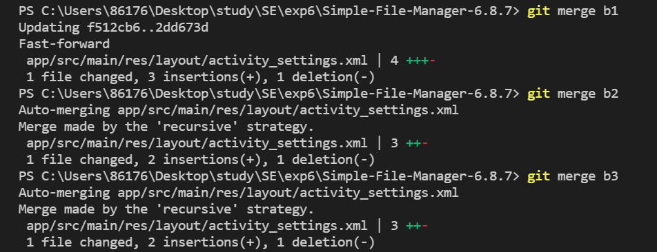

   **分支合并图（没有发生冲突）：**

   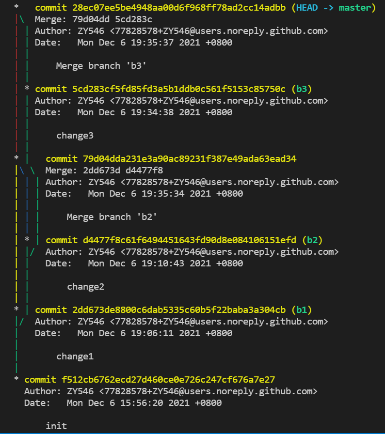

   

4. 给你的某个稳定版本的代码打上标签

   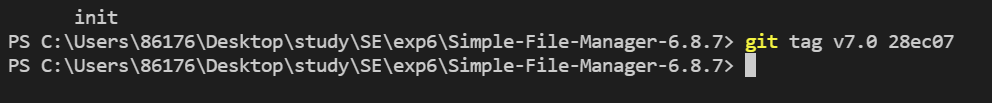

   

5. 注册 github 账号，在账号中创建远程仓库 (权限请设置为 public)；把本地的所有分支和标签推送到远端

   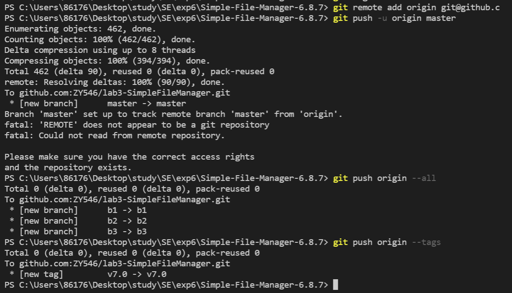

   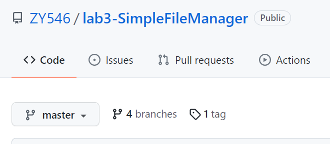

   

6. 使用 pull request 提交自己的代码和报告 (作业提交说明里细 )

7. ##### 实验思考题

   ##### 在报告中回答以下问题：

   ##### 	使用 git 的好处？

   ​	便于项目管理，特别是回退和分支等操作，不仅便于修改，还便于不同任务的分开编写

   ##### 	使用远程仓库 (如 github/gitee 等) 的好处？

   ​	首先，便于大量项目工程的存储；其次，便于协同开发

   ##### 	在开发中使用分支的好处？你在实际开发中有哪些体会和经验？

   ​	提高效率，便于不同任务的分开编码，便于修改和重新开始。我在实际的编码中，将不同的任务在不同的分支上编写，其中一个分支编写出现很大的失误，但由于使用了分支，可以直接将该分支上的修改丢弃，而不影响其他分支上已有的编码

   ##### Git的其他指令学习

   ​	在我的开源项目的修改中，出现了第三个修改的分支的编写错误的问题，我学习了丢弃分支，重新编写的操作

   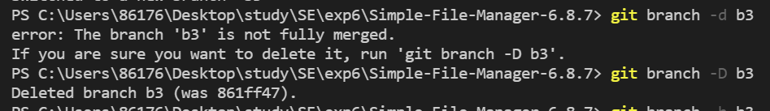