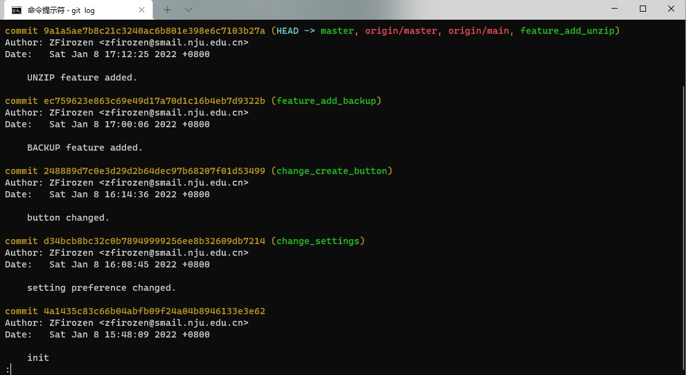
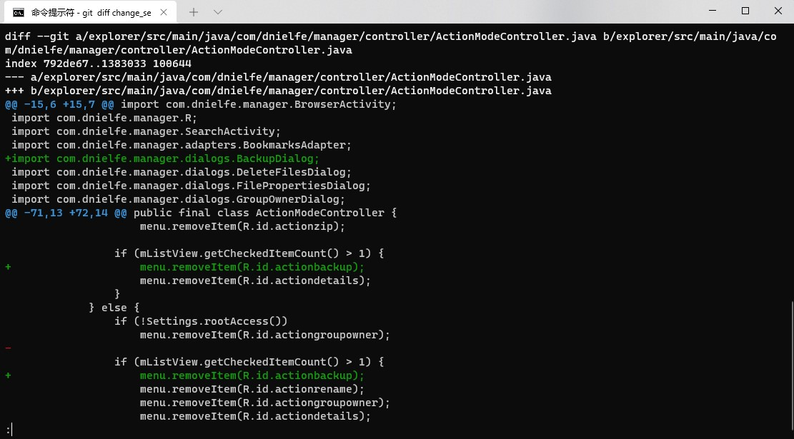
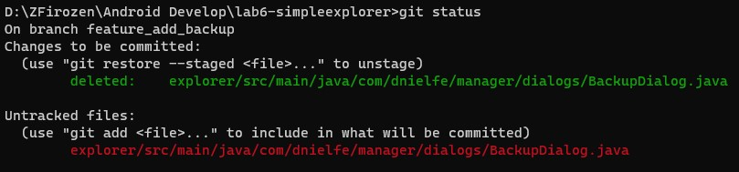
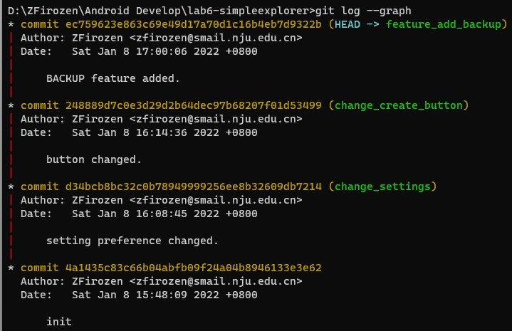
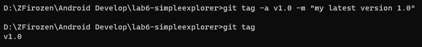

# 软件工程实验六：项目协同开发管理与工具集成环境实验

### 回答问题

##### 使用git的好处？

使用git便于进行版本控制，从而管理开发进度、回顾和检查过往的开发内容。

##### 使用远程仓库(如github/gitee等)的好处？

远程仓库的使用利于团队项目开发的管理和协调，不同团队成员可以负责不同内容而很少会出现进度不一致导致的冲突；出现冲突也可以协调进行合并。

同时，远程仓库还相当于一份备份，当本地文件损坏时可以从远程仓库拉取上一次提交的文件。

##### 在开发中使用分支的好处？你在实际开发中有哪些体会和经验？

可以方便的管理为不同目的作出的修改，不同改动不会互相纠缠在一起。

简单的修改最好也新建一个分支，这样可以避免其他复杂的修改由此变得更加混乱；不过为了提交记录的整洁性，数个简单且相互具有一定关联的修改可以考虑统一在一个分支内。

### Git操作

我使用的Git操作主要包括：

```
git add .
git commit -m "description"
git checkout -b branch_name
git checkout master
git merge branch_name
git push
```

使用`git log`：



使用`git diff`：



使用`git status`：



使用`git log --graph`展示分支开发：



对版本打上`tag`：

