# NJU-SE2021-autumn-Lab6实验报告

姓名：张芷昕

学号：191220173

------

#### 1 初始化

安装 git，在本地将你的开源项目目录初始化为 git 仓库 (如已有.git 文件夹请先删除)

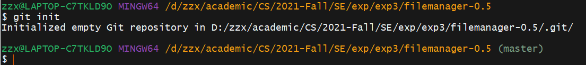

------

#### 2 修改、提交、回退

在本地尝试修改、提交、回退等过程，在报告中展示你的操作，并使用 git diff, git log, git status 等命令展示操作前后的区别

- 另外创建一个仓库，添加`1.txt`用于测试，并将初始版本提交

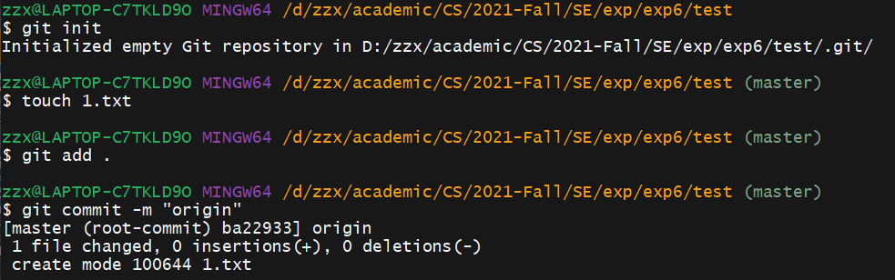

- 修改`1.txt`中的内容，输入`123`

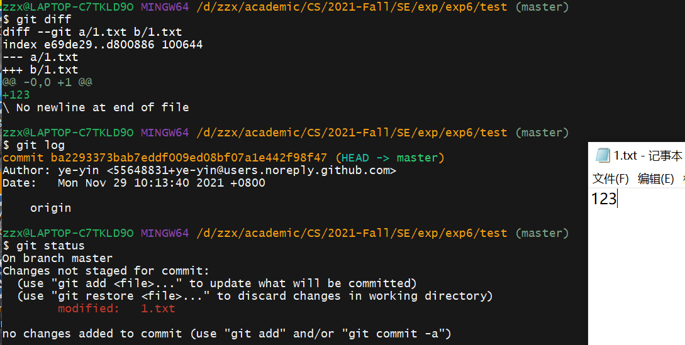

- 提交

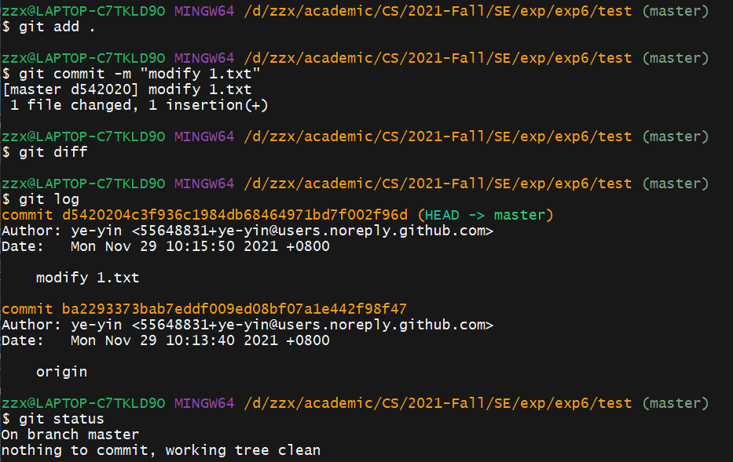

- 回退至初始版本，可见`1.txt`内容为空

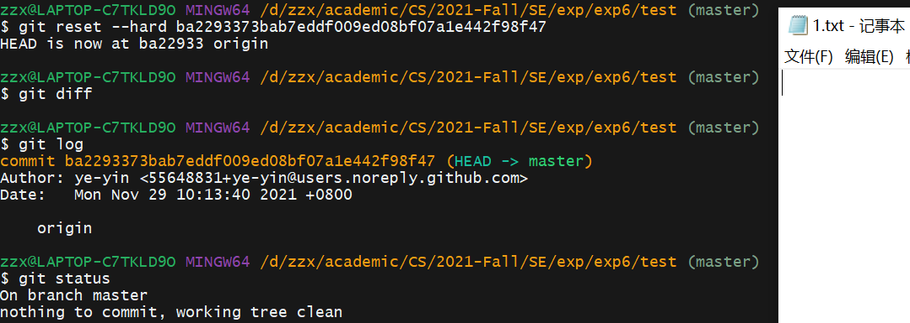

------

#### 3 实验三开发

创建第一个分支，完成修改后将本分支提交。第二个和第三个分支同理。

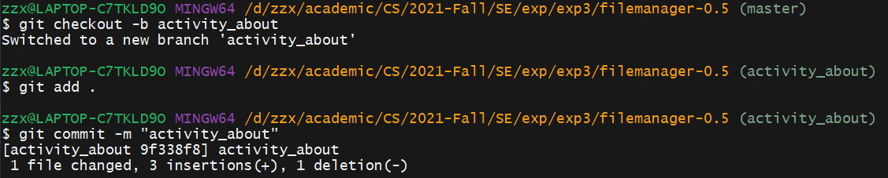

三个分支如下

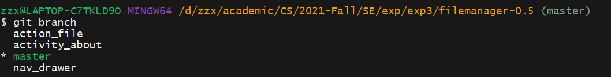

依次合并三个分支

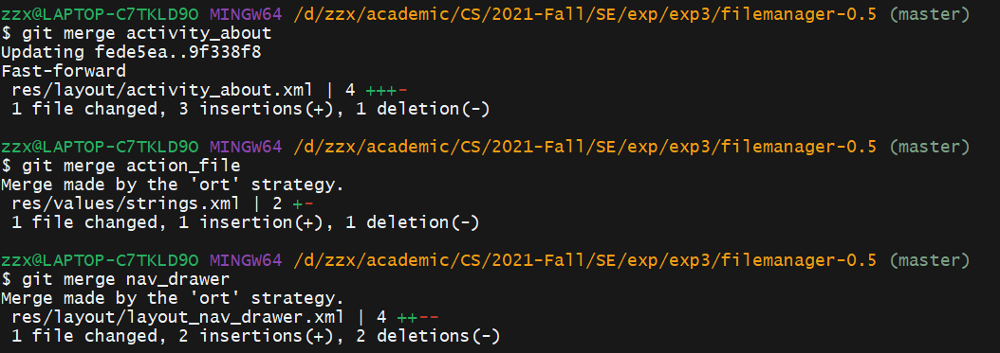

完成实验三后的分支合并图

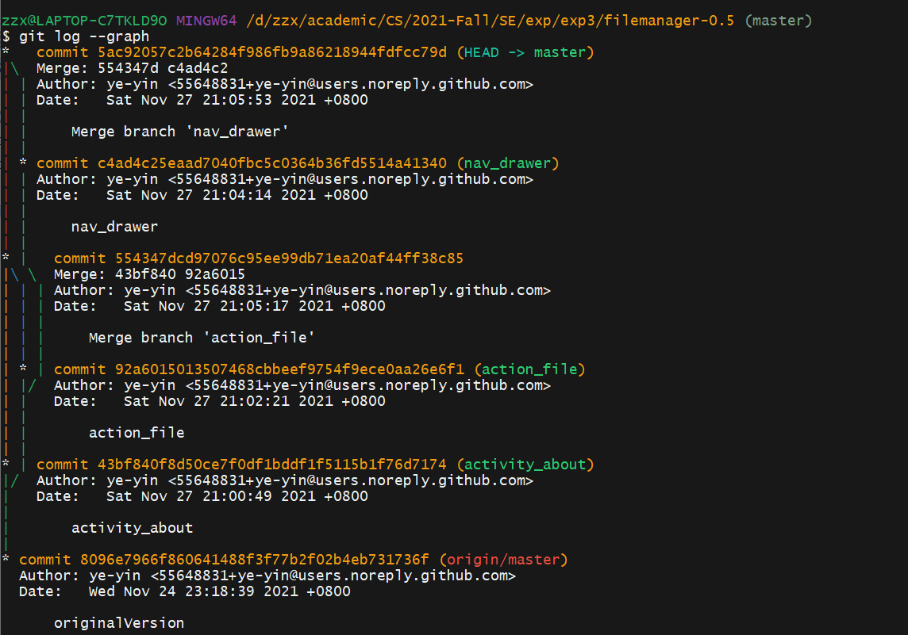

给稳定版本打上标签

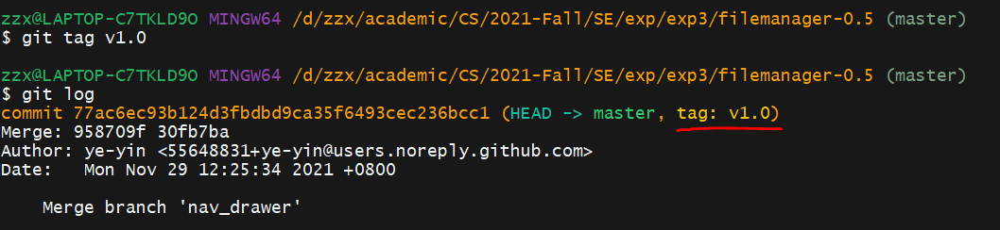

将各分支和标签上传至远程仓库

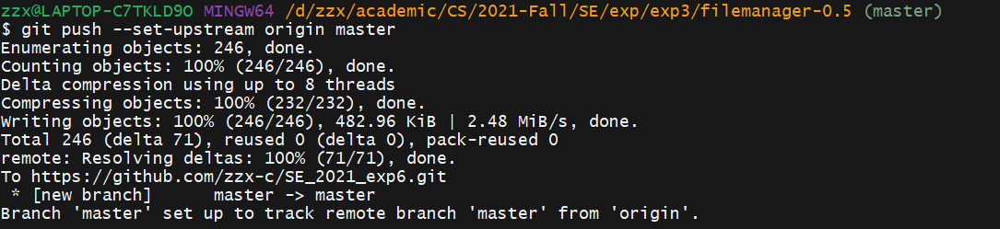

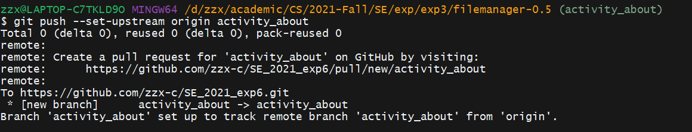

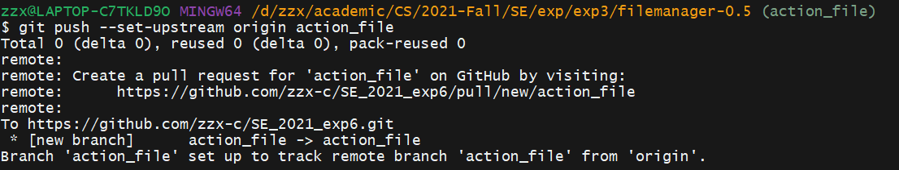

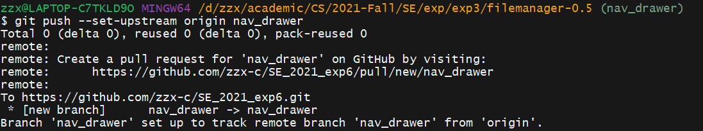

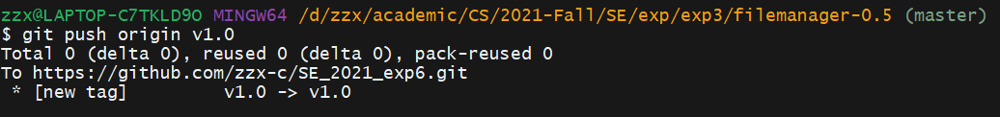

------

#### 4 问题回答

**1. 使用 git 的好处？**

- 本地拥有版本库，随时进行版本后退：先将写好的代码commit到本地库，完成另一部分后再次commit。这时想要回退到前一个代码版本可直接在本地操作，不必担心无法回退，从而减少代码错误造成的损失。

- 非常简单的建立分支：使用git可以直接建立一个分支branch，直接在该分支上修改，修改之后commit到该分支的对应本地库的位置，期间还可以切换回主分支进行修改其他代码。

- 速度更快，克隆代码、切换分支与提交修改使得操作更加灵活。

- 可以指定和若干不同的远端代码仓库进行交互，实现层次模型式的工作流。

**2. 使用远程仓库 (如 github/gitee 等) 的好处？**

- 将自己的代码保存在远程仓库中，方便备份和随时查看。
- 方便多设备开发，在不同场景下通过远程仓库快速同步代码。

- 方便多人开发、团队合作，有利于代码的资源共享。

**3. 在开发中使用分支的好处？你在实际开发中有哪些体会和经验？**

- 版本迭代更加清晰
- 开发效率提升
- 利于代码回退的实现，从而使整个团队开发更加规范，减少bug率

**如果你额外学习并实践了关于 git/github 的其他进阶操作 (如 merge 和 rebase 的区别、reset 和 revert 的区别、stash, cherry-pick 的使用等)，可在报告中展示**

**1. merge 和 rebase 的区别**

- 处理冲突的方式：

  - 使用`merge`命令合并分支，解决完冲突，执行`git add .`和`git commit -m 'fix conflict'`。这个时候会产生一个commit。

  - 使用`rebase`命令合并分支，解决完冲突，执行`git add .`和`git rebase --continue`，不会产生额外的commit。这样更加干净，分支上不会有无意义的解决分支的commit；但如果合并的分支中存在多个`commit`，需要重复处理多次冲突。

- `merge`结果能够体现出时间线，而`rebase`可以把本地未push的分叉提交历史整理成直线，使得我们在查看历史提交的变化时更容易。

**2. reset 和 revert 的区别**

- `revert`是用一次新的commit来回滚之前的commit。`reset`是直接删除指定的commit。
- 使用`revert`，因为是用一次逆向的commit”中和”之前的提交，因此日后合并旧的branch时，这部分改变不会再次出现。而`reset`再次合并旧的branch时，这些被回滚的commit还会被引入。
- `git reset`是把HEAD向后移动了一下，而`git revert`是HEAD继续前进，只是新的commit的内容和要revert的内容正好相反，能够抵消要被revert的内容。

**3. stash**

`stash`可以把当前工作现场“保存”起来，等以后恢复现场后继续工作。

**4. cherry-pick**

cherry-pick会可以将某个分支上commit的更改重新在其他分支上重新提交，即将相同功能应用到其他分支上。