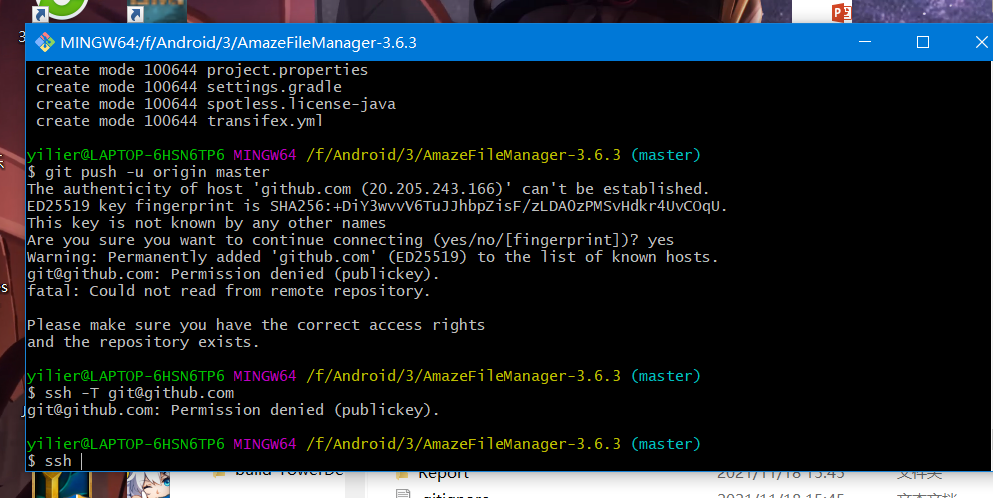

#Report

##我完成本次作业的过程以及问题

1.首先fork了作业提交远程仓库，并将这个分支clone到了本地的仓库，并在Report目录中新建自己的内容并着手写这个报告

2.下一步是在本地创建一个lab3的仓库
使用init指令初始化了一个本地仓库，然后在网站上创建远端仓库并连接
连接时出现了问题

先是无法连接到输入的远端仓库，然后在CSDN上查资料，看到需要查看ssh的权限情况，看代码一查，果然提示出了permission denied。

再次查资料，得知是key的问题。在账号上ssh选项中新增一个key并且使用ssh-keygen -t rsa -C "1136980583@qq.com"（我的申请邮箱）语句使我的本地仓库具有远程仓库的key，最终成功push

3.将没有修改过的文件作为master分支push，再将修改过的文件作为code分支push上去，然后使用子模块将远程仓库放入Project文件夹中

4.最后完成这份报告，add，commit等操作后将报告push上去。

##使用git的好处
用自己的话说，它可以帮我记录不同版本文件的改动并十分方便回溯（git已经在这学期拯救我的高程项目不止一次了），并且也十分方便将代码分享给别人并请他们修改。当然，github的classroom功能也确实让我的多门课程作业提交变得非常便利（除了经常连不上让人非常抓狂）。

##使用远程仓库的好处
保存多个不同版本的代码，打上标签可轻松区别并访问，不占用本地存储空间。分享给别人的时候也不需要传输，直接让他clone自己的仓库就行了。自己本地的内容如果被自己瞎改出问题了，又de了半天bug不知道问题出在哪里，从远程仓库直接回档可以成为救命的方法。

##在开发中使用分支的好处
如果在多人合作开发项目时，自己创建一个分支并在上面工作，自己可以随意修改而不用担心影响原分支的代码进而影响工作进度。当然我目前单人完成的小项目上很少使用分支。分支我感觉就像是一个可以在这个仓库中访问的新仓库，里面的内容似乎可以完全不同且不互相影响。