
计算机科学与技术系

软件工程实验报告

**实验名称:项目协同开发管理与工具集成环境实验**

**学号：191220176**

**姓名：赵智宇**

**指导老师：张天**

**实验地点：基础实验楼乙区208**

**实验时间：2021.11.22**

### 一、实验名称
1. 项目协同开发管理与工具集成环境实验

### 二、实验目的
1. 了解协同开发与持续集成过程
2. 学会使用项目协同开发管理工具 git/github
3. 了解持续集成并使用 jenkins 自动构建项目

### 三、实验环境
1. 软件: Git for Windows,
2. 硬件：Android版本 11.0 x86_64 Pixel 2 API 30

### 四、实验内容
+  安装 git，在本地将你的开源项目目录初始化为 git 仓库 (如已有.git 文件夹请先删除)
+ 在本地尝试修改、提交、回退等过程，在报告中展示你的操作，并使用 git diff, git
log, git status 等命令展示操作前后的区别
+ 根据实验三针对几个页面进行微调的任务，在本地为每个子任务创建一个分支并在各
分支上进行开发，最终将所有修改合并到 master 分支上；如有冲突请尝试解决。在报
告中展示你的操作，并使用 git log --graph 命令展示分支合并图
+ 给你的某个稳定版本的代码打上标签
+ 注册 github 账号，在账号中创建远程仓库 (权限请设置为 public)；把本地的所有分支
和标签推送到远端
+ 使用 pull request 提交自己的代码和报告 (作业提交说明里细 )
+ 在报告中回答以下问题：
   + 使用 git 的好处？
   +  使用远程仓库 (如 github/gitee 等) 的好处？
   +  在开发中使用分支的好处？你在实际开发中有哪些体会和经验？

### 五、实验过程与结果说明
+ 为了演示，在d盘新建目录git_test，用`git init`命令初始化仓库，出现`.git`文件夹
   + 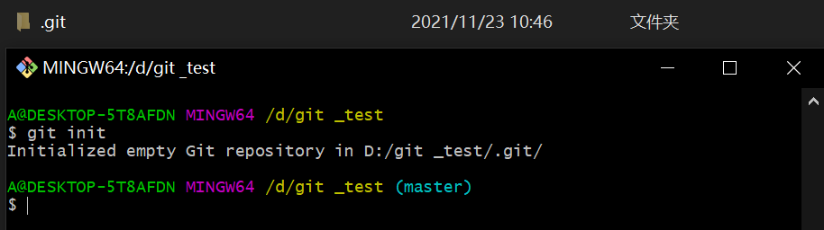 

+ 在该目录下新建`for_test.txt`文件，此时输入`git status`命令，显示此时没有`commit`记录，并提示有修改未被加载到暂存区
   + 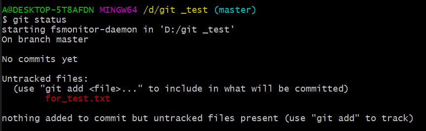 

+ 此时输入`git add`命令，将修改加载到暂存区，并再输入`git status`命令，此时提示，暂存区有未提交的变化
  +  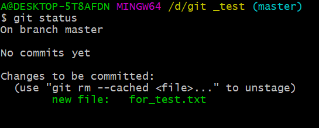 

+ 此时，在`for_test.txt`文件输入两行内容，再输入`git diff`命令，提示工作目录和暂存区文件有不同（当然，`git diff`命令还有很多其他参数可加，这里不再进一步展示了）
  + 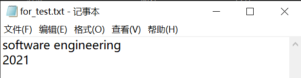 
  + 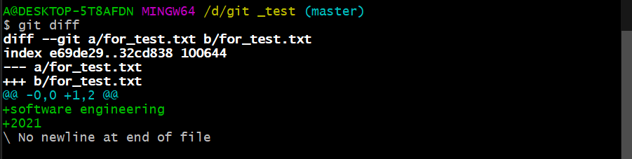 

+ 随后调用`git commit`命令，提交修改，再输入`git status`命令，显示提交成功，并且工作区干净
  + 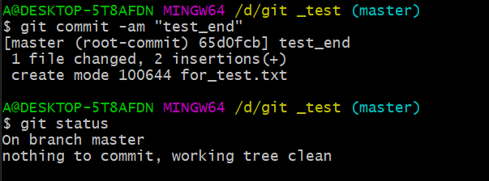 

+ 一开始，在进行实验三时，并没有遵照实验六的指导，并没有为每一个子任务创建一个分支，全部在`master`分支上进行，因此我在这里截图展示一下之前的`git log`,随后新建仓库快速重复实验三的过程
   + 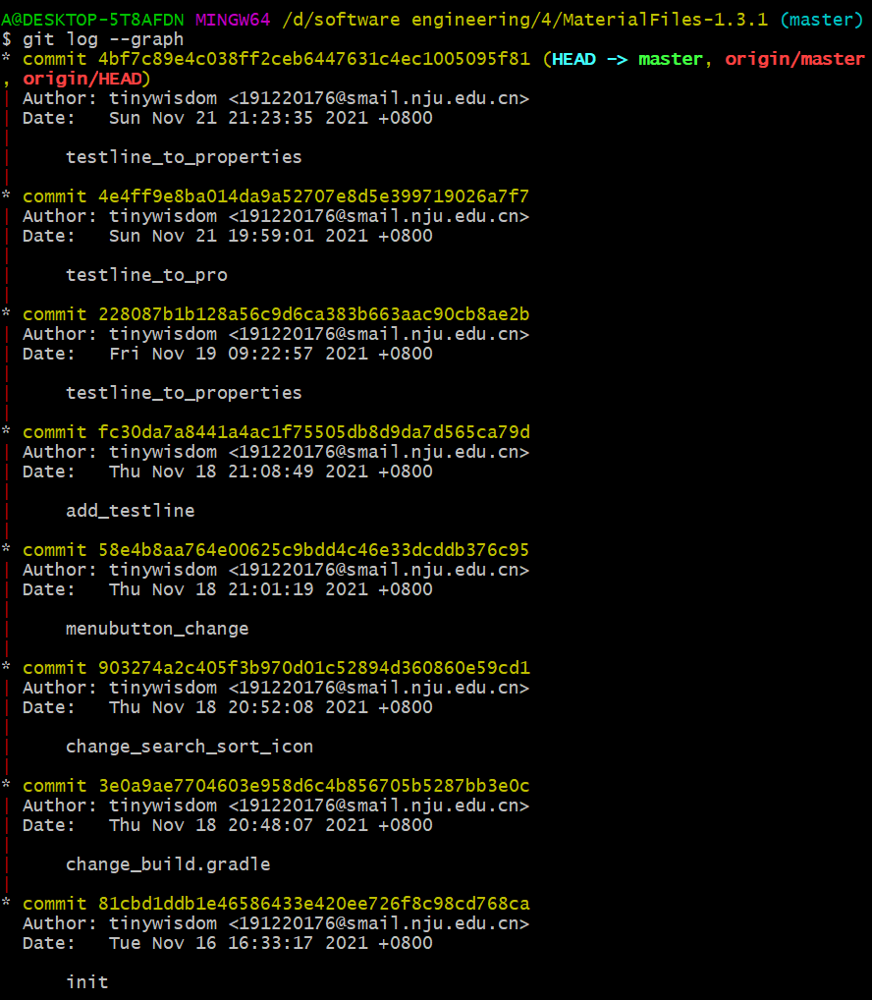 

+ 重做实验三时，新建了三个分支，分别为`button_icon`,`button_colour`,`new_testline`，分别进行修改，完成后提交，并且并入`master`分支，由于并没有涉及对同一个文件的改变，并没有出现冲突的情况。在实验过程中，每一个分支都可以用`git reset`命令回退版本。
   + 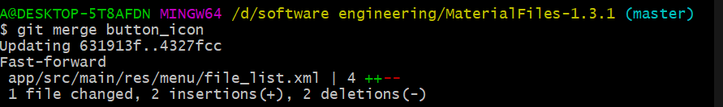 
   + 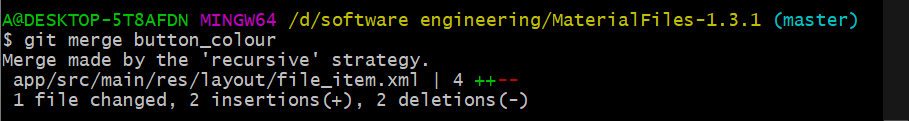 
   + 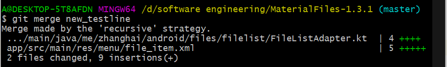 

+ 最后，展示`git log --graph`
  +  

+ 接下来是对过去的一些提交打上标签，这里先查询打印历次提交的信息和校验和，随后进行打上标签的操作，并且推动到远端仓库
   + 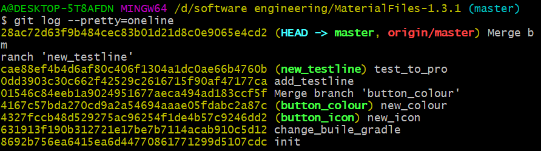 
   + 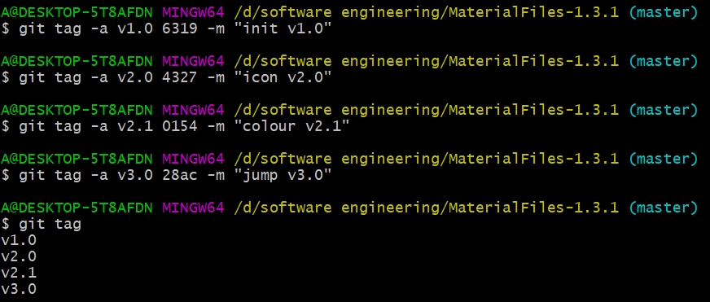 
   + 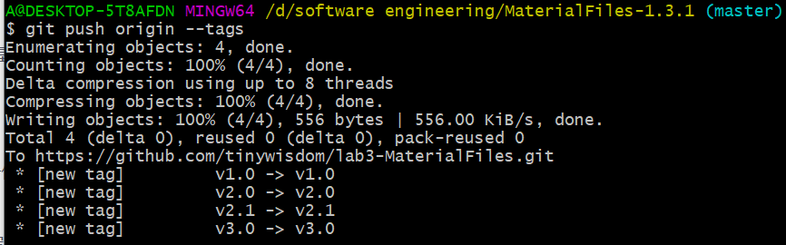 

+ 最后是对`fork`源仓库提出`pull request`的申请，请求管理人员审查并且进行代码的合并。这里进行时我没能完全理解`pull request`的意义，在自己的远端仓库未更新时直接提出了PR，后经助教提醒才意识到本地还没有进行`git push`操作，在这个过程中，我也是体会到了“PR前先更新源仓库”的重要性,还包括本地仓库和远端仓库的同步。

### 六、回答问题
+ 使用 git 的好处？
   + 管理代码，尤其是项目代码十分方便，当错误的修改涉及多文件时可以及时回退
   + 运用分支管理，单人开发可以进行试错尝试，多人开发则便于代码合并
   + 备份代码，和远程仓库交互更加便利 
+  使用远程仓库 (如 github/gitee 等) 的好处？
   + 对个人来说，便于代码和数据的备份管理
   + 对社区来说，便于开源代码的分享和项目的多人协作  
+  在开发中使用分支的好处？你在实际开发中有哪些体会和经验？
   + 便于多人协同进行开发项目，提高效率，降低了管理代码的成本 
   + 单人开发时，创建多个分支可以进行多种想法的尝试，根据结果选择是否采用
+ 个人的体会
   + git让试错几乎毫无成本，只要随时备份提交，因为可以回退，任何想法都可以尝试。
   + 分支给团队协作提供了非常理想的平台，管理团队项目代码显得十分快捷方便。 

### 七、额外的问题
+ 关于`merge` 和 `rebase`
   + 我浅显的理解是，在进行分支合并时， `merge`根据两条分支的最新提交，合并生成一个新的`commit`记录，形成的是平铺的树状结构。`rebase`则是从两条分支的共同最近祖先开始，会把其中一条分支的所有改变复写到另一条分支上，最终只剩下一条分支，这些提交也会进行更新，获得新的校验码。个人的感觉是`rebase`可以“剪去”不必要的分支记录，避免提交树的结构过于复杂。
+ 关于`reset` 和 `revert`
   +  `reset`是让指针回退到指定的提交位置，类似于“时间回溯”；`revert`则是生成一个新的`commit`记录，这个提交的内容和指定位置一模一样，类似于“昨日重演”。当本地仓库和远程仓库一致时，使用`reset`，会使得本地仓库版本落后于远程仓库；使用`revert`则是对本地仓库的更新，版本领先于远程仓库。
+ 关于`git stash`和`cherry pick`
   +  `git stash`可以暂时保存当前修改的状态，并且回退到之前的某个提交记录。比如当我在修改某个功能时，源仓库的代码需要同步一个更新，那么可以暂存当前的修改，回退到某个版本同步更新，再处理保存的修改状态。
   + `cherry pick`可以选择某个分支上的某个（或者某些）提交，合并到另一个分支上，而不是直接进行分支的合并。

 实验评分：____________ 

指导教师签字：____________

____年____月____日

