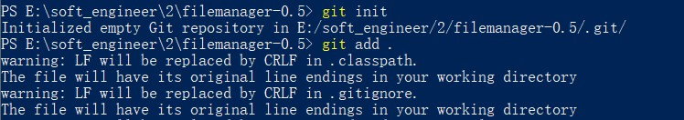
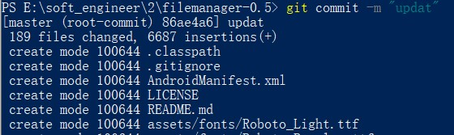
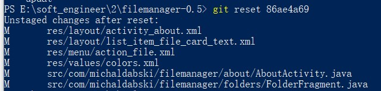
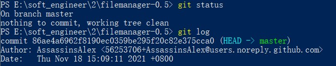
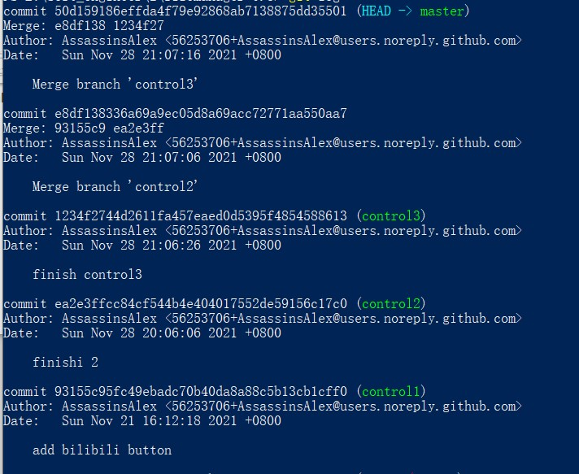
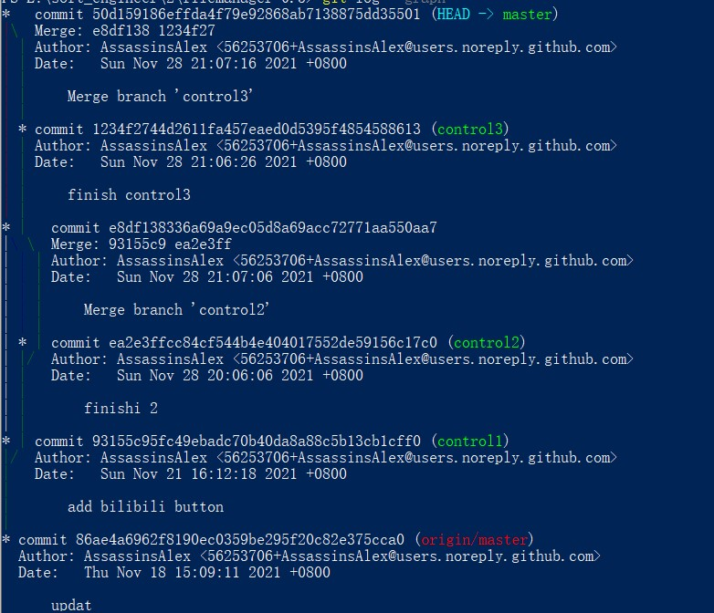

E:\soft_engineer\2\filemanager-0.5>git remote add origin https://github.com/AssassinsAlex/SE_experiment.git

# 实验六实验报告

191240018-贾林杰  
2021.12.16

## 实验操作1，修改、提交、回退

>
>提交  
>  
>回退   
>

## 实验操作2， log， status

>

## 实验操作3，分支和图

>
>

## 使用的好处

>1. 方便管理版本，方便回退和修改
>2. 远程仓库方便了多人协作和多人远程开发
>3. 分支可以方便进行多种尝试，开发不同的版本