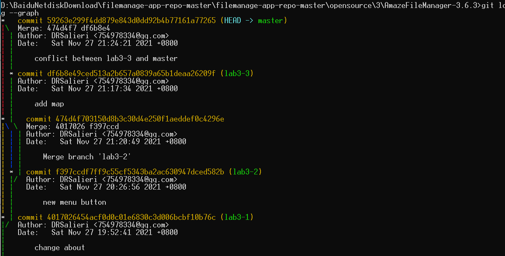

# 《软件工程》lab6

张涛 191240073

实验APP：3号APP（AmazeFileManager-3.6.3）

## 0. 用到的git操作

| 操作         | 功能                                                         |
| ------------ | ------------------------------------------------------------ |
| git status   | 比较暂存区与版本库                                           |
| git diff     | 比较工作区与暂存区                                           |
| git add      | 将工作区更新到暂存区                                         |
| git commit   | 将暂存区更新到版本库                                         |
| git reset    | 回滚 --hard参数能够删除当前所有暂存区文件 HEAD~0表示当前版本，HEAD~1表示上一版本，以此类推 |
| git reflog   | 查看近期操作记录，一般用于查看版本的SHA1码                   |
| git branch   | 查看所有分支                                                 |
| git checkout | 转到某个分支 -b表示创建并转到某个分支                   |
| git tag      | 打标签                                                       |
| git push     | 将版本库push到远端仓库                                       |
| git pull     | 远端仓库更新到工作区（当前目录已有git环境）                  |
| git clone    | 利用远端仓库创建一个本地git环境（当前目录没有git环境）       |
| git merge    | 将目标分支merge到当前分支，如果有冲突需要手动解决            |

## 1. status、diff

## 2. add、commit、reset（包括reflog）

首先利用add与commit提交一次，备注"First Commit"

做了一点无关紧要的修改，再提交一次，备注"test change"

利用 git reset 回滚到 HEAD~1版本，也就是HEAD的上一个版本

如果想要再修改回去，需要那次提交的SHA1码，可以利用git reflog查看近期操作记录，从而获取到目标SHA1码为"61ab67e"，再利用git reset回去

## 3.branch、merge

利用 git checkout -b 创建新的分支lab3-1

同理，再创建两个，分别叫lab3-2、lab3-3

对lab3-1版本进行微小的修改，提交一次，备注"change about"

lab3-2，lab3-3也进行一些不同的修改，都提交一次

切回到master分支，利用git merge将lab3-1分支merge到master分支上

lab3-2，lab3-3同理，这里发现lab3-3在merge的时候出现了conflict，需要手动解决

利用 git status 查看当前的冲突，发现是在activity_about.xml这个文件里产生的冲突

就是个字体颜色冲突了，给他手动解决一下

解决之后add+commit将merge完成

最后的结构如图

## 4.tag

利用 git tag 给最终的稳定版本打个标签

## 5.思考题

### 5.1 使用git的好处？

git给了一个后悔药的功能，使软件的版本易于管理，回滚也更加方便。

### 5.2 使用远程仓库的好处？

方便进行多人开发，利用clone与push可以在任何时间任何地点拉取并提交。
还能方便开源社区进行交流，将git进行可视化也更养眼。

### 5.3 使用分支的好处？开发中的体会与经验？

方便多人开发，并且可以在某个基础上分别实现不同的功能，最后再进行merge。就是conflict有点烦人。

实际开发中，如果一个项目由多人共同开发的话，感觉精力都花在了版本控制、代码同步上，git+远程仓库使得多人开发更加的容易，也构建了新一代的开源社区，使很多人享受在开源社区中共同开发的过程。