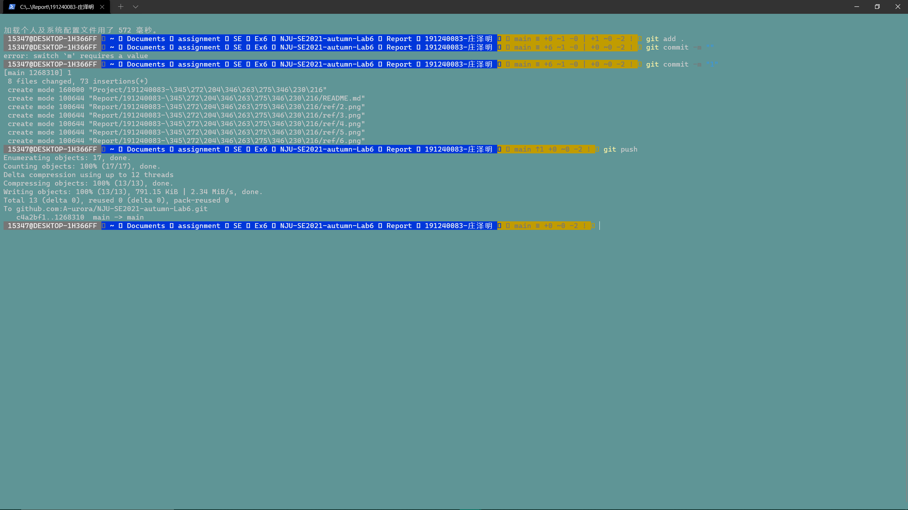
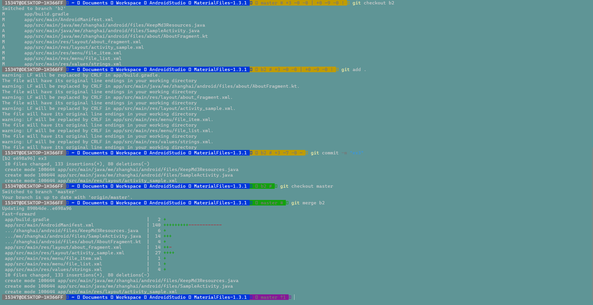
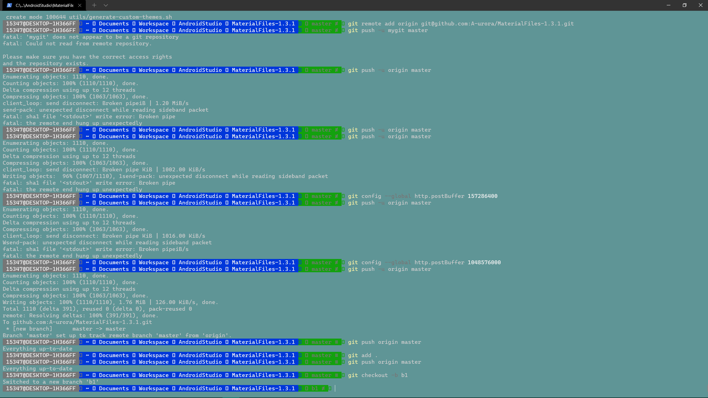
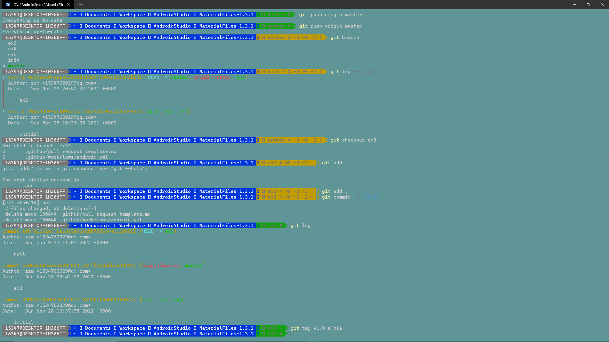
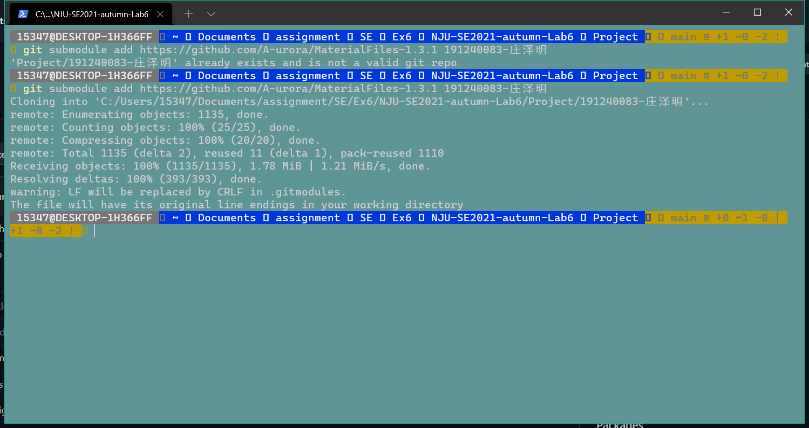

# Lab6 Report

## 实验名称

​	项目协同开发管理与工具集成环境实验

## 实验目的

	* 了解协同开发与持续集成过程
	* 学会使用项目协同开发管理工具git / github
	* 了解持续集成并使用jenkins自动构建项目

## 实验工具

​	git和github

## 实验内容及结果

 * 实验报告的git使用

   

 * 实验三代码的git使用

   git push

   

   git checkout ; git add ; git commit ; git merge;

   

   git tag; git log

   

   git push

   

   git submodule add xxx

   

## 实验结论

* 使用git的好处？

  - 对项目的管理便捷，体现在分支和log上
  - pull和push方便

* 使用远程仓库github的好处？

  - 能够较快的推送和拉取需要存放的文件
  - 对多人合作的项目处理方便
  - 可以学习别人公开的项目学习

* 在开发中使用分支的好处？你在开发中有哪些体会和经验？

  - 不用对一个文件的不同版本分别进行保存
  - 遇到bug可以查看log进行回溯
  - 可以减少不同阶段的代码修改之间的影响

  

