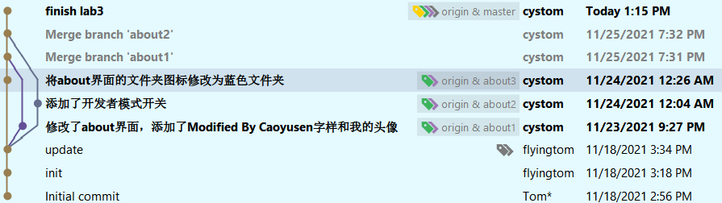

# NJU-SE2021-autumn-Lab6实验报告

曹雨森 191250004

--- 
## 实验内容

### 1. 安装git，在本地将你的开源项目目录初始化为git 仓库(如已有.git 文件夹请先删除)

安装git并配置
```
sudo apt install git
git config --global user.name "balabala"
git config --global user.name "balabala@bala.com"
```

WSL2的proxy配置 (比如Clash的Tun网卡接管)以及一些其他的配置此前就已经完成过，在此就不再列出


### 2. 在本地尝试修改、提交、回退等过程，在报告中展示你的操作，并使用git diff, git log, git status 等命令展示操作前后的区别

- git diff


- git log


- git status (此处因为已经提交过，所以工作区是clean的)


- git revert 和 git reset


git revert是new一个commit(复制一份新的)出来实现回退的功能，git revert是强行倒车回退

- git branch 和 git checkout 

这份报告是在我完成实验三以后写的，因为强迫症的缘故(指工作目录里乱七八糟的)，我删除了项目目录重新pull了一次

但是如下图所见，利用git branch观察分支我们可以看到，默认只拉取了master分支，而git fetch --all 和 git pull --all也没有效果(因为这个时候本地只有一个master的分支，所有对--all来说全部的分支只有一个master),

所以我们要先checkout到对应的分支上，将remote的分支恢复到本地，然后再git branch我们就可以看到我们之前的三个分支了。


### 3. 根据实验三针对几个页面进行微调的任务，在本地为每个子任务创建一个分支并在各分支上进行开发，最终将所有修改合并到master 分支上；如有冲突请尝试解决。在报告中展示你的操作，并使用git log --graph 命令展示分支合并图

因为我是先写的lab3然后再写的lab6(正常做lab3应该也不会边做边截图)，所以具体的git merge的截图我没有保存，大致的操作顺序是

```shell
git checkout master
git merge about1
git merge about2
git merge about3
```

这里是Android Studio里的git分支图以及终端里的分支合并图




### 4. 给你的某个稳定版本的代码打上标签


通过`git log`和`git tag`可以看到我为最新的一个版本打上了`releasr`标签

### 5. 注册Github账号，在账号中创建远程仓库(权限请设置为public)；把本地的所有分支和标签推送到远端

Github已经注册过，创建远程仓库就按照Github默认给出的命令执行即可

最后在本地
```
git add .
git -am "XXXX"
git push origin
```

### 6. 使用pull request 提交自己的代码和报告

### 7. 在报告中回答以下问题：

#### 1.使用git的好处？

- 本地拥有版本库，可以随时进行版本的切换，且支持离线工作(SVN服务器挂了就寄了)

- 建立分支非常简单，且可以在分支之间任意切换，方便多人协同开发

- 可以指定和多个不同的远程仓库进行交互

- 有着较为成熟的冲突处理机制

#### 2.使用远程仓库(如Github/Gitee 等)的好处？

- 有利于协作开发时的资源共享，以及修改的实时同步

- 有效的存储文件更改，更好地确保文件完整性

- 对于个人开发者而言，免费的代码仓库我不嫖白不嫖，多份备份永远不是坏事(特别是在Github允许不限量的私仓以后)

> 电脑坏了，数据丢了？Github和OneDrive是你永远的家


#### 3.在开发中使用分支的好处？你在实际开发中有哪些体会和经验？

- 每个开发者可以在独立分支上同时进行开发，减少冲突，提升开发效率

- 各个分支在开发过程中，如果一个分支开发失败，不会对其他分支有任何影响,提升项目的健壮性

以上是分支开发在团队协同开发时的优点

个人开发时我觉得用分支开发就是见仁见智了，一个`master`分支+一个`dev`分支我觉得是值得提倡的操作，但是一个人开发搞出大量的分支我觉得除了使得代码冗余以及使得git merge的时候冲突可能性变高，没有什么值得称道的优点。

个人开发的时候都是一个螺丝一个钉，这个组件/界面/区块的功能做好了，测试好了能跑了才会开发下一个，与其通过branch实现项目版本的解耦，不如在代码设计的时候分模块进行代码解耦

#### 4.如果你额外学习并实践了关于git/github 的其他进阶操作(如merge 和rebase 的区别、reset 和revert 的区别、stash, cherry-pick 的使用等)，可在报告中展示

- merge 和 rebase 的区别

git merge 和 git rebase 都被用来合并不同分支之下的代码

merge一般发生在主分支上，会把公共分支和你当前的commit合并在一起，形成一个新的 commit 提交

rebase会始终把最新的修改放到最前，逻辑上会比merge要清楚很多

- reset 和 revert的区别

git revert是通过一次逆向的commit来撤销之前的提交，会使git的HEAD指针继续前进，只是新的commit的内容和要revert的内容相反，因此日后合并分支时，会导致这部分改变不会再次出现

git reset则是将撤销点后的操作都会回退到暂存区中，会使git的HEAD指针向后移动，因此当日后合并分支时，被回退的commit可能还会被引入