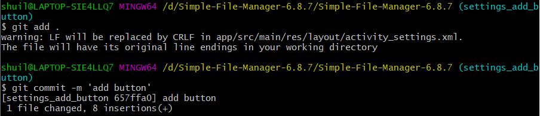
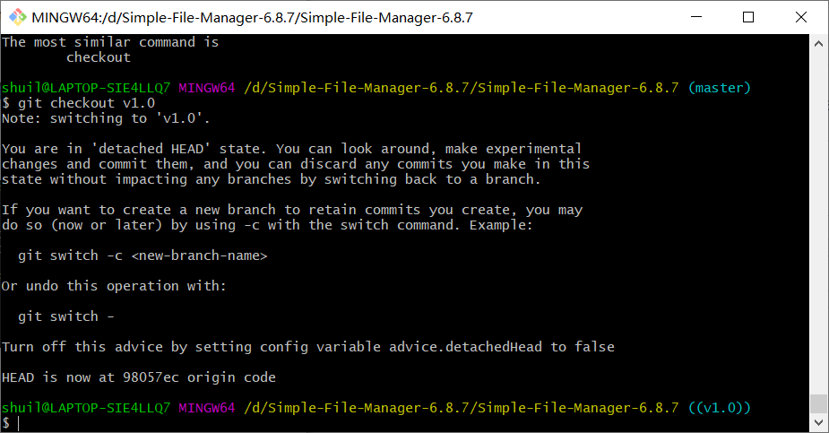
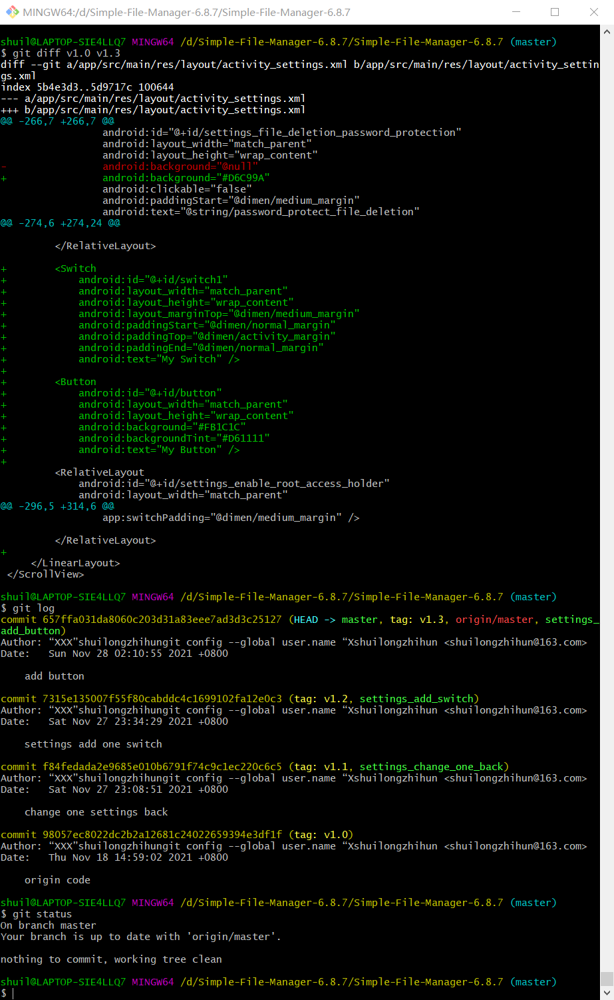
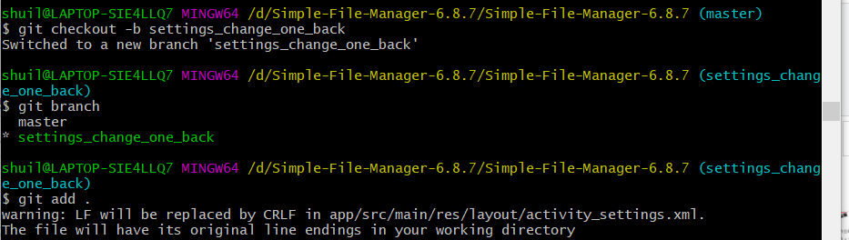
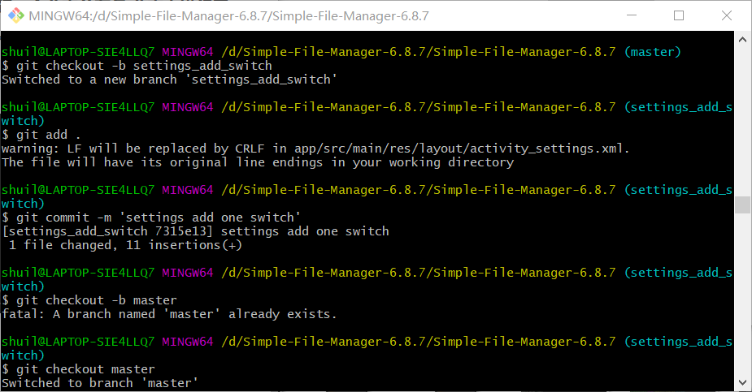
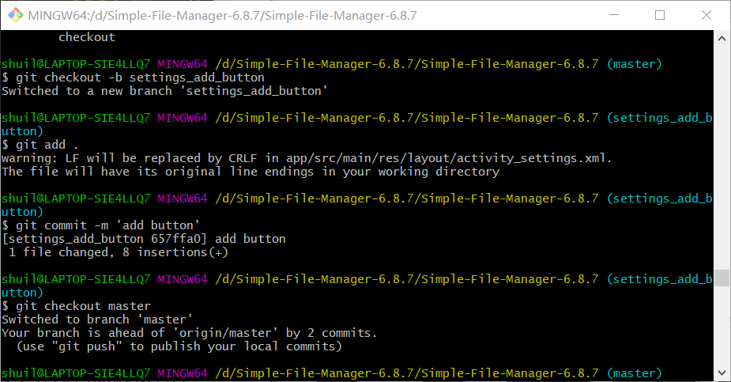
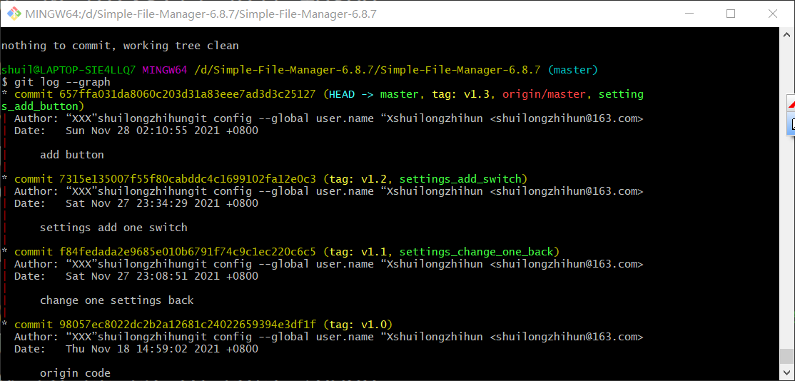
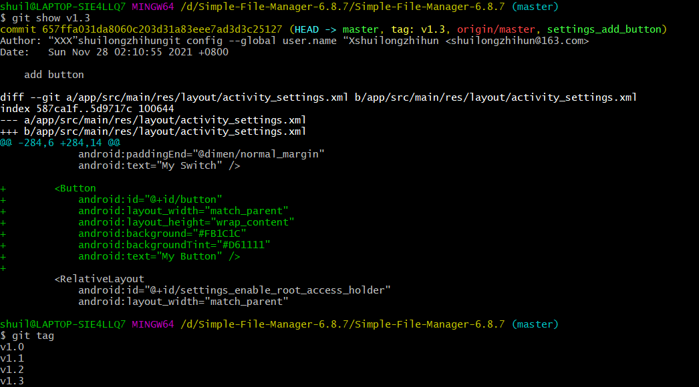

# NJU-SE2021-AUTUMN-LAB6-REPORT

南京大学软件工程2021秋季课程实验六报告

实验人：浦亮

学号：191250114

时间：2021/11/18

## 实验内容

1. **安装 git，在本地将你的开源项目目录初始化为 git 仓库 (如已有.git 文件夹请先删除)** 

   之前已经安装好git，并在实验源代码目录下成功进行git init.

2. **在本地尝试修改、提交、回退等过程，在报告中展示你的操作，并使用 git diff, git log, git status 等命令展示操作前后的区别** 

   修改并提交:

   

   回退:

   

   git diff/git log/git status:

   

3. **根据实验三针对几个页面进行微调的任务，在本地为每个子任务创建一个分支并在各 分支上进行开发，最终将所有修改合并到 master 分支上；如有冲突请尝试解决。在报 告中展示你的操作，并使用 git log --graph 命令展示分支合并图**

   第一个分支:

   

   第二个分支:

   

   第三个分支:

   

   git log --graph:

   

4. **给你的某个稳定版本的代码打上标签** 

   我在修改过程中每进行一个修改就打了一个tag

   

5. **注册 github 账号，在账号中创建远程仓库 (权限请设置为 public)；把本地的所有分支 和标签推送到远端** 

   已经完成，否则我也无法提交这份报告 **:)**

6. **在报告中回答以下问题**

    • 使用 git 的好处？

   ​	方便进行开发中版本回滚等问题

   • 使用远程仓库 (如 github/gitee 等) 的好处？

   ​	在为代码在远程端提供一个备份的保障，同时提供一个较为方便的多设备协作开发平台

   • 在开发中使用分支的好处？你在实际开发中有哪些体会和经验？

   ​	可以在不同分支上进行不同的修改，且可以保证互相互不干扰。一开始在升级Andorid Studio后我的代码曾经一度无法编译，后来通过版本回滚解决了这个问题。
