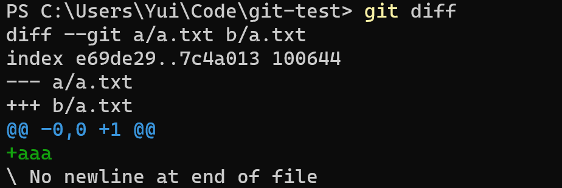
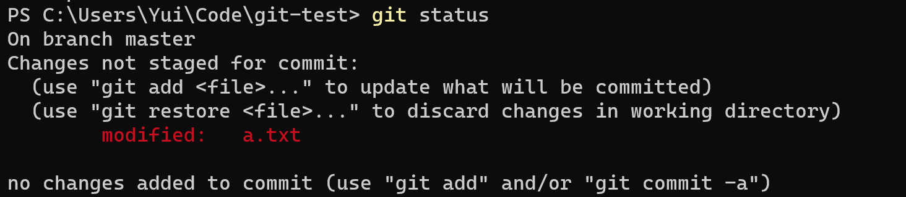
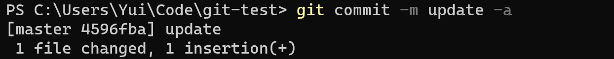
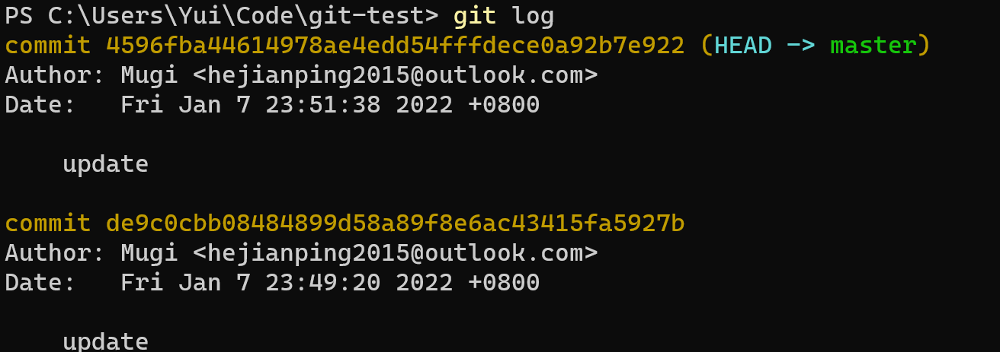
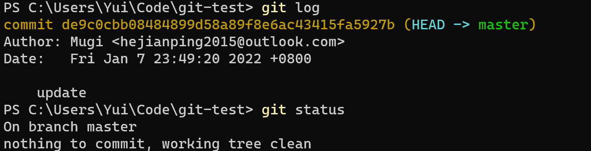
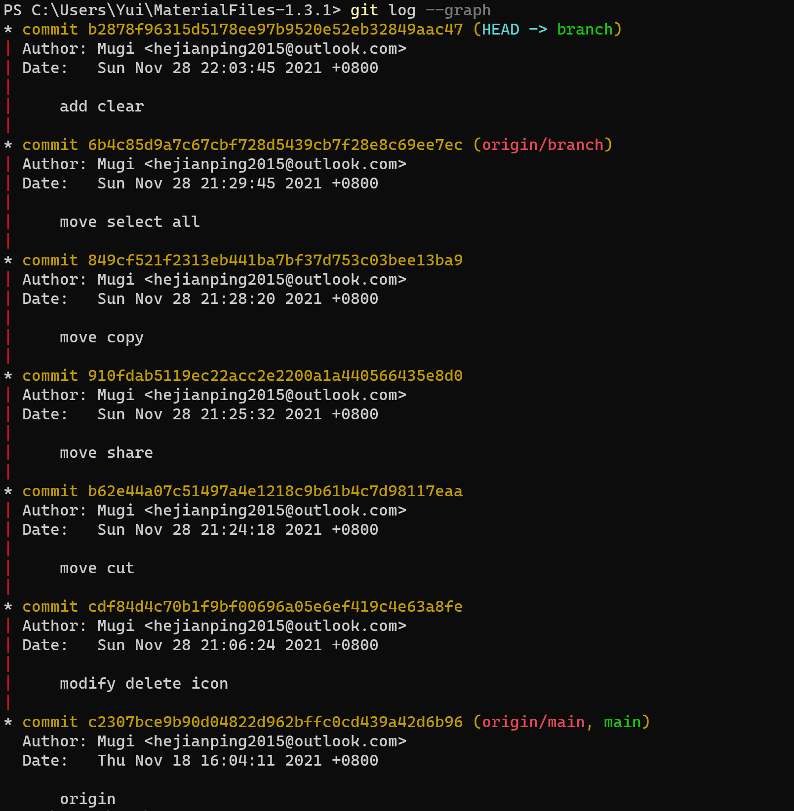
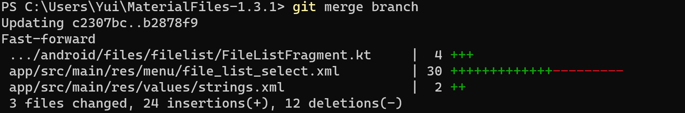
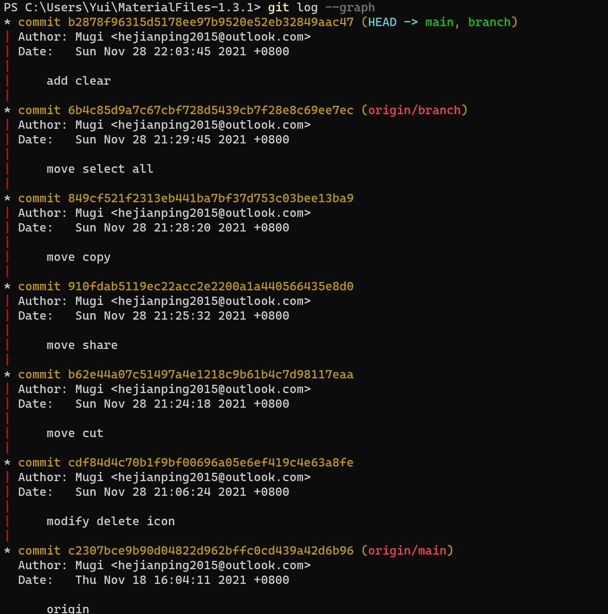
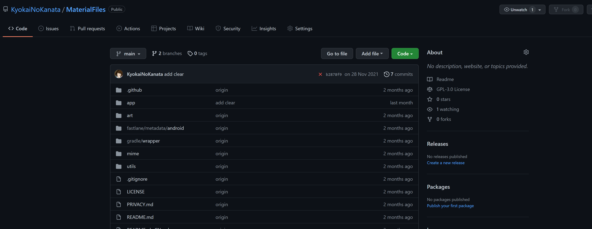
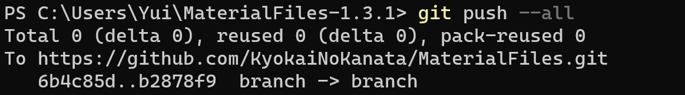

# 实验六：项目协同开发管理与工具集成环境实验

姓名：何健平

学号：191830048

指导教师：张天

实验时间：2022.1

实验地点：基础实验楼乙208

## 实验目的

1. 了解协同开发与持续管理过程
2. 学会使用协同开发管理工具git/gitgub
3. 了解持续继承并使用jenkins自动创建项目

## 实验内容

### 安装`git`，在本地将你的开源项目目录初始化为git仓库


在目录中使用命令初始化git仓库

```powershell
git init
```

### 在本地尝试修改、提交、回退等过程，在报告中展示你的操作，并使用`git diff`, `git log`, `git status`等命令展示操作前后的区别

添加一个`a.txt`文件

```powershell
git add .
```

修改其中内容，然后查看修改

```powershell
git diff
```



查看状态

```powershell
git status
```



添加并提交

```powershell
git commit -m update -a
```



查看修改

```powershell
git diff
```


此时查看状态


查看日志

```powershell
git log
```



回退

```powershell
git reset
```


回退后查看日志



### 根据实验三对几个叶片进行微调的任务，在本地为每个子任务创建一个分支并在各分支上进行开发，最终将所有修改合并到`master`分支上。在报告中展示你的操作，并使用`git log --graph`命令展示分支合并图

创建并切换到`branch`分支

```powershell
git checkout -b branch
```

进行修改，在合并前的分支图如下



切换到`main`分支

```powershell
git checkout main
```

将`branch`合并到`main`分支

```powershell
git merge branch
```



查看分支合并图

```powershell
git log --graph
```



### 为你的某个稳定版本代码打上标签

添加标签

```powershell
git tag -a 1.3.2 -m "modified"
```

查看标签

```powershell
git tag
```


### 注册`github`账号，在账号中创建远程仓库，把本地所有分支和标签推送到远端



推送所有分支

```powershell
git push --all
```



## 思考题

### 使用`git`的好处？

* 便于版本管理，可以记录开发过程、记录版本和回退。
* 可以实现分支操作，实现独立的分支或合并。
* 便于协作开发的管理。

### 使用远程仓库的好处？

* 防止代码丢失，解决存储问题。
* 方便共享和传播，促进开源社区交流。
* 方便跨设备或平台进行协作，实现分布式开发。

### 在开发中使用分支的好处？你在实际开发中有哪些体会和经验？

* 可以实现互不干扰、独立进行的分支。
* 可以实现多种不同的版本共存。
* 也可以提高项目的稳定性，防止一些错误导致整个项目不可用。
