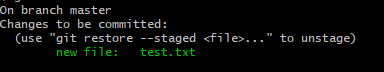
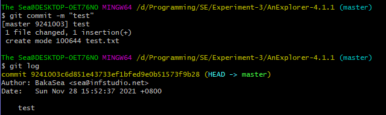
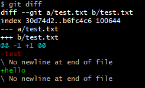
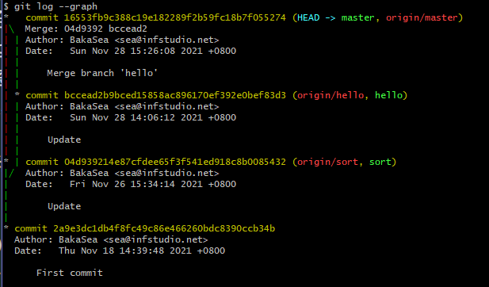
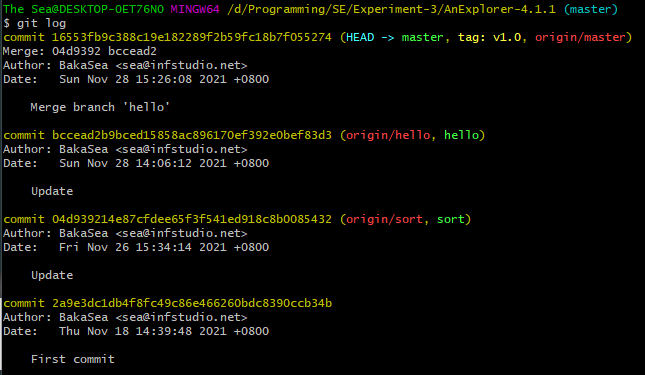

# 软件工程实验六：项目协同开发管理与工具集成环境实验

191830058 黄铭昊

## 实验内容

在开源项目目录下添加`test.txt`文件，并输入`test`作为内容。

在Git Bash中输入

```
git add .
git status
```

得到下面结果。



接着输入

```
git commit -m "test"
git log
```

得到下面结果。



将`test.txt`文件的内容改为`hello`，接着输入

```
git diff
```

得到下面结果。




在实验三中，创建两个分支`sort`和`hello`，分别处理排序场景和Hello场景，各自commit，最后进行merge。在`master`分支中输入

```
git merge sort
git merge hello
git log --graph
```

合并所有分支，发现没有冲突，得到下面结果。



给稳定的版本打上标签，输入

```
git tag v1.0 16553f
git log
```

得到下面结果。




## 实验问题

* 使用git的好处？
  * 对每个进度进行一个存储，如果对当前进度不满意可以及时回滚，减少冗余操作。
  * 进行分支管理，每个分支之间互不阻碍，进度独立。
  * 有助于多人协同开发。
* 使用远程仓库（如github/gitee等）的好处？
  * 有助于多人协同、多设备开发。
  * 方便将代码分享给其他人。
* 在开发中使用分支的好处？你在实际开发中有哪些体会和经验？
  * 每个分支的开发互不干扰，独立进行。
  * 在团队开发中，可以每人负责一个分支，当负责的对应部分完成后merge到主分支，让主分支显得更加简洁和稳定。