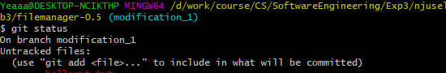
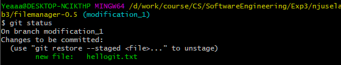
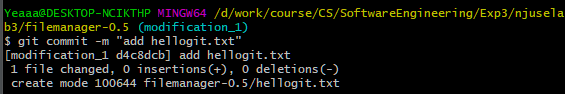
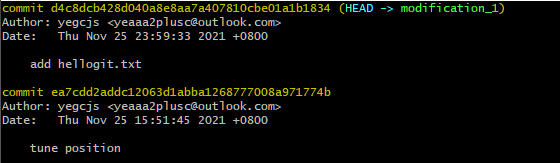
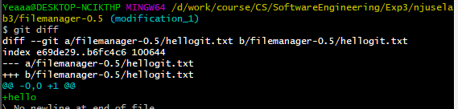
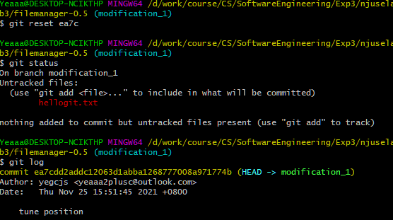
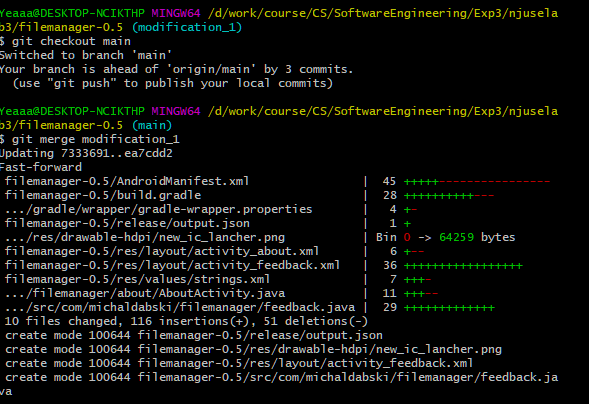
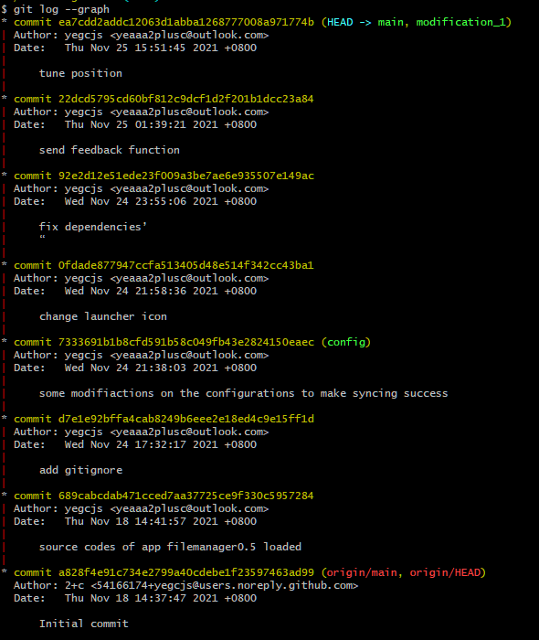
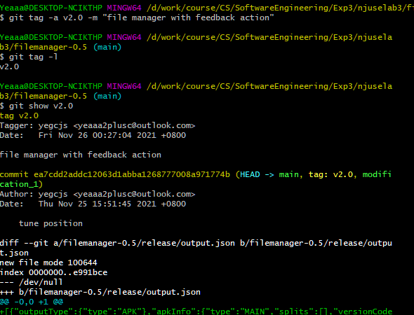
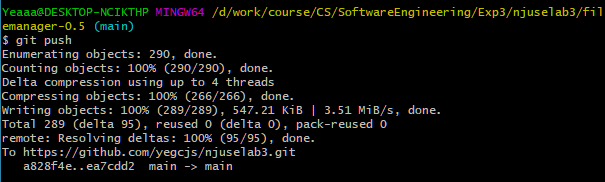

## 实验内容

### git基础操作

1. 将实验3开源项目初始化为git 仓库

   ```bash
   git init 
   ```

   并与远程仓库绑定

   ```bash
   git remote add origin https://github.com/yegcjs/njuselab3
   git push -u origin main
   ```

2. 创建分支开发实验功能

   ```bash
   git checkout -b modification_1
   ```

3. 添加`hellogit.txt`，通过`git status`查看文件tracked的情况

   

4. 通过`git add hellogit.txt`track该文件，再次`git status`发现该文件标记为待`commit`

   

5. 通过`git commit -m "add hellogit.txt"`提交

   

6. 通过`git log`查看提交记录，看到最近一次提交记录为刚才的add hellogit.txt

   )

7. 修改`hellogit.txt`中的内容，通过`git diff`查看修改情况

   

8. 通过`git reset ea7c`回退到创建hellogit.txt前的版本，回退后`git status`可以看到`hellogit.txt`为untracked，`git log`可以看到当前版本为message是tune position（add hellogit.txt的前一个）

   

9. 当前在开发实验三功能的branch上，需要merge到main分支。首先`git checkout main`切换分支，然后`git merge modification_1`将`modification_1`分支合并进来

   

10. 通过`git log graph`可以查看分支情况

    

11. 通过`git tag -a v2.0 -m "file manager with feedback action"`为新版本打上标签，并标注信息，标注后通过`git tag -l`即可看到该标签，通过`git show v2.0`可以查看该标签信息

    

12. 通过`git push`推送到[远程仓库](https://github.com/yegcjs/njuselab3)

    

### git其他

1. merge和rebase区别：rebase不会保留被merge分支上的commit，而是将被merge分支上的修改作为要merge到的分支最新一次commit后的修改
2. reset和revert的区别：reset是回退，将HEAD指针指向要回退到的版本，取消该版本后的修改；revert是反做，在HEAD基础上执行增删改到要回退版本的状态，并commit一个新版本
3. stash: 暂存当前未commit的修改，同时回退到最后一次commit后的仓库
4. cherry-pick 将指定的commit应用到其他分支上


## 思考题

### 使用git的好处

1. 可以创建分支、进行版本之间的回退等操作，便于开发过程中的管理各个修改步骤
2. 是分布式版本控制系统，可以多人分别在不同设备上在不同的分支同时进行开发，提高团队合作效率

### 使用远程仓库 (如 github/gitee 等)的好处？

1. 通过远程代码备份，便于代码的保存
2. 发挥分布式版本控制系统的优势，便于多人分别在不同设备、物理位置上同时开发协作

### 在开发中使用分支的好处？你在实际开发中有哪些体会和经验？

1. 便于多人分别开发，彼此之间互不影响，只需要在合并时解决冲突即可
2. 便于管理不同的开发流程

实际开发中可能多人同时对同一功能进行开发/修改，彼此内部使用不一样的接口，或用同样的接口完成不同的功能，如果不使用分支，彼此的代码将混杂在一起导致代码混乱，容易误触其他人开发中的代码。