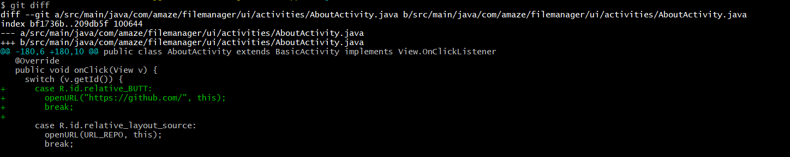
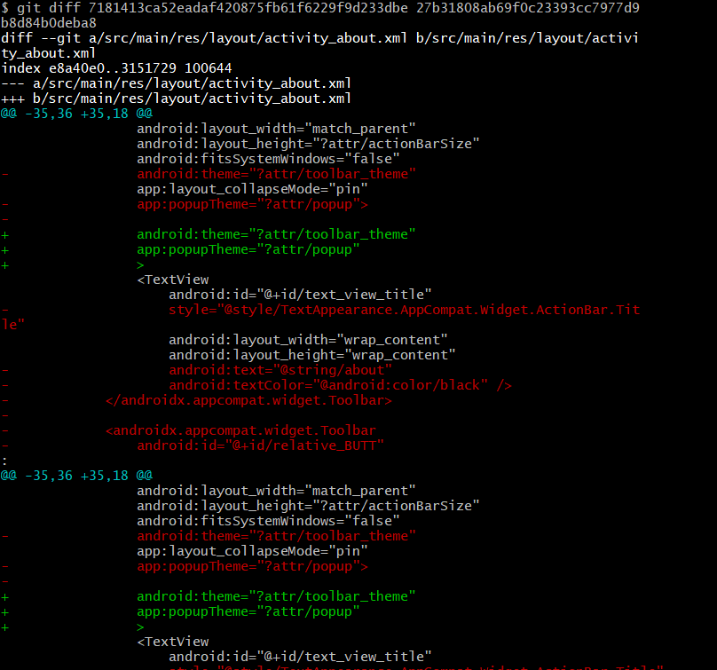
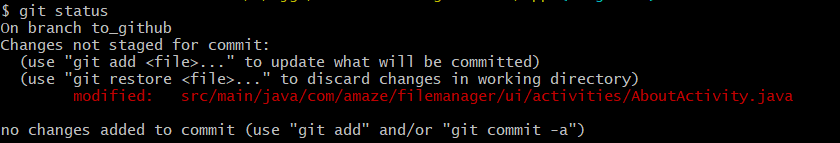
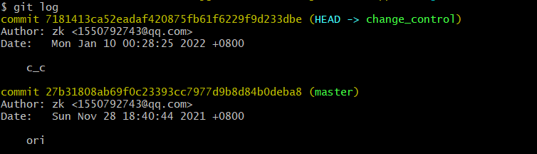
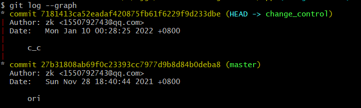
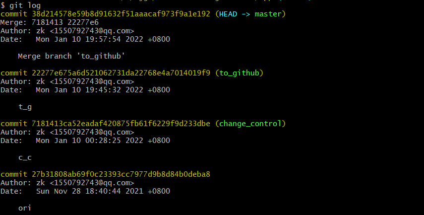
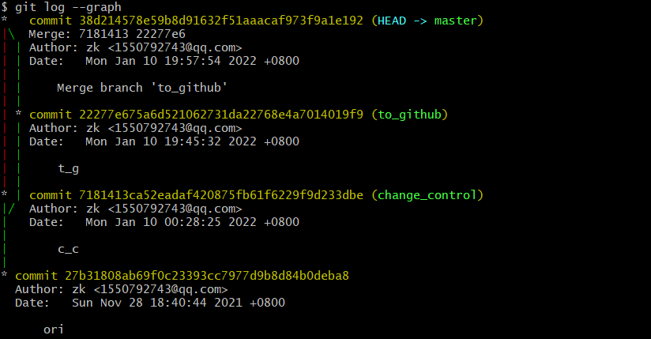
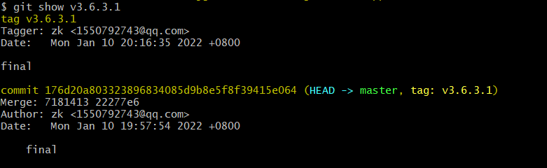

# 软件工程

## NJU-SE2021-autumn-Lab6 实验报告

## 1. git指令使用示例

1. git diff

   本指令可以比较已提交和工作区的差异，也可以通过commit的id来比较两个提交版本的差异。

   

   

2. git status

   展示此次修改与上次commit的区别

   

3. git log

   

   

## 2. 分支合并

1. 通过拉起两个分支（change_control和to_github）实现不同的功能之后，完成merge合并

   

   

2. 再次检查git log的结果

   

   

3. 重命名最后一个提交版本为final并打上tag

   

   

   通过git show展示tag对应信息，表示标签成功打上

   

## 3. 思考题

1.  使用 git 的好处？

   使得开发过程管理起来方便。虽然此前因为一些错误使用导致混乱，本次重新完成全过程之后发现了虽然git指令众多，但是逻辑清晰，易于管理。

2. 使用远程仓库 (如 github/gitee 等) 的好处？

   弥补分布式系统分享文件的不足。如果采取绝对的分布式管理，将会出现发布、分享文件的不便，通过github/gitee这样的方式可以弥补这样的不足。

3. 在开发中使用分支的好处？你在实际开发中有哪些体会和经验？

   比较方便的是可以分开完成各模块。通过分支使得每次完成的任务可以不扭在一起，也可以各个功能同步推进完善，最后合并在一起。在添加控件和增加控件功能的两个分支上，分开完成不同的功能可以各自调试，然后合并在一起。这样的操作可能需要各功能模块互不干扰，也就是要求模块独立性较高。