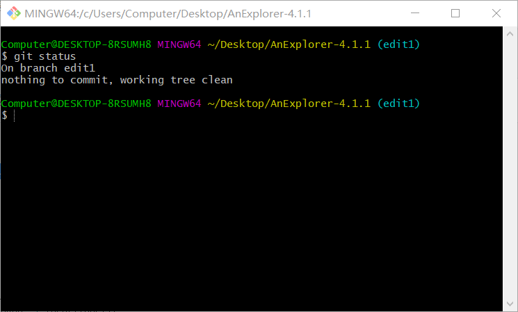
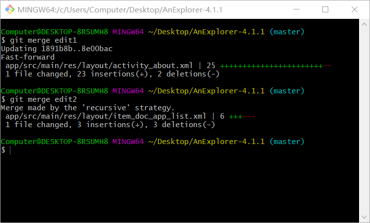
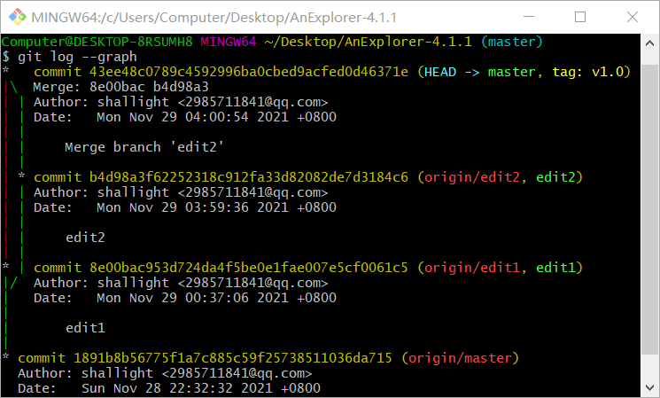
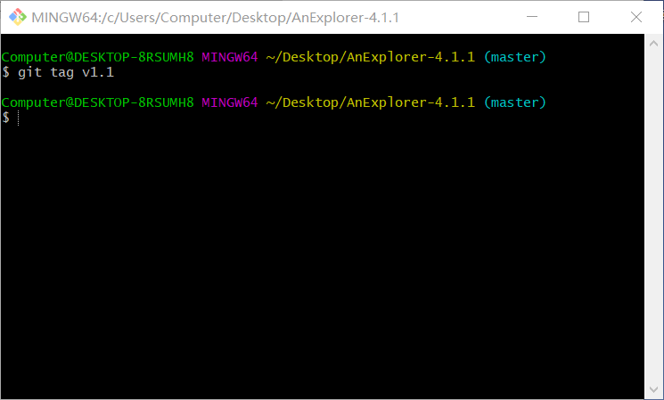

# 软件工程实验六实验报告

##### 191850139 马川腾

#### Git的操作：

1. 使用git checkout -b可以新建并转到一个分支

2. 使用git branch查看全部分支和当前分支

   

3. 使用git status查看当前文件状态

4. 使用git merge将分支与主干合并

5. 使用git log --graph显示合并过程

6. 使用git tag添加标签

   

#### 问题：

1. 使用git的好处？

   答：可以便捷地管理一个项目的多个版本及修改记录；

   ​        便于多人合作开发同一个项目；

   ​        便于在不同设备上持续开发同一个项目。

2. 使用远程仓库 (如 github/gitee 等) 的好处？

   答：为代码提供（多个版本的）备份，有助于保障数据安全；便于在不同设备间上传与拷贝；节省本地磁盘空间。

3. 在开发中使用分支的好处？你在实际开发中有哪些体会和经验？

   答：便于让多个开发者对不同分支同时各自进行开发；

   ​       便于尝试性地对某个项目进行修改，如果修改不能达到预期可以随时回退，不影响项目本体的开发；如果修改达到预期，可以将其与本体合并。