# 实验六 

项目协同开发管理与工具集成环境实验

## git

### 配置别名

这是我在很久之前配置的别名，包括了少数几个我自己常用的命令，在后面的阶段中我会（习惯性地）使用这些别名

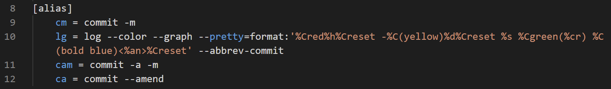

### 实验三中git的使用

创建dev分支

在dev分支下创建第一个任务（更改ui字符串）的分支

使用diff查看工作区所做修改

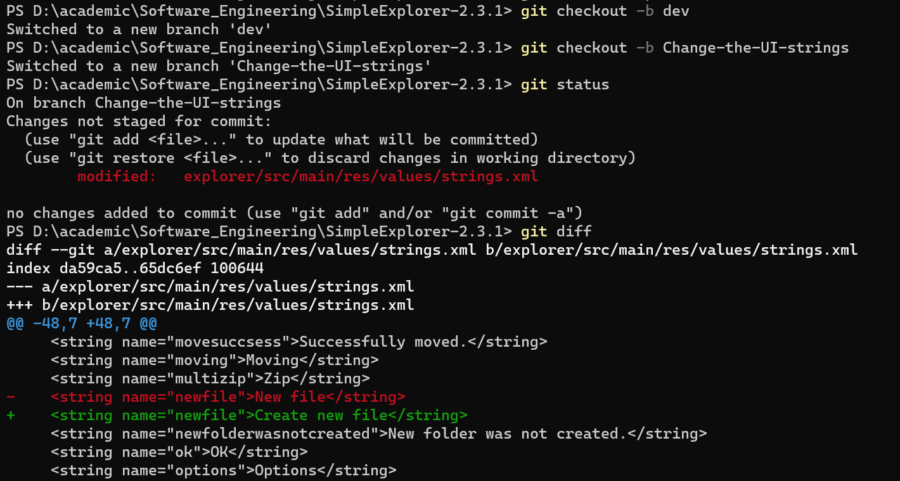

将工作区的修改放到暂存区后提交

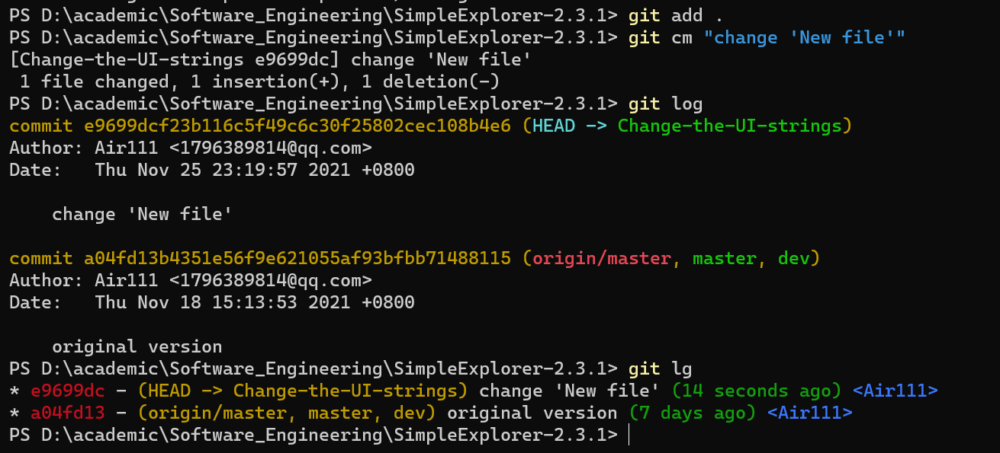

对“复制路径”等任务仍执行相同流程

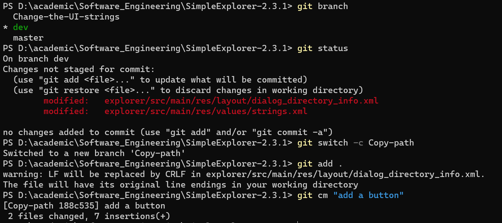

在4个分支（任务）都完成后，进行分支合并

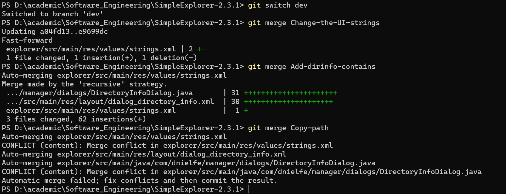

由于对同个文件进行了修改，合并时会产生冲突（下图所示是在合并另一个分支时）

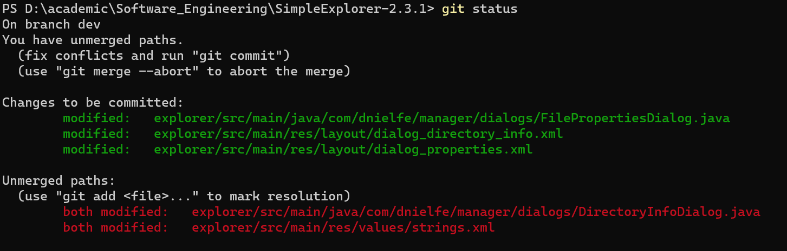

在Android Studio中打开相应文件，找到类似标记

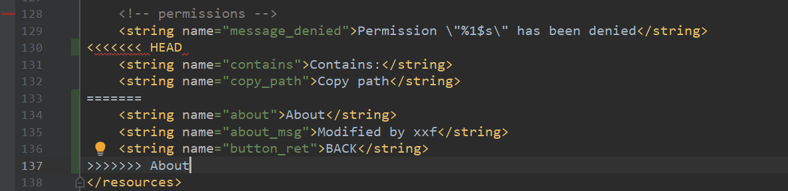

手动解决冲突（修改文件）后，添加新的提交

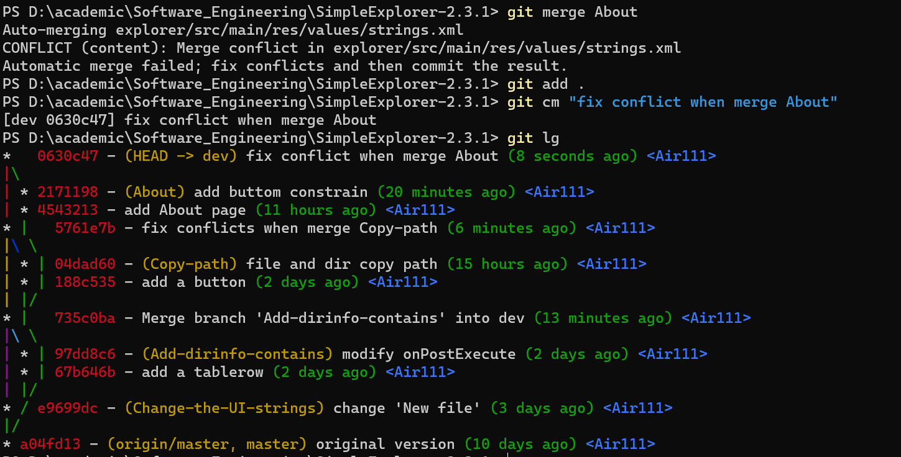

将dev分支合并到master，同时可以看到总的修改量

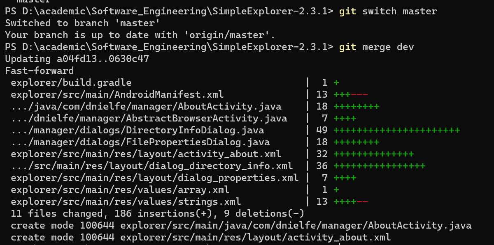

最后删除其他分支

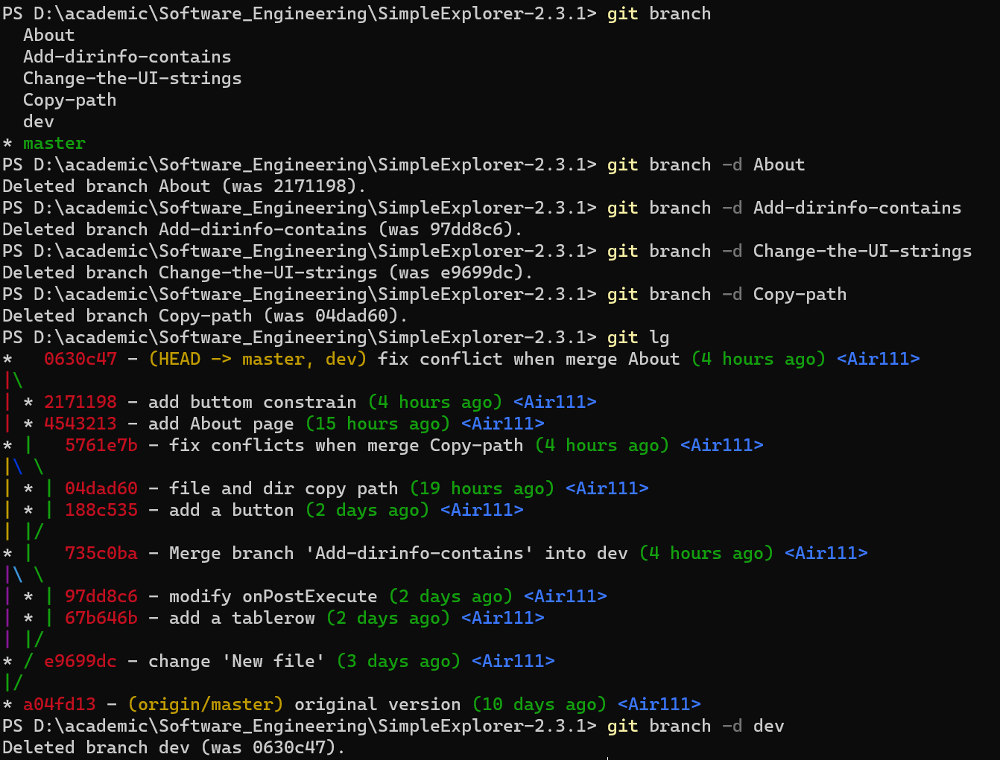

给稳定版本（最后的一个提交）打上标签

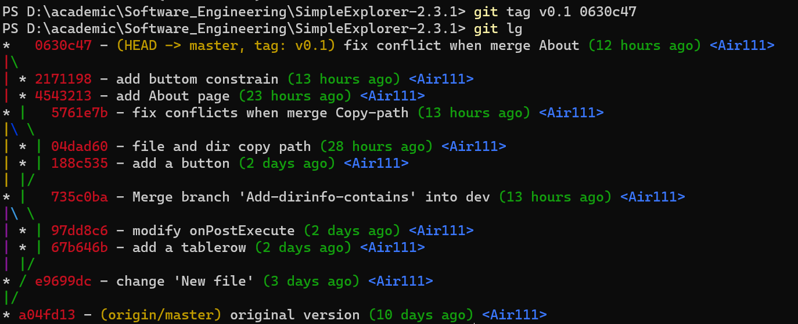

### Q&A

> 使用git的好处？

1. 在未使用git之前，曾经我删除一段代码会通过将它注释的方法来“删除”，以防以后发现不对劲而要重新写一遍。而使用git能够方便且高效地保存文本类型文件的修改记录，不仅有条理而且查找起来方便
2. 记录自己的开发历程

> 使用远程仓库的好处？

1. 能够进行多人远程协同工作
2. 相当于本地仓库的一个备份
3. 便于程序员直接的交流

> 在开发中使用分支的好处？

1. 多个相关度不高的任务直接，使用分支能够更有条理
2. 对同一个任务有不同的想法时，使用分支往往更加合理
3. 在我自己的使用中，分支是在版本回退时，保留一个直观的新版本的指针的方法
