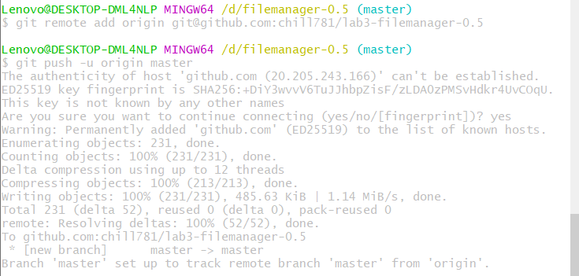
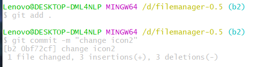

# 实验六报告
## Git 基本操作
### 1.git diff
 做出修改后查看前后区别

### 2.git log 

查看提交记录

### 3.git status
查看当前状态

### 4.git reset
回退上一个版本

## 实验3记录
在项目文件夹D：\filemanager-0.5 下新建git仓库,并做首次提交

把本地仓库推送到GitHub远程仓库并进行关联

创建新的分支b1进行软件开发

更改完成后进行提交

把b1分支推送到远程仓库

继续新建分支b2并切换到该分支进行第二项功能更改

更改完后进行提交

把b2分支推送到远程仓库

新建b3分支进行第三项功能开发

更改完成后进行提交

将b3分支推送到远程仓库

将master分支与b1，b2，b3分支进行合并，在
合并b2分支时出现冲突

打开res/menu/folder_browser.xml文件后，发现冲突问题

修改后再次提交合并

合并分支图如下图所示

给master分支打上标签

## 问答
- 使用git的好处
 
  方便进行文件的版本控制，使用分支进行开发，能够很方便快速的记录与回退版本

- 使用远程仓库的好处。
 
  提供一个远程的代码文件仓库，作为中转站方便多人对同一个项目经行修改提交

- 在开发中使用分支的好处，在实际开发中的体会与经验 。
  
  对于个人而言可以很方便对一个项目经行不同功能的开发测试，不容易丢失开发进度，可以回溯所有的版本信息，对一个团队而言也方便不同的人协作开发一个项目。在实验三增加新界面的开发中，很容易因为操作不当导致app编译失败，用分支开发便可无后顾之忧的进行开发，可以很快速得回到修改前的状态，也无需担心文件的损坏。

