# NJU-SE2021-autumn-Lab6实验报告

姓名：徐邹韬

学号：202220015

------

#### 1 初始化

安装 git，在本地将你的开源项目目录初始化为 git 仓库

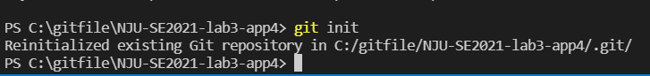

#### 2 实验三开发

在实验三开发过程中，未使用新分支，仅在master上修改并commit；
故在之后的部分新开一个txt文本，作为分支合并操作的测试。
实验三的git log如下：

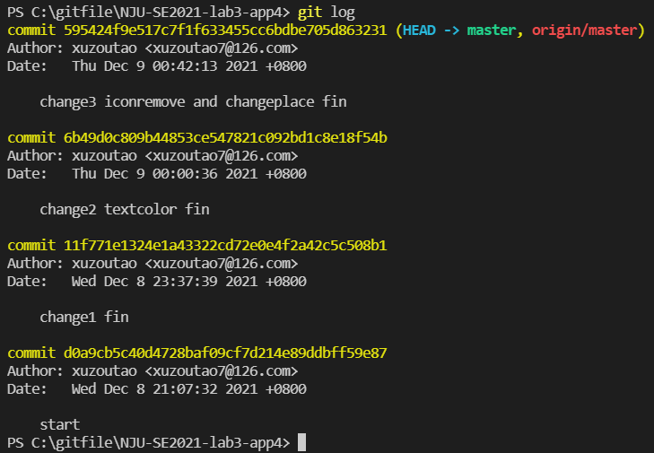

#### 3 修改、提交、回退

在本地尝试修改、提交、回退等过程，在报告中展示你的操作，并使用 git diff, git log, git status 等命令展示操作前后的区别

- 在master新建两个分支，分别添加一个文本文件，并与master进行合并(无冲突)。

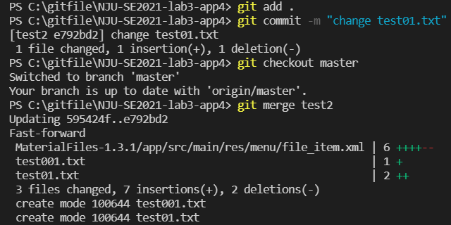

- 在master新建两个"change test01 1"和"change test01 2"，分别对test01.txt进行不同修改

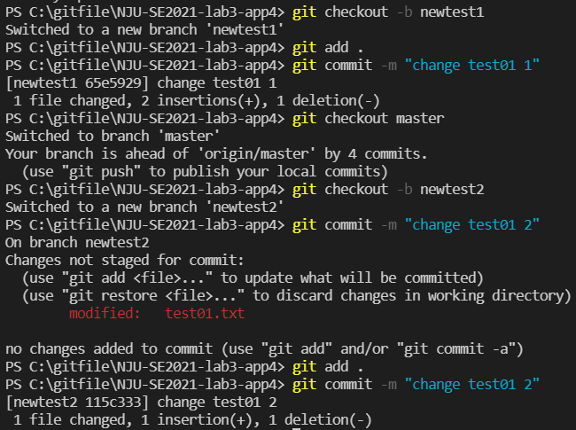

- 之后与master进行合并，合并时产生冲突。

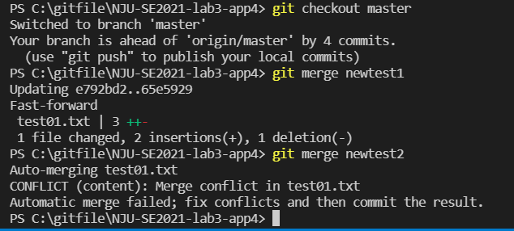

- 手动对冲突的修改进行选择。

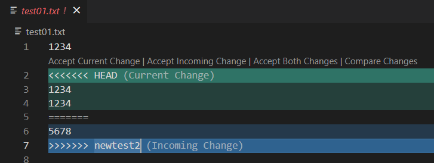

- 将修改冲突后的新文件再次commit。

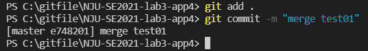

- 用git diff展示前后区别。

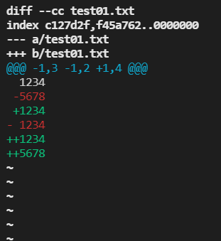

- 用git log -graph展示分支结构。

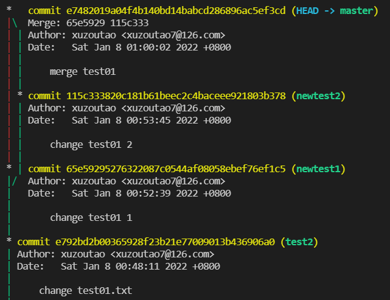

- 查询分支中test前的commit编号，用reset进行回退。

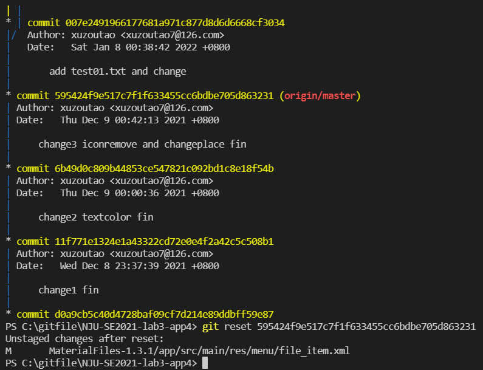

- 在此版本添加tag。

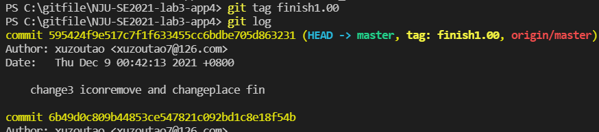

- 连同tag一起提交到远端。

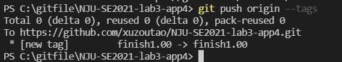

------

#### 4 问题回答

**1. 使用 git 的好处？**

- 在出现错误时，可随时进行版本回退，防止因出错而回不到以前的正确版本。
- 使用git可以直接建立一个分支，在分支上修改，修改期间还可以切换回主分支，从上一个稳定版本修改其他部分。
- 克隆代码、切换分支的操作让合作开发更方便。

**2. 使用远程仓库 (如 github/gitee 等) 的好处？**

- 将自己的代码保存在远程仓库中，方便备份或是多终端开发。
- 方便多人团队合作开发，有利于代码的同步。

**3. 在开发中使用分支的好处？你在实际开发中有哪些体会和经验？**

- 版本变化清晰，通过确定稳定版本，在分支上进行开发，有利于代码回退，减少出错。
- 多个功能可以同时开发，使整体开发效率提升。

**如果你额外学习并实践了关于 git/github 的其他进阶操作 (如 merge 和 rebase 的区别、reset 和 revert 的区别、stash, cherry-pick 的使用等)，可在报告中展示**

**stash**

- stash命令把当前工作现场保存起来，等以后恢复现场后继续工作。
