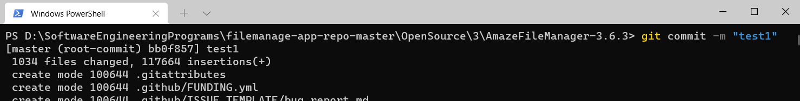
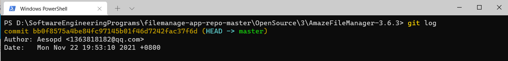
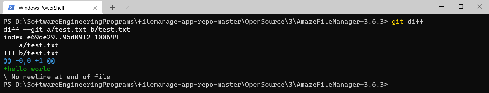
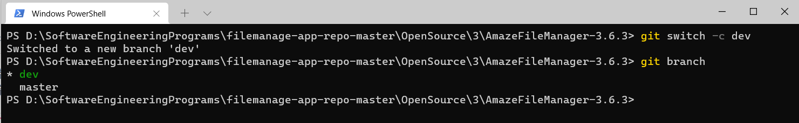
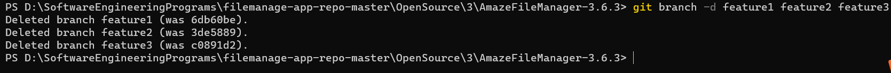

<b>南京大学 计算机科学与技术系</b>

<b>软件工程实验报告</b> 

<b>
    &nbsp&nbsp&nbsp&nbsp
    实验名称：
    <u>&nbsp&nbsp
    项目协同开发管理与工具集成环境实验
    &nbsp&nbsp</u>
     &nbsp&nbsp&nbsp&nbsp
    学&nbsp&nbsp&nbsp&nbsp号：
    <u>&nbsp&nbsp&nbsp&nbsp&nbsp&nbsp&nbsp&nbsp&nbsp&nbsp&nbsp&nbsp&nbsp&nbsp
    191220081
    &nbsp&nbsp&nbsp&nbsp&nbsp&nbsp&nbsp&nbsp&nbsp&nbsp&nbsp&nbsp&nbsp&nbsp&nbsp</u>
     &nbsp&nbsp&nbsp&nbsp
    姓&nbsp&nbsp&nbsp&nbsp名：
    <u>&nbsp&nbsp&nbsp&nbsp&nbsp&nbsp&nbsp&nbsp&nbsp&nbsp&nbsp&nbsp&nbsp&nbsp&nbsp
    毛彦杰
    &nbsp&nbsp&nbsp&nbsp&nbsp&nbsp&nbsp&nbsp&nbsp&nbsp&nbsp&nbsp&nbsp&nbsp&nbsp&nbsp&nbsp</u>
	 &nbsp&nbsp&nbsp&nbsp
    指导教师：
    <u>&nbsp&nbsp&nbsp&nbsp&nbsp&nbsp&nbsp&nbsp&nbsp&nbsp&nbsp&nbsp&nbsp&nbsp&nbsp&nbsp
    张天
    &nbsp&nbsp&nbsp&nbsp&nbsp&nbsp&nbsp&nbsp&nbsp&nbsp&nbsp&nbsp&nbsp&nbsp&nbsp&nbsp&nbsp&nbsp</u>
     &nbsp&nbsp&nbsp&nbsp
    实验地点：
    <u>&nbsp&nbsp&nbsp&nbsp&nbsp&nbsp&nbsp&nbsp&nbsp&nbsp&nbsp&nbsp
    实验楼乙区211
    &nbsp&nbsp&nbsp&nbsp&nbsp&nbsp&nbsp&nbsp&nbsp&nbsp&nbsp&nbsp&nbsp</u>
     &nbsp&nbsp&nbsp&nbsp
    实验时间：
    <u>&nbsp&nbsp&nbsp&nbsp&nbsp&nbsp&nbsp&nbsp&nbsp&nbsp&nbsp&nbsp&nbsp
    2021.11.22
    &nbsp&nbsp&nbsp&nbsp&nbsp&nbsp&nbsp&nbsp&nbsp&nbsp&nbsp&nbsp&nbsp&nbsp&nbsp</u>
    </b> 

### 一. 实验名称

**项目协同开发管理与工具集成环境实验**

### 二. 实验要求

1. 了解协同开发与持续集成过程。
2. 学会使用项目协同开发管理工具git/github。
3. 了解持续集成并使用jenkins自动构建项目。

### 三. 实验环境

​	1.软件（JDK，Android SDK，Gradle）：

​		JDK : JDK1.8

​		Android SDK : Android 12.0 (S)

​		Gradle : 6.7.1

​	2.硬件（安卓模拟器版本）：Android 11.0 x86_64

​	3.项目名称：AmazeFileManager-3.6.3

### 四. 实验内容

-  安装git，在本地将你的开源项目目录初始化为git 仓库(如已有.git 文件夹请先删除)

-  在本地尝试修改、提交、回退等过程，在报告中展示你的操作，并使用git diff, git log, git status 等命令展示操作前后的区别

- 根据实验三针对几个页面进行微调的任务，在本地为每个子任务创建一个分支并在各分支上进行开发，最终将所有修改合并到master 分支上；如有冲突请尝试解决。在报告中展示你的操作，并使用git log --graph 命令展示分支合并图

- 给你的某个稳定版本的代码打上标签

- 注册github 账号，在账号中创建远程仓库(权限请设置为public)；把本地的所有分支和标签推送到远端

-  使用pull request 提交自己的代码和报告(作业提交说明里细 )

- 在报告中回答以下问题：

  ​	·使用git 的好处？
  ​	·使用远程仓库(如github/gitee 等) 的好处？
  ​	·在开发中使用分支的好处？你在实际开发中有哪些体会和经验？

- 如果你额外学习并实践了关于git/github 的其他进阶操作(如merge 和rebase 的区
  别、reset 和revert 的区别、stash, cherry-pick 的使用等)，可在报告中展示

  

  

### 五. 实验结果与说明

#### 1. 将开源项目目录初始化为git仓库

在开源项目目录下打开 cmd 或 powershell 或 "右键-git bash here"，输入`git init`命令即可初始化git仓库

#### 2.在本地尝试修改、提交、回退等操作

在项目文件夹下添加文本文件test.txt

输入命令`git add .` 再输入`git commit -m "test1"`

输入`git log`可查看提交历史

往空的test.txt中写入"hello world"内容并保存

使用`git status`查看当前仓库状态，可见test.txt被修改过了，但还没有提交修改。

使用`git diff`查看做了什么修改,可以发现是加上了内容hello world

再次`git add .` `git commit -m "test2"` 进行提交，通过 `git log` 可见当前有两次提交，当前处于的提交版本是test2

使用`git reset --hard HEAD^` 回退到上一个版本，使用`git reset --hard 版本号` 回退到指定版本，版本号可在git log中查看，如上图红色框框出的部分。执行完git reset命令后，通过git log可以看到现在已经回到了test1版本。

此时再打开test.txt可以发现之前添加的内容已经消失

#### 3.在本地为实验三的每个微调任务创建一个分支，并在各分支上进行开发

使用`git switch -c dev` 命令创建并切换到dev分支(不稳定的测试版本分支),使用`git branch` 查看分支信息如图

再`git switch -c feature1`创建并切换到feture1分支进行第一个子模块的开发

feature1开发完后，`git add .` + `git commit` 提交到feature1分支上

`git switch dev` 切换回dev分支，再使用`git merge --no-ff -m "feature1 complete" feature1` 在禁用Fast Forward的情况下将feature1合并到dev中，同时提交。

使用`git log --graph --pretty=oneline --abbrev-commit` 查看精简版图形化分支如下图所示，其中`--pretty=oneline` 参数是将每条日志都只显示一行，`--abbrev-commit` 参数是使得每个版本号只精简显示最前面几个字符，而不全部显示。

同理，建立feature2和feature3分支并在最后一起合并到dev分支上，再次检查确定没有问题后合并到master分支，视为发布的稳定版本。使用命令`git log --graph --pretty=oneline --abbrev-commit` 查看精简版分支图如下所示：

为master分支上的最终版本打上标签：

最后删除feature1,feature2,feature3分支：

///////////////////////////////////////////////////////////////////////////////////////////////////////////////////////

#### 2. 问题

##### 1）使用git的好处？

- 具有本地版本库，可以随时进行版本回退。
- 具有分支功能，可以自由修改而不必担心污染源码。
- 与远程仓库交互方便。

##### 2）使用远程仓库(如github/gitee等)的好处？

- 将项目保存在云端，防止本地由于各种硬件原因而导致的数据丢失。
- 方便进行项目的协同开发。

##### 3）在开发中使用分支的好处？你在实际开发中有哪些体会和经验？

**分支的好处：**

- 版本迭代清晰，隔离性好。
- 每个人都拥有独立分支，可以一起进行修改，开发效率高。
- 有利于代码回退，减少bug。

**个人体会**：git和github对于项目开发绝对是益处很大的。尽管现阶段对于git命令等使用还不熟悉，但早日熟悉这种开发手段肯定是有百利而无一害的。事实上，在另一门课Java高级程序设计中，我们所有的作业都是通过github保存并提交的，早期同样使用Pull Request，现在则使用Github Classroom。
